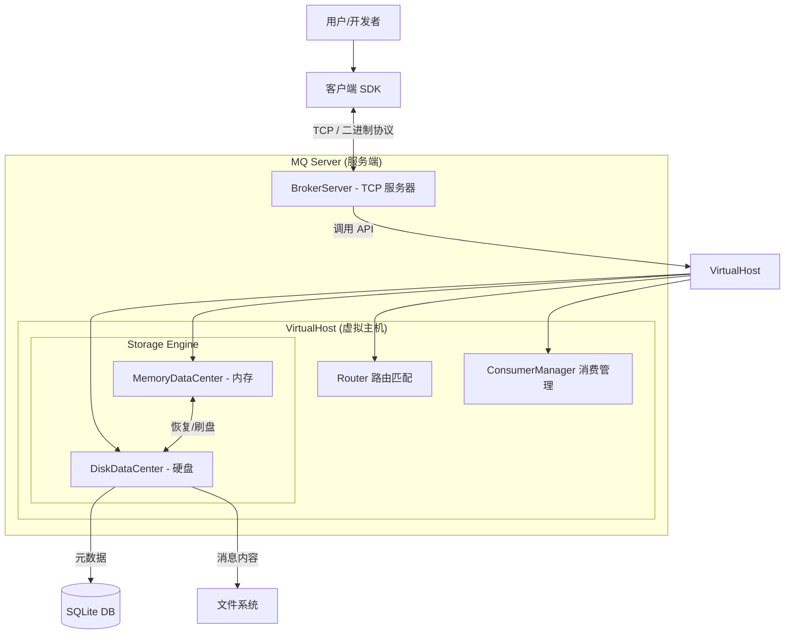
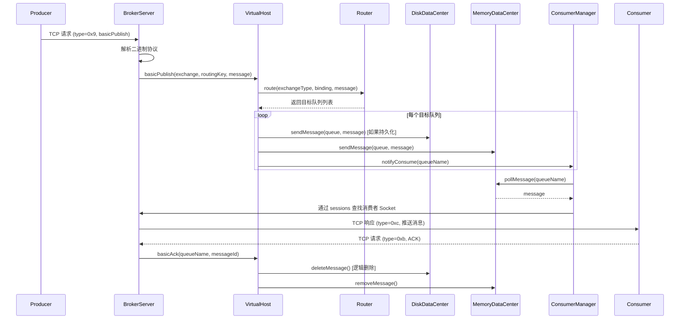
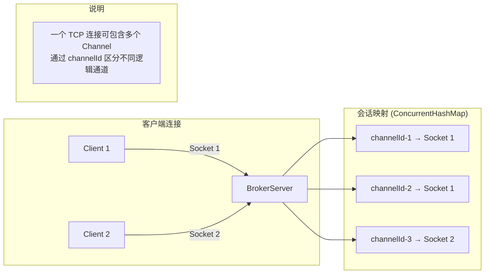
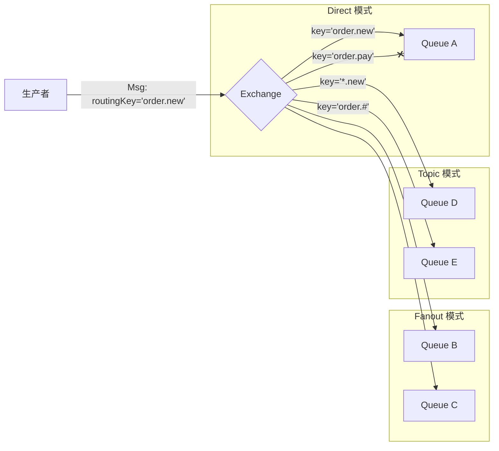
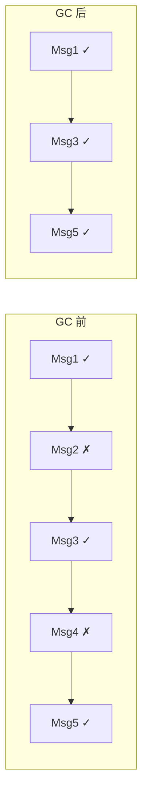

# 消息队列 (MQ) 学习手册

> **最后更新**: 2026-01-20
> **目标**: 从零开始理解消息队列核心原理，并掌握本项目的实现细节。

---

## 目录

1. [消息队列基础理论](#1-消息队列基础理论)
2. [项目概览](#2-项目概览)
3. [当前开发进度](#3-当前开发进度)
4. [核心架构图](#4-核心架构图)
5. [深度技术解析](#5-深度技术解析)
6. [关键代码路径导航](#6-关键代码路径导航)
7. [学习检验与思考题](#7-学习检验与思考题)
8. [延伸阅读与参考资料](#8-延伸阅读与参考资料)

---

## 1. 消息队列基础理论

在深入代码之前，先建立对消息队列的宏观理解。

### 1.1 为什么需要消息队列？

在分布式系统中，服务之间的直接调用会带来三个核心问题：

| 问题 | 场景 | MQ 如何解决 |
| :--- | :--- | :--- |
| **耦合性高** | 服务 A 调用服务 B，B 挂了 A 也跟着出错 | 生产者只管发消息，不关心谁消费、是否在线 |
| **流量峰值** | 秒杀场景瞬间涌入 10 万请求，数据库被打崩 | 消息堆积在队列中，消费者按自身能力慢慢处理（削峰填谷） |
| **同步阻塞** | 用户下单后要等支付、库存、物流全部完成才响应 | 异步处理，下单后立即返回，后续流程由 MQ 驱动 |

**一句话总结**：MQ 是分布式系统的"缓冲区"和"解耦器"。

### 1.2 核心概念速查表

| 术语 | 英文 | 解释 | 类比 |
| :--- | :--- | :--- | :--- |
| **生产者** | Producer | 发送消息的应用程序 | 寄信人 |
| **消费者** | Consumer | 接收并处理消息的应用程序 | 收信人 |
| **队列** | Queue | 消息的存储容器，FIFO 结构 | 邮筒 |
| **交换机** | Exchange | 消息的路由中心，决定消息去哪个队列 | 邮局分拣中心 |
| **绑定** | Binding | 交换机与队列的关联规则 | 邮政编码规则 |
| **路由键** | RoutingKey | 生产者发送时附带的标签 | 信封上的地址 |
| **绑定键** | BindingKey | 队列订阅时声明的匹配模式 | 邮筒接受的地址范围 |
| **虚拟主机** | VirtualHost | 逻辑隔离的 MQ 实例 | 不同楼层的邮局 |
| **确认机制** | ACK | 消费者告知 MQ "我处理完了" | 签收回执 |

### 1.3 AMQP 协议简介

本项目设计思路参考了 **RabbitMQ**，而 RabbitMQ 是 AMQP (Advanced Message Queuing Protocol) 的标准实现。

AMQP 定义了三个核心组件的交互方式：

```
Producer → Exchange → Binding → Queue → Consumer
             ↓
        (路由规则)
```

**AMQP 的工作流程：**
1. 生产者将消息发送给 Exchange，并附带 RoutingKey
2. Exchange 根据类型和 BindingKey 匹配规则，决定转发给哪些 Queue
3. 消费者从 Queue 中拉取或接收推送的消息
4. 消费完成后发送 ACK，MQ 才会删除该消息

### 1.4 三种交换机模式对比

| 类型 | 匹配规则 | 使用场景 | 示例 |
| :--- | :--- | :--- | :--- |
| **Direct** | RoutingKey == BindingKey (精确匹配) | 点对点通信，如日志分级 | `routingKey="error"` 只进 error 队列 |
| **Fanout** | 无视 Key，广播给所有绑定队列 | 广播通知，如系统公告 | 所有服务都收到同一条消息 |
| **Topic** | 支持通配符 `*` 和 `#` 的模式匹配 | 灵活订阅，如新闻分类 | `usa.*` 匹配 `usa.news`、`usa.weather` |

**Topic 通配符规则：**
- `*`：匹配**恰好一个**单词。如 `order.*` 可匹配 `order.created`，不能匹配 `order.item.created`
- `#`：匹配**零个或多个**单词。如 `order.#` 可匹配 `order`、`order.created`、`order.item.created`

---

## 2. 项目概览

本项目是一个基于 **Java 17** 和 **Spring Boot** 开发的轻量级消息队列，设计思路参考了 **RabbitMQ**。

### 2.1 核心设计理念

- **生产者-消费者模型**：实现服务解耦与异步通信
- **双层存储**：内存保证速度，硬盘保证持久化
- **多虚拟主机**：逻辑隔离，代码结构已支持（目前使用默认 Host）

### 2.2 关键特性

- ✅ 支持 **Direct**, **Fanout**, **Topic** 三种交换机模式
- ✅ 支持 **持久化** (SQLite + 磁盘文件) 与 **内存** 双层存储
- ✅ 支持 **消息确认机制 (ACK)**
- ✅ 支持消息文件的 **GC 垃圾回收**
- ✅ 完整的 **TCP 网络通信层**（二进制协议）
- ✅ **消费者管理器**（轮询推送机制）

---

## 3. 当前开发进度

项目已完成**全部核心功能**的开发，包括服务端核心、网络通信层和客户端 SDK。

### ✅ 已完成模块

| 模块 | 核心类 | 功能描述 |
| :--- | :--- | :--- |
| **核心模型** | `Exchange`, `MSGQueue`, `Binding`, `Message` | 定义了 MQ 的基本概念实体 |
| **路由引擎** | `Router` | 实现消息从 Exchange 到 Queue 的匹配规则 (含 Topic 通配符匹配) |
| **持久化层** | `DiskDataCenter`, `DataBaseManager`, `MessageFileManager` | SQLite 存储元数据，文件系统存储消息体 |
| **内存层** | `MemoryDataCenter` | 维护内存中的状态 (ConcurrentHashMap)，提供高性能读写 |
| **控制中心** | `VirtualHost` | 整合内存与硬盘管理，对外提供核心 API |
| **消费管理** | `ConsumerManager` | 维护消费者订阅关系，实现消息的轮询推送 |
| **网络通信** | `BrokerServer` | TCP 服务器，实现二进制协议解析和会话管理 |
| **通信协议** | `Request`, `Response`, `*Arguments` | 客户端与服务端交互的二进制协议格式 |
| **客户端 SDK** | `Connection`, `Channel` | 封装网络通信，给用户提供易用的发送/订阅接口 |

### 🔧 协议操作类型一览

`BrokerServer` 实现了完整的 12 种操作类型：

| 编码 | 操作 | 对应方法 | 描述 |
| :--- | :--- | :--- | :--- |
| `0x1` | createChannel | - | 创建通道，建立 channelId 与 Socket 的映射 |
| `0x2` | closeChannel | - | 销毁通道，从 sessions 中移除 |
| `0x3` | exchangeDeclare | `virtualHost.exchangeDeclare()` | 声明交换机 |
| `0x4` | exchangeDelete | `virtualHost.exchangeDelete()` | 删除交换机 |
| `0x5` | queueDeclare | `virtualHost.queueDeclare()` | 声明队列 |
| `0x6` | queueDelete | `virtualHost.queueDelete()` | 删除队列 |
| `0x7` | queueBind | `virtualHost.queueBind()` | 绑定队列到交换机 |
| `0x8` | queueUnbind | `virtualHost.queueUnbind()` | 解除队列绑定 |
| `0x9` | basicPublish | `virtualHost.basicPublish()` | 发布消息 |
| `0xa` | basicConsume | `virtualHost.basicConsume()` | 订阅队列 |
| `0xb` | basicAck | `virtualHost.basicAck()` | 确认消息 |
| `0xc` | (响应) | - | 服务器向消费者推送消息 |

---

## 4. 核心架构图

### 4.1 整体架构



### 4.2 消息流转时序图



### 4.3 BrokerServer 会话管理



---

## 5. 深度技术解析

### 5.1 BrokerServer 网络通信层 ⭐

`BrokerServer` 是 MQ 的网络入口，基于 TCP 实现多线程请求处理。

#### 核心设计要点

```java
// 文件位置: src/main/java/org/adam/mq/mqserver/BrokerServer.java

public class BrokerServer {
    private ServerSocket serverSocket;
    private VirtualHost virtualHost = new VirtualHost("DefaultVHost");

    // 会话管理：channelId -> Socket
    private ConcurrentHashMap<String, Socket> sessions = new ConcurrentHashMap<>();

    // 线程池处理并发连接
    private ExecutorService executorService = Executors.newCachedThreadPool();
}
```

#### 二进制协议格式

```
┌──────────────┬──────────────┬────────────────────────────────┐
│   4 bytes    │   4 bytes    │          N bytes               │
│    type      │   length     │          payload               │
│  (操作类型)   │  (数据长度)   │      (序列化后的参数对象)        │
└──────────────┴──────────────┴────────────────────────────────┘
```

#### 消息推送机制

当消费者订阅队列时，`BrokerServer` 会注册一个回调函数：

```java
// 订阅时注册的回调
virtualHost.basicConsume(consumerTag, queueName, autoAck, new Consumer() {
    @Override
    public void handleDelivery(String consumerTag, BasicProperties props, byte[] body) {
        // 1. 根据 consumerTag (即 channelId) 找到对应的 Socket
        Socket clientSocket = sessions.get(consumerTag);

        // 2. 构造推送响应 (type = 0xc)
        SubscribeReturns returns = new SubscribeReturns();
        returns.setBody(body);

        // 3. 直接写入 Socket 输出流，实现服务端主动推送
        DataOutputStream dos = new DataOutputStream(clientSocket.getOutputStream());
        writeResponse(dos, response);
    }
});
```

**关键理解点**：
- 一个 TCP 连接可以包含多个 Channel（逻辑通道）
- `sessions` 保存的是 `channelId → Socket` 的映射
- 消息推送时，通过 `consumerTag`（等于 `channelId`）找到目标 Socket

### 5.2 Exchange 路由机制



### 5.3 Topic 通配符匹配算法 ⭐

这是本项目的核心算法之一，使用**双指针遍历**实现模式匹配。

#### 算法思路

将 `bindingKey` 和 `routingKey` 按 `.` 分割成 token 数组，用两个指针分别遍历：

```
bindingKey: "order.#.completed"  →  ["order", "#", "completed"]
routingKey: "order.item.payment.completed"  →  ["order", "item", "payment", "completed"]
```

#### 核心代码解析

```java
// 文件位置: src/main/java/org/adam/mq/mqserver/core/Router.java

private boolean routeTopic(Binding binding, Message message) {
    String[] bindingTokens = binding.getBindingKey().split("\\.");
    String[] routingTokens = message.getRoutingKey().split("\\.");

    int bindingIndex = 0;
    int routingIndex = 0;

    while (bindingIndex < bindingTokens.length && routingIndex < routingTokens.length) {
        if (bindingTokens[bindingIndex].equals("*")) {
            // 情况1: * 匹配任意单个词，双方各前进一步
            bindingIndex++;
            routingIndex++;
        } else if (bindingTokens[bindingIndex].equals("#")) {
            bindingIndex++;
            if (bindingIndex == bindingTokens.length) {
                // 情况2: # 在末尾，直接匹配成功（吞掉剩余所有词）
                return true;
            }
            // 情况3: # 不在末尾，需要在 routingTokens 中找下一个匹配点
            routingIndex = findNextMatch(routingTokens, routingIndex, bindingTokens[bindingIndex]);
            if (routingIndex == -1) {
                return false;  // 找不到匹配，失败
            }
            bindingIndex++;
            routingIndex++;
        } else {
            // 情况4: 普通字符串，要求完全相等
            if (!bindingTokens[bindingIndex].equals(routingTokens[routingIndex])) {
                return false;
            }
            bindingIndex++;
            routingIndex++;
        }
    }
    // 情况5: 只有双方都走到末尾才算匹配成功
    return bindingIndex == bindingTokens.length && routingIndex == routingTokens.length;
}
```

#### 匹配测试用例

| BindingKey | RoutingKey | 结果 | 说明 |
| :--- | :--- | :--- | :--- |
| `aaa.bbb` | `aaa.bbb` | ✅ true | 精确匹配 |
| `aaa.*` | `aaa.bbb` | ✅ true | `*` 匹配 `bbb` |
| `aaa.*.ccc` | `aaa.bbb.ccc` | ✅ true | `*` 匹配中间的 `bbb` |
| `aaa.#` | `aaa.bbb.ccc` | ✅ true | `#` 吞掉 `bbb.ccc` |
| `aaa.#.ccc` | `aaa.bbb.ccc` | ✅ true | `#` 匹配 `bbb`，然后精确匹配 `ccc` |
| `aaa.#.ccc` | `aaa.ccc` | ✅ true | `#` 匹配零个词 |
| `aaa.bbb` | `aaa.bbb.ccc` | ❌ false | 长度不匹配 |
| `*.aaa` | `aaa` | ❌ false | `*` 必须匹配恰好一个词 |

### 5.4 双层存储架构

我们采用 **内存 + 硬盘** 的混合存储策略，以平衡性能与数据安全性。

| 存储层 | 介质 | 存储内容 | 目的 |
| :--- | :--- | :--- | :--- |
| **内存层** | RAM (ConcurrentHashMap) | Exchange, Queue, Binding, Message | 极低延迟的读写操作 |
| **硬盘层 - DB** | SQLite | Exchange, Queue, Binding 元数据 | 结构化数据持久化 |
| **硬盘层 - File** | Binary Files | Message 消息体 | 大量变长数据的高效存储 |

#### 为什么消息体不存数据库？

消息是"流数据"，特点是量大、变长、生命周期短。相比数据库的随机写入，文件系统的**顺序追加写 (Sequential Write)** 效率高出数量级，且更容易做 GC。

### 5.5 消息文件存储格式 ⭐

消息以**变长二进制格式**追加存储在 `queue_data.txt` 文件中：

```
┌──────────────┬────────────────────────────────┐
│  4 bytes     │         N bytes                │
│  消息长度    │         消息体 (序列化)         │
├──────────────┼────────────────────────────────┤
│  4 bytes     │         N bytes                │
│  消息长度    │         消息体 (序列化)         │
└──────────────┴────────────────────────────────┘
```

#### 关键字段

每条 `Message` 对象包含：
- `offsetBeg`: 消息体在文件中的起始偏移量（不含长度字段）
- `offsetEnd`: 消息体在文件中的结束偏移量
- `isValid`: 有效标记（0x1 有效，0x0 已删除）

#### 核心代码解析

```java
// 文件位置: src/main/java/org/adam/mq/mqserver/datacenter/MessageFileManager.java

public void sendMessage(MSGQueue queue, Message message) throws MqException, IOException {
    byte[] messageBinary = BinaryTool.toBytes(message);  // 序列化

    synchronized (queue) {  // 以队列粒度加锁，保证线程安全
        try (RandomAccessFile raf = new RandomAccessFile(queueDataFile, "rw")) {
            long fileLength = raf.length();
            raf.seek(fileLength);  // 移动到文件末尾

            // 记录消息在文件中的位置（用于后续删除）
            message.setOffsetBeg(fileLength + 4);  // +4 跳过长度字段
            message.setOffsetEnd(fileLength + 4 + messageBinary.length);

            raf.writeInt(messageBinary.length);  // 写入长度
            raf.write(messageBinary);            // 写入消息体
        }
        // 更新统计信息
        Stat stat = readStat(queue.getName());
        stat.totalCount += 1;
        stat.validCount += 1;
        writeStat(queue.getName(), stat);
    }
}
```

### 5.6 GC 垃圾回收机制 ⭐

消息被消费后采用**逻辑删除**（仅修改 `isValid` 标记），随着时间推移会产生大量"垃圾"。GC 机制负责清理这些无效数据。

#### 触发条件

```java
public boolean checkGC(String queueName) {
    Stat stat = readStat(queueName);
    // 总消息数 > 2000 且 有效率 < 50%
    return stat.totalCount > 2000 &&
           (double)stat.validCount / stat.totalCount < 0.5;
}
```

#### GC 算法：复制算法

与 JVM 新生代 GC 类似，采用**复制算法**：

```
1. 创建新文件 queue_data_new.txt
2. 遍历原文件，只把 isValid=1 的消息复制到新文件
3. 删除原文件 queue_data.txt
4. 重命名 queue_data_new.txt → queue_data.txt
5. 更新统计文件
```



### 5.7 线程安全设计

本项目在多个层面保证线程安全：

| 层级 | 保护对象 | 机制 |
| :--- | :--- | :--- |
| BrokerServer | sessions 会话映射 | `ConcurrentHashMap` |
| VirtualHost | Exchange 操作 | `synchronized (exchangeLocker)` |
| VirtualHost | Queue 操作 | `synchronized (queueLocker)` |
| MessageFileManager | 单个队列的文件读写 | `synchronized (queue)` |
| MemoryDataCenter | 数据结构 | `ConcurrentHashMap` |

**嵌套锁的注意事项**：在 `queueBind` 操作中，需要同时操作交换机和队列，此时采用固定的加锁顺序（先 exchangeLocker 再 queueLocker）避免死锁。

---

## 6. 关键代码路径导航

建议按以下顺序阅读代码，从网络层到核心层再到存储层：

### 第一阶段：理解网络通信层

1. **BrokerServer.java** - 网络入口
   - 路径: `src/main/java/org/adam/mq/mqserver/BrokerServer.java`
   - 重点方法: `start()`, `processConnection()`, `process()`
   - 理解: TCP 服务器如何接收请求、解析协议、分发到 VirtualHost

2. **Request.java / Response.java** - 协议对象
   - 路径: `src/main/java/org/adam/mq/common/`
   - 重点: 二进制协议的 type + length + payload 结构

### 第二阶段：理解核心 API

3. **VirtualHost.java** - 业务逻辑入口
   - 路径: `src/main/java/org/adam/mq/mqserver/VirtualHost.java`
   - 重点方法: `exchangeDeclare()`, `queueDeclare()`, `basicPublish()`, `basicConsume()`
   - 理解: 如何协调内存层和硬盘层

4. **ConsumerManager.java** - 消费者管理
   - 路径: `src/main/java/org/adam/mq/mqserver/core/ConsumerManager.java`
   - 重点: 消费者轮询机制，消息推送流程

### 第三阶段：理解存储层

5. **MemoryDataCenter.java** - 内存数据管理
   - 路径: `src/main/java/org/adam/mq/mqserver/datacenter/MemoryDataCenter.java`
   - 重点: ConcurrentHashMap 的使用，`recovery()` 数据恢复

6. **DiskDataCenter.java** - 硬盘数据管理
   - 路径: `src/main/java/org/adam/mq/mqserver/datacenter/DiskDataCenter.java`
   - 重点: `init()` 初始化流程，`sendMessage()` 持久化逻辑

7. **MessageFileManager.java** - 消息文件管理
   - 路径: `src/main/java/org/adam/mq/mqserver/datacenter/MessageFileManager.java`
   - 重点: `sendMessage()`, `deleteMessage()`, `gc()`, 文件格式设计

### 第四阶段：理解路由

8. **Router.java** - 路由匹配算法
   - 路径: `src/main/java/org/adam/mq/mqserver/core/Router.java`
   - 重点: `routeTopic()` 通配符匹配算法

---

## 7. 学习检验与思考题

完成以下问题，检验你对项目的理解程度。

### 🟢 基础题

1. **概念辨析**：RoutingKey 和 BindingKey 有什么区别？分别在什么时候使用？

2. **模式选择**：如果你需要实现一个"所有服务都收到同一条系统通知"的功能，应该使用哪种交换机类型？

3. **存储设计**：为什么元数据存 SQLite，而消息体存文件？如果反过来会有什么问题？

4. **网络通信**：为什么 BrokerServer 使用 `ConcurrentHashMap` 来存储 sessions？

### 🟡 进阶题

5. **算法分析**：`routeTopic()` 方法的时间复杂度是多少？能否优化？

6. **GC 策略**：当前的 GC 触发条件是 `totalCount > 2000 && validRate < 0.5`，这个设计有什么优缺点？你会如何改进？

7. **线程安全**：为什么 VirtualHost 要使用两把不同的锁（exchangeLocker 和 queueLocker）而不是一把全局锁？

8. **协议设计**：为什么 type=0xc 的响应不需要 rid？（提示：看 SubscribeReturns 的构造）

### 🔴 挑战题

9. **故障恢复**：如果消息写入文件成功，但更新统计文件时服务器崩溃了，会发生什么？如何解决这个问题？

10. **性能优化**：如果每秒有 10 万条消息写入同一个队列，当前的 `synchronized (queue)` 锁会成为瓶颈吗？你会如何优化？

11. **功能扩展**：如果要实现"延迟消息"功能（消息在指定时间后才能被消费），你会如何设计？

12. **连接管理**：当客户端断开连接时，`clearClosedSession()` 方法如何清理对应的所有 Channel？这个设计有什么潜在问题？

---

## 8. 延伸阅读与参考资料

### 官方文档

- [RabbitMQ 官方文档](https://www.rabbitmq.com/documentation.html) - 本项目的设计参考
- [AMQP 0-9-1 协议规范](https://www.rabbitmq.com/amqp-0-9-1-reference.html) - 理解消息队列的协议层

### 技术文章

- [消息队列设计精要](https://tech.meituan.com/2016/07/01/mq-design.html) - 美团技术团队的 MQ 设计思考
- [RabbitMQ 消息可靠性投递](https://www.cnblogs.com/vipstone/p/9350075.html) - 理解 ACK 机制

### 设计模式与原理

- **生产者-消费者模式**：本项目的核心架构模式
- **发布-订阅模式**：Fanout 和 Topic 交换机的理论基础
- **策略模式**：Router 根据 ExchangeType 选择不同路由策略

### 相关开源项目

- [RabbitMQ](https://github.com/rabbitmq/rabbitmq-server) - Erlang 实现的工业级 MQ
- [Apache RocketMQ](https://github.com/apache/rocketmq) - 阿里开源的分布式消息中间件
- [Apache Kafka](https://github.com/apache/kafka) - 高吞吐量的分布式事件流平台

---

*文档更新于：2026-01-20*
*祝学习愉快！遇到问题先翻代码，代码不会骗你。*
