# Java - 仿 RabbitMQ 的消息队列
## 一. 消息队列背景知识

曾经我们学习过 阻塞队列 (BlockingQueue) , 我们说, 阻塞队列最大的用途, 就是用来实现 生产者消费

者模型.

生产者消费者模型, 存在诸多好处, 是后端开发的常用编程方式.

- 解耦合

- 削峰填谷

在实际的后端开发中, 尤其是分布式系统里, 跨主机之间使用生产者消费者模型, 也是非常普遍的需求.

因此, 我们通常会把阻塞队列, 封装成一个独立的服务器程序, 并且赋予其更丰富的功能.

这样的程序我们就称为 消息队列 (Message Queue, MQ)

市面上成熟的消息队列非常多.

- RabbitMQ

- Kafka

- RocketMQ

- ActiveMQ

- ......

其中, RabbitMQ 是一个非常知名, 功能强大, 广泛使用的消息队列.

咱们就仿照 RabbitMQ, 模拟实现一个简单的消息队列.

## 二. 需求分析

核心概念

- 生产者 (Producer)

- 消费者 (Consumer)

- 中间人 (Broker)

- 发布 (Publish)

- 订阅 (Subscribe)

一个生产者, 一个消费者

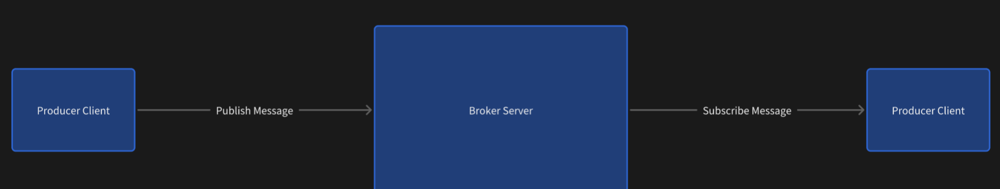
N 个生产者, N 个消费者

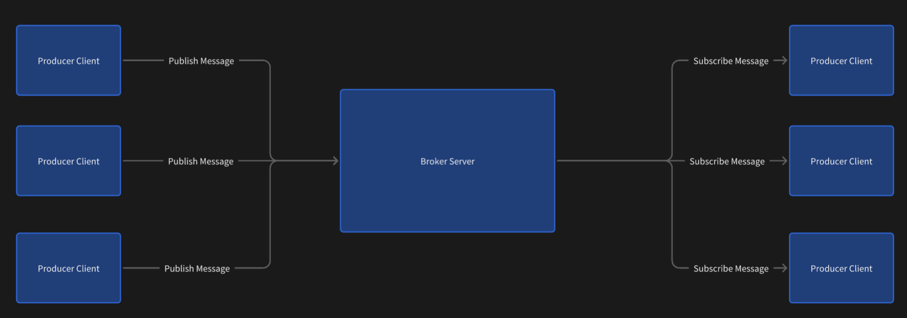
其中, Broker 是最核心的部分. 负责消息的存储和转发.

在 Broker 中, 又存在以下概念.

- 虚拟机 (VirtualHost): 类似于 MySQL 的 "database", 是一个逻辑上的集合. 一个 BrokerServer 上可

以存在多个 VirtualHost.

- 交换机 (Exchange): 生产者把消息先发送到 Broker 的 Exchange 上. 再根据不同的规则, 把消息转发

给不同的 Queue.

- 队列 (Queue): 真正用来存储消息的部分. 每个消费者决定自己从哪个 Queue 上读取消息.

- 绑定 (Binding): Exchange 和 Queue 之间的关联关系. Exchange 和 Queue 可以理解成 "多对多" 关

系. 使用一个关联表就可以把这两个概念联系起来.

- 消息 (Message): 传递的内容.

所谓的 Exchange 和 Queue 可以理解成 "多对多" 关系, 和数据库中的 "多对多" 一样. 意思是:

一个 Exchange 可以绑定多个 Queue (可以向多个 Queue 中转发消息).

一个 Queue 也可以被多个 Exchange 绑定 (一个 Queue 中的消息可以来自于多个 Exchange).

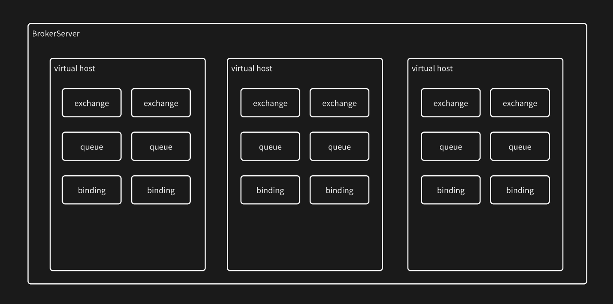
这些概念, 既需要在内存中存储, 也需要在硬盘上存储.

- 内存存储: 方便使用.

- 硬盘存储: 重启数据不丢失.

核心 API

对于 Broker 来说, 要实现以下核心 API. 通过这些 API 来实现消息队列的基本功能.

1. 创建队列 (queueDeclare)

2. 销毁队列 (queueDelete)

3. 创建交换机 (exchangeDeclare)

4. 销毁交换机 (exchangeDelete)

5. 创建绑定 (queueBind)

6. 解除绑定 (queueUnbind)

7. 发布消息 (basicPublish)

8. 订阅消息 (basicConsume)

9. 确认消息 (basicAck)

另一方面, Producer 和 Consumer 则通过网络的方式, 远程调用这些 API, 实现 生产者消费者模型.

关于 VirtualHost

对于 RabbitMQ 来说, VirtualHost 也是可以随意创建删除的.

此处咱们暂时不做这部分功能(实现起来也比较简单, 咱们的代码中会完成部分和虚拟主机相关的结构

设计. 大家可以自行完成管理逻辑).

交换机类型 (Exchange Type)

对于 RabbitMQ 来说, 主要支持四种交换机类型.

- Direct

- Fanout

- Topic

- Header

其中 Header 这种方式比较复杂, 比较少见. 常用的是前三种交换机类型. 咱们此处也主要实现这三种.

- Direct: 生产者发送消息时, 直接指定被该交换机绑定的队列名.

- Fanout: 生产者发送的消息会被复制到该交换机的所有队列中.

- Topic: 绑定队列到交换机上时, 指定一个字符串为 bindingKey. 发送消息指定一个字符串为

routingKey. 当 routingKey 和 bindingKey 满足一定的匹配条件的时候, 则把消息投递到指定队列.

这三种操作就像给 qq 群发红包.

- Direct 是发一个专属红包, 只有指定的人能领.

- Fanout 是使用了魔法, 发一个 10 块钱红包, 群里的每个人都能领 10 块钱.

- Topic 是发一个画图红包, 发 10 块钱红包, 同时出个题, 得画的像的人, 才能领. 也是每个领到的人

都能领 10 块钱.

持久化

Exchange, Queue, Binding, Message 都有持久化需求.

当程序重启 / 主机重启, 保证上述内容不丢失.

网络通信

生产者和消费者都是客户端程序, broker 则是作为服务器. 通过网络进行通信.

在网络通信的过程中, 客户端部分要提供对应的 api, 来实现对服务器的操作.

1. 创建 Connection

2. 关闭 Connection

3. 创建 Channel

4. 关闭 Channel

5. 创建队列 (queueDeclare)

6. 销毁队列 (queueDelete)

7. 创建交换机 (exchangeDeclare)

8. 销毁交换机 (exchangeDelete)

9. 创建绑定 (queueBind)

10. 解除绑定 (queueUnbind)

11. 发布消息 (basicPublish)

12. 订阅消息 (basicConsume)

13. 确认消息 (basicAck)

可以看到, 在 broker 的基础上, 客户端还要增加 Connection 操作和 Channel 操作.

Connection 对应一个 TCP 连接.

Channel 则是 Connection 中的逻辑通道.

一个 Connection 中可以包含多个 Channel.

Channel 和 Channel 之间的数据是独立的. 不会相互干扰.

这样的设定主要是为了能够更好的复用 TCP 连接, 达到长连接的效果, 避免频繁的创建关闭 TCP 连接.

Connection 可以理解成一根网线. Channel 则是网线里具体的线缆.


消息应答

被消费的消息, 需要进行应答.

应答模式分成两种.

- 自动应答: 消费者只要消费了消息, 就算应答完毕了. Broker 直接删除这个消息.

- 手动应答: 消费者手动调用应答接口, Broker 收到应答请求之后, 才真正删除这个消息.

手动应答的目的, 是为了保证消息确实被消费者处理成功了. 在一些对于数据可靠性要求高的场景, 比

较常见.

## 三. 模块划分

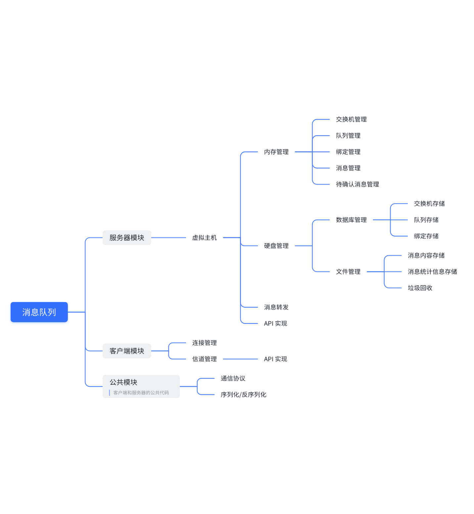

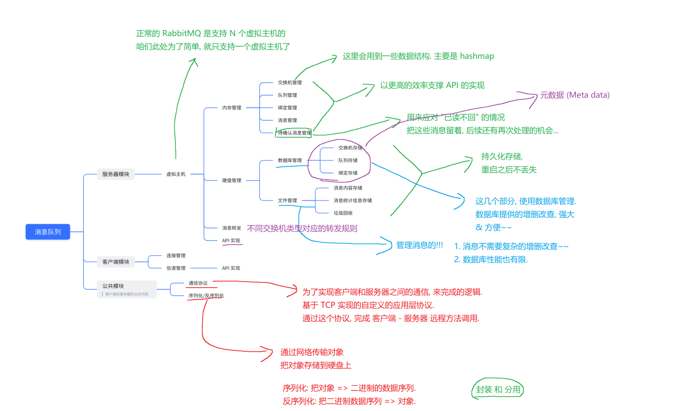

可以看到, 像 交换机, 队列, 绑定, 消息, 这几个核心概念在内存和硬盘中都是存储了的.

其中内存为主, 是用来实现消息转发的关键; 硬盘为辅, 主要是保证服务器重启之后, 之前的信息都可以正常保持.

## 四. 项目创建

创建 SpringBoot 项目.

使用 SpringBoot 2 系列版本, Java 8.

依赖引入 Spring Web 和 MyBatis.

## 五. 创建核心类

创建包 mqserver.core

创建 Exchange

```java
public class Exchange {

   private String name;

   private ExchangeType type = ExchangeType.DIRECT;

   private boolean durable = false;

   private boolean autoDelete = false;

   private Map<String, Object> arguments = new HashMap<>();

   // 省略 getter setter

}

public enum ExchangeType {

   DIRECT(0),

   FANOUT(1),

   TOPIC(2);

   private final int type;

   private ExchangeType(int type) {

       this.type = type;

   }

   public int getType() {

       return this.type;

   }

}
```

- name  : 交换机的名字. 相当于交换机的身份标识.

- type : 交换机的类型. 三种取值, DIRECT, FANOUT, TOPIC.

- durable : 交换机是否要持久化存储. true 为持久化, false 不持久化.

- autoDelete : 使用完毕后是否自动删除. 预留字段, 暂时未使用.

- arguments : 交换机的其他参数属性. 预留字段, 暂时未使用.

RabbitMQ 中的交换机, 支持 autoDelete  和 arguments , 咱们此处为了简单, 暂时没有实现对

应功能, 只是预留了字段, 同学们可以尝试自己完成.

创建 MSGQueue

```java
public class MSGQueue {

   private String name;

   private boolean durable;

   private boolean exclusive;

   private boolean autoDelete;

   private Map<String, Object> arguments = new HashMap<>();

   // 省略 getter setter

}
```

类名叫做 MSGQueue, 而不是 Queue, 是为了防止和标准库中的 Queue 混淆.

- name : 队列的名字. 相当于队列的身份标识.

- durable : 交换机是否要持久化存储. true 为持久化, false 不持久化.

- exclusive : 独占(排他), 队列只能被一个消费者使用.

- autoDelete : 使用完毕后是否自动删除. 预留字段, 暂时未使用.

- arguments : 交换机的其他参数属性. 预留字段, 暂时未使用.

创建 Binding

```java
public class Binding {

   private String exchangeName;

   private String queueName;

   private String bindingKey;

   // 省略 getter setter

}
```

- exchangeName  交换机名字

- queueName  队列名字

- bindingKey  只在交换机类型为 TOPIC  时才有效. 用于和消息中的 routingKey  进行匹配.

创建 Message

一个Message主要包含两个部分

1. 属性部分 basic properties
2. 正文部分byte[] 正文是支持二进制格式的

```java
public class Message implements Serializable {

   private BasicProperties basicProperties = new BasicProperties();

   private byte[] body;

   // 消息在文件中对应的 offset 的范围, [offsetBeg, offsetEnd)

    // 从这个范围取出的 byte[] 正好可以反序列化成一个 Message 对象.

    // offsetBeg 前面的 4 个字节是消息的长度

    private transient long offsetBeg = 0;

    private transient long offsetEnd = 0;

    // 消息在文件中是否有效. 0x0 表示无效, 0x1 表示有效

    private byte isValid = 0x1;

    // 创建新的消息, 同时给该消息分配一个新的 messageId

    // routingKey 以参数的为准. 会覆盖掉 basicProperties 中的 routingKey

    public static Message createMessageWithId(String routingKey,

BasicProperties basicProperties, byte[] body) {

        Message message = new Message();

        if (basicProperties != null) {

            message.basicProperties = basicProperties;

        }

        message.basicProperties.setMessageId("M-" +

UUID.randomUUID().toString());

        message.basicProperties.setRoutingKey(routingKey);

        message.body = body;

        return message;

    }

    // 省略 getter setter

}

public class BasicProperties implements Serializable {

   // 消息的唯一 id. 使用 uuid 表示.

    private String messageId;

    private String routingKey;

    // 1 表示消息非持久化. 2 表示消息持久化

    private int deliveryMode = 1;

    // 省略 getter setter

}
```

- Message  需要实现 Serializable  接口. 后续需要把 Message 写入文件以及进行网络传输.

- basicProperties  是消息的属性信息. body  是消息体.

- offsetBeg  和 offsetEnd  表示消息在消息文件中所在的起始位置和结束位置. 这一块具体的

设计后面再详细介绍. 使用 transient  关键字避免属性被序列化.

- isValid  用来表示消息在文件中是否有效. 这一块具体的设计后面再详细介绍.

- createMessageWithId  相当于一个工厂方法, 用来创建一个 Message 实例. messageId 通过UUID 的方式生成.

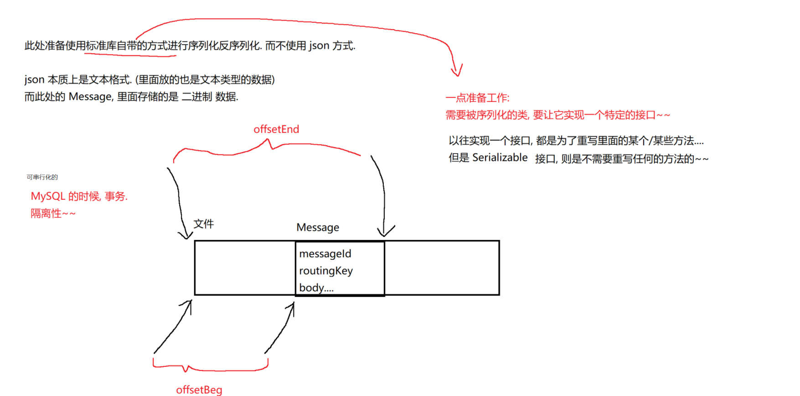

## 六. 数据库设计

对于 Exchange, MSGQueue, Binding, 我们使用数据库进行持久化保存.

此处我们使用的数据库是 SQLite, 是一个更轻量的数据库.

SQLite 只是一个动态库(当然, 官方也提供了可执行程序 exe), 我们在 Java 中直接引入 SQLite 依赖, 即

可直接使用, 不必安装其他的软件.

配置 sqlite

引入 pom.xml 依赖

```xml
<dependency>

  <groupId>org.xerial</groupId>

  <artifactId>sqlite-jdbc</artifactId>

  <version>3.41.0.1</version>

</dependency>
```

配置数据源 application.yml

```yaml
spring:

 datasource:

   url: jdbc:sqlite:./data/meta.db

   username:

   password:

   driver-class-name: org.sqlite.JDBC

mybatis:

 mapper-locations: classpath:mapper/**Mapper.xml

Username 和 password 空着即可.
```

此处我们约定, 把数据库文件放到 ./data/meta.db  中.

SQLite 只是把数据单纯的存储到一个文件中. 非常简单方便.

> 对于SQLlite来说，并不需要指定用户密码
>
> MYSQL是一个客户端服务器结构的程序，一个数据库服务器，就会对于很多个客户端来访问它
>
> SQLite则不是客户端服务器结构的程序，就只有自己一个人能访问(把数据放在本地上，和网络无关，就只有本地主机才能访问)

实现创建表

```java
@Mapper

public interface MetaMapper {

   void createUserTable();

   void createExchangeTable();

   void createQueueTable();

   void createBindingTable();

}
```

本身 MyBatis 针对 MySQL / Oracle 支持执行多个 SQL 语句的, 但是针对 SQLite 是不支持的, 只能写成多个方法.

```xml
<update id="createExchangeTable">

   create table if not exists exchange (

       name varchar(50) primary key,

       type int,                       -- 0 表示 direct, 1 表示 fanout, 2 表示

topic

       durable boolean,                -- false 表示不持久化, true 表示持久化.

       autoDelete boolean,             -- false 表示不自动删除, true 表示自动删除.

       arguments varchar(1024)         -- 创建交换机指定的参数

   );

</update>

<update id="createQueueTable">

   create table if not exists queue (

       name varchar(50) primary key,

       durable boolean,                -- false 表示不持久化, true 表示持久化.

       autoDelete boolean,             -- false 表示不自动删除, true 表示自动删除.

       arguments varchar(1024)         -- 创建交换机指定的参数

   );

</update>

<update id="createBindingTable">

   create table if not exists binding (

       exchangeName varchar(50),

       queueName varchar(50),

       bindingKey varchar(256)

   );

</update>
```

实现数据库基本操作

给 mapper.MetaMapper  中添加

void insertExchange(Exchange exchange);

void deleteExchange(String exchangeName);

void insertQueue(MSGQueue msgQueue);

void deleteQueue(String queueName);

void insertBinding(Binding binding);

void deleteBinding(Binding binding);

> 对于**交换机**和**队列**这两个表，由于使用name作为主键，直接按照name进行删除即可
>
> 对于**绑定**来说此时没有主键，删除操作其实是针对 exchangeName和 queueName两个维度进行筛选

给 MetaMapper  中添加

```xml
<insert id="insertExchange"

parameterType="com.example.java_message_queue.mqserver.core.Exchange">

   insert into exchange values(#{name}, #{type}, #{durable}, #{autoDelete}, #

{arguments});

</insert>

<delete id="deleteExchange" parameterType="java.lang.String">

   delete from exchange where name = #{exchangeName};

</delete>

<insert id="insertQueue"

parameterType="com.example.java_message_queue.mqserver.core.MSGQueue">

   insert into queue values(#{name}, #{durable}, #{autoDelete}, #{arguments});

</insert>

<delete id="deleteQueue" parameterType="java.lang.String">

   delete from queue where name = #{queueName};

</delete>

<insert id="insertBinding"

parameterType="com.example.java_message_queue.mqserver.core.Binding">

   insert into binding values(#{exchangeName}, #{queueName}, #{bindingKey});

</insert>

<delete id="deleteBinding"

parameterType="com.example.java_message_queue.mqserver.core.Binding">

   delete from binding where exchangeName = #{exchangeName} and queueName = #

{queueName};

</delete>
```

实现 DataBaseManager

mqserver.datacenter.DataBaseManager

### 1) 创建 DataBaseManager 类

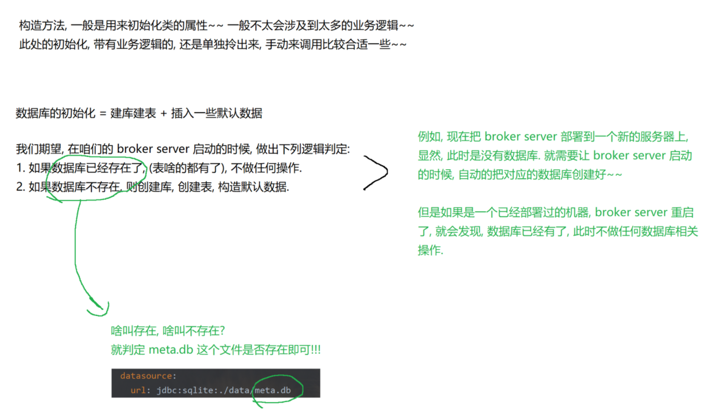

通过这个类来封装针对数据库的操作.

```java
public class DataBaseManager {

   // 由于 DataBaseManager 不是一个 Bean

    // 需要手动来获取实例

    private MetaMapper metaMapper;

    public void init() {

        this.metaMapper =

JavaMessageQueueApplication.ac.getBean(MetaMapper.class);

        // 构造数据库

        if (!checkDBExists()) {

            // 1. 读取 sql 文件中的内容, 并创建表

            createTable();

            // 2. 插入默认数据

            createDefaultData();

            System.out.println("[DataBaseManager] 数据库初始化完成!");

       } else {

           System.out.println("[DataBaseManager] 数据库已经存在!");

       }

   }

}
```

如果数据库文件存在, 则不必建库建表了.

针对 JavaMessageQueueApplication, 需要新增一个 ac 属性. 并初始化

@SpringBootApplication

```java
public class JavaMessageQueueApplication {

  public static ConfigurableApplicationContext ac;

  public static void main(String[] args) throws IOException {

     ac = SpringApplication.run(JavaMessageQueueApplication.class);

  }

}
```

### 2) 实现 checkDBExists

```java
private boolean checkDBExists() {

   File file = new File("./meta.db");

   if (file.exists()) {

       return true;

   }

   return false;

}
```

### 3) 实现 createTable

// 创建数据表

```java
private void createTable() {

    metaMapper.createExchangeTable();

    metaMapper.createQueueTable();

    metaMapper.createBindingTable();

    System.out.println("[DataBaseManager] 创建表完成!");

}
```

### 4) 实现 createDefaultData

// 创建表中的默认数据

```java
private void createDefaultData() {

   // 构造默认交换机

    Exchange exchange = new Exchange();

    exchange.setName("");

    exchange.setType(ExchangeType.DIRECT);

    exchange.setDurable(true);

    exchange.setAutoDelete(false);

    metaMapper.insertExchange(exchange);

    System.out.println("[DataBaseManager] 创建初始数据完成!");

}
```

默认数据主要是创建一个默认的交换机. 这个默认交换机没有名字, 并且是直接交换机.

### 5) 封装其他数据库操作

```java
public void insertExchange(Exchange exchange) {

   metaMapper.insertExchange(exchange);

}

public void deleteExchange(String exchangeName) {

   metaMapper.deleteExchange(exchangeName);

}

public List<Exchange> selectAllExchanges() {

   return metaMapper.selectAllExchanges();

}

public void insertQueue(MSGQueue queue) {

   metaMapper.insertQueue(queue);

}

public void deleteQueue(String queueName) {

   metaMapper.deleteQueue(queueName);

}

public List<MSGQueue> selectAllQueues() {

   return metaMapper.selectAllQueues();

}

public void insertBinding(Binding binding) {

   metaMapper.insertBinding(binding);

}

public void deleteBinding(Binding binding) {

   metaMapper.deleteBinding(binding);

}

public List<Binding> selectAllBindings() {

   return metaMapper.selectAllBindings();

}
```

测试 DataBaseManager

使用 Spring 自带的单元测试, 针对上述代码进行测试验证.

在 test 目录中, 创建 DataBaseManagerTests

### 1) 准备工作

```java
@SpringBootTest

public class DataBaseManagerTests {

   private static DataBaseManager dataBaseManager = new DataBaseManager();

   @BeforeAll

   public static void setupAll() throws IOException {

       // 初始情况下, 先统一清除数据库

        dataBaseManager.deleteDB();

    }

    @BeforeEach

    public void setUp() throws IOException {

        // 每次运行一个用例, 都重置数据库. 防止用例之间的数据相互干扰.

        // 需要初始化 ac 对象

        JavaMessageQueueApplication.ac =

SpringApplication.run(JavaMessageQueueApplication.class);

        // 再初始化数据库

        dataBaseManager.init();

    }

    @AfterEach

    public void tearDown() throws IOException {

        // 需要关闭 ac 对象

        JavaMessageQueueApplication.ac.close();

        // 然后再删除数据库

        dataBaseManager.deleteDB();

    }

}
```

- @SpringBootTest  注解表示该类是一个测试类.

- @BeforeAll  在所有测试执行之前执行. 此处先删除之前的数据库, 避免干扰.

- @BeforeEach  每个测试用例之前执行. 一般用来做准备工作. 此处进行数据库初始化, 以及针对

Spring 服务的初始化.

- @AfterEach 每个测试用例之后执行. 一般用来做收尾工作. 此处需要先关闭 Spring 服务, 再删除

数据库.

由于 Spring 服务启动的时候, 会和数据库建立连接(通过 MyBatis). 因此需要先关闭服务, 才能删除数

据库, 否则会删除失败(Spring 服务会持有数据库文件的访问权限).

### 2) 编写测试用例

- @Test  注解表示一个测试用例.

- Assertions  是断言, 用来断定执行结果.

- 每个用例执行之前, 都会自动调用到 setUp, 每次用例执行结束之后, 都会自动调用 tearDown

- 要确保每个用例的执行都是 "clean" 的, 也就是该用例不会被上个用例干扰到.

```java
@Test

public void testInitTable() throws IOException {

   List<Exchange> exchangeList = dataBaseManager.selectAllExchanges();

   List<MSGQueue> queueList = dataBaseManager.selectAllQueues();

   List<Binding> bindingList = dataBaseManager.selectAllBindings();

   Assertions.assertEquals(1, exchangeList.size());

   Assertions.assertEquals("", exchangeList.get(0).getName());

   Assertions.assertEquals(ExchangeType.DIRECT,

exchangeList.get(0).getType());

   Assertions.assertEquals(0, queueList.size());

   Assertions.assertEquals(0, bindingList.size());

}

private Exchange createTestExchange(String exchangeName) {

   Exchange exchange = new Exchange();

   exchange.setName(exchangeName);

   exchange.setType(ExchangeType.FANOUT);

   exchange.setAutoDelete(true);

   exchange.setDurable(true);

   HashMap<String, Object> arguments = new HashMap<>();

   arguments.put("aaa", "111");

   arguments.put("bbb", "222");

   exchange.setArguments(arguments);

   return exchange;

}

@Test

public void testInsertExchange() {

   Exchange exchange = createTestExchange("test");

   dataBaseManager.insertExchange(exchange);

   List<Exchange> exchangeList = dataBaseManager.selectAllExchanges();

   Assertions.assertEquals(2, exchangeList.size());

   Assertions.assertEquals("test", exchangeList.get(1).getName());

   Assertions.assertEquals(ExchangeType.FANOUT,

exchangeList.get(1).getType());

   Assertions.assertEquals(true, exchangeList.get(1).isAutoDelete());

   Assertions.assertEquals(true, exchangeList.get(1).isDurable());

   Assertions.assertEquals("111", exchangeList.get(1).getArgument("aaa"));

   Assertions.assertEquals("222", exchangeList.get(1).getArgument("bbb"));

}

@Test

public void testDeleteExchange() {

   Exchange exchange = createTestExchange("test");

   dataBaseManager.insertExchange(exchange);

   List<Exchange> exchangeList = dataBaseManager.selectAllExchanges();

   Assertions.assertEquals(2, exchangeList.size());

   Assertions.assertEquals("test", exchangeList.get(1).getName());

   dataBaseManager.deleteExchange("test");

   exchangeList = dataBaseManager.selectAllExchanges();

   Assertions.assertEquals(1, exchangeList.size());

   Assertions.assertEquals("", exchangeList.get(0).getName());

}

private MSGQueue createTestQueue(String queueName) {

   MSGQueue queue = new MSGQueue();

   queue.setName(queueName);

   queue.setDurable(true);

   queue.setAutoDelete(true);

   queue.setExclusive(true);

   HashMap<String, Object> hashMap = new HashMap<>();

   hashMap.put("aaa", "111");

   hashMap.put("bbb", "222");

   queue.setArguments(hashMap);

   return queue;

}

@Test

public void testInsertQueue() {

   MSGQueue queue = createTestQueue("test");

   dataBaseManager.insertQueue(queue);

   List<MSGQueue> queueList = dataBaseManager.selectAllQueues();

   Assertions.assertEquals(1, queueList.size());

   Assertions.assertEquals("test", queueList.get(0).getName());

   Assertions.assertEquals(true, queueList.get(0).isDurable());

   Assertions.assertEquals(true, queueList.get(0).isAutoDelete());

   Assertions.assertEquals(true, queueList.get(0).isExclusive());

   Assertions.assertEquals("111", queueList.get(0).getArgument("aaa"));

   Assertions.assertEquals("222", queueList.get(0).getArgument("bbb"));

}

@Test

public void testDeleteQueue() {

   MSGQueue queue = createTestQueue("test");

   dataBaseManager.insertQueue(queue);

   List<MSGQueue> queueList = dataBaseManager.selectAllQueues();

   Assertions.assertEquals(1, queueList.size());

   Assertions.assertEquals("test", queueList.get(0).getName());

   dataBaseManager.deleteQueue("test");

   queueList = dataBaseManager.selectAllQueues();

   Assertions.assertEquals(0, queueList.size());

}

@Test

public void testInsertBinding() {

   Binding binding = new Binding();

   binding.setQueueName("testQueue");

   binding.setExchangeName("testExchange");

   binding.setBindingKey("testBindingKey");

   dataBaseManager.insertBinding(binding);

   List<Binding> bindingList = dataBaseManager.selectAllBindings();

   Assertions.assertEquals(1, bindingList.size());

   Assertions.assertEquals("testQueue", bindingList.get(0).getQueueName());

   Assertions.assertEquals("testExchange",

bindingList.get(0).getExchangeName());

   Assertions.assertEquals("testBindingKey",

bindingList.get(0).getBindingKey());

}

@Test

public void testDeleteBinding() {

   Binding binding = new Binding();

   binding.setQueueName("testQueue");

   binding.setExchangeName("testExchange");

   binding.setBindingKey("testBindingKey");

   dataBaseManager.insertBinding(binding);

   List<Binding> bindingList = dataBaseManager.selectAllBindings();

   Assertions.assertEquals(1, bindingList.size());

   dataBaseManager.deleteBinding(binding);

   bindingList = dataBaseManager.selectAllBindings();

   Assertions.assertEquals(0, bindingList.size());

}
```

## 七. 消息存储设计

设计思路

消息需要在硬盘上存储. 但是并不直接放到数据库中, 而是直接使用文件存储.

原因如下:

1. 对于消息的操作并不需要复杂的增删改查 .

2. 对于文件的操作效率比数据库会高很多.

主流 MQ 的实现(包括 RabbitMQ), 都是把消息存储在文件中, 而不是数据库中.

> 消息是依附于队列的，因此存储的时候，就把消息按照队里的维度展开

我们给每个队列分配一个目录. 目录的名字为 data + 队列名. 形如 ./data/testQueue

该目录中包含两个固定名字的文件.

- queue_data.txt  消息数据文件, 用来保存消息内容.

- queue_stat.txt  消息统计文件, 用来保存消息统计信息.

queue_data.txt  文件格式:

使用二进制方式存储.

这个文件中包含若干个消息,每个消息分成两个部分:

- 前四个字节, 表示 Message 对象的长度(字节数)

- 后面若干字节, 表示 Message 内容.

- 消息和消息之间首尾相连.

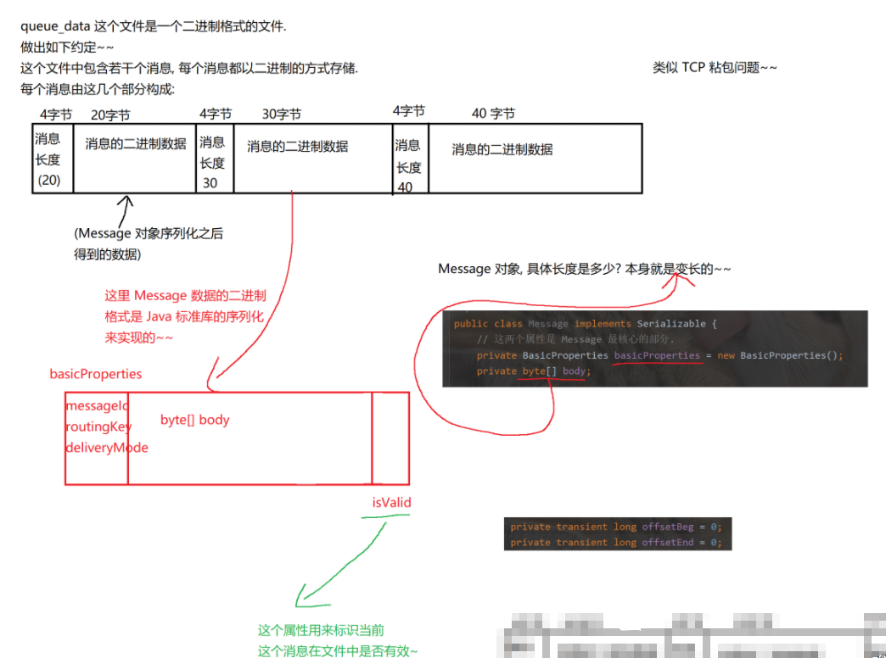

> **对于isValid:**
>
> 对于BrokerServer来说，消息是需要新增的，也需要删除的。生产者生产一个消息过来，就得新增这个消息，消费者把这个消息消费掉，这个消息就得删除。
>
> 新增和删除对于内存中来说是一个简单的事情（直接使用一些集合类）
>
> 但是在文件中就不好办了
>
> - 新增消息可以直接把新的消息追加到文件的末尾，
> - 删除消息(不好办)文件可以视为一个"顺序表"这样的结构，如果直接删除中间元素，就需要涉及到类似于“顺序表搬运”这样的操作效率是非常低的，因此这种搬运的的方式删除是不合适的。
>
> 因此逻辑删除的方式是比较合适的：
>
> - isValid为1，是有效消息
> - isValid为0，是无效消息(已经被标记删除了)
>
> 但是随着时间的推移，这个消息文件可能会越来越大，并且这里可能大部分都是无效消息
>
> 针对这种情况，就需要考虑对当前的消息数据文件，进行垃圾回收
>

每个 Message 基于 Java 标准库的 ObjectInputStream / ObjectOutputStream 序列化.

Message 对象中的 offsetBeg 和 offsetEnd 正是用来描述每个消息体所在的位置.

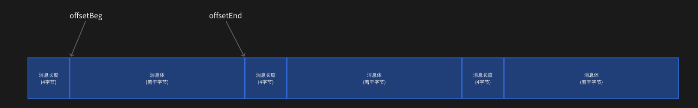

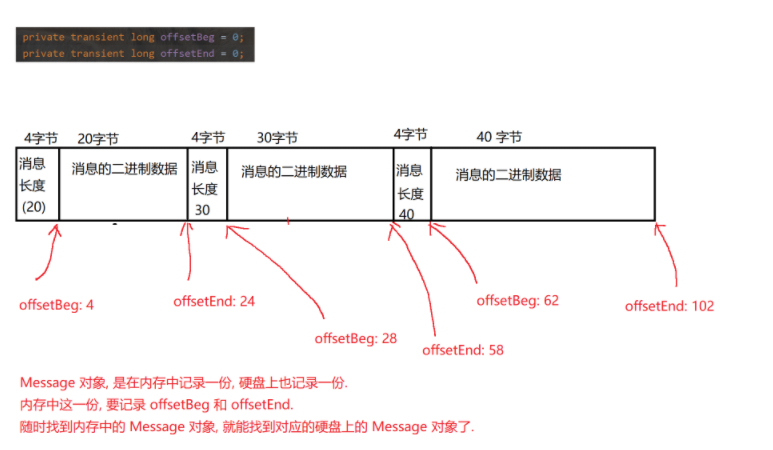

queue_stat.txt  文件格式:

使用文本方式存储.

文件中只包含一行, 里面包含两列(都是整数), 使用 \t 分割.

第一列表示当前总的消息数目. 第二列表示有效消息数目.

形如:

2000\t1500

创建 MessageFileManager 类

创建 mqserver.database.MessageFileManager

```java
public class MessageFileManager {

   // 表示消息的统计信息

    static public class Stat {

        public int totalCount;

        public int validCount;

    }

    public void init() {

        // 当前这里不需要做任何工作.

    }

    // 队列目录

    private String getQueueDir(String queueName) {

        return "./data/" + queueName;

    }

    // 队列数据文件

   // 这个文件来存储队列的真实数据

    private String getQueueDataPath(String queueName) {

        return getQueueDir(queueName) + "/queue_data.txt";

    }

    // 队列统计文件

    // 这个文件用来存储队列中的统计信息.

    // 包含一行, 两个列使用 \t 分割, 分别是总数据, 和无效数据.

    private String getQueueStatPath(String queueName) {

        return getQueueDir(queueName) + "/queue_stat.txt";

    }

}
```

- 内部包含一个 Stat 类, 用来表示消息统计文件的内容.

- getQueueDir, getQueueDataPath, getQueueStatPath 用来表示这几个文件所在位置.

实现统计文件读写

这是后续操作的一项准备工作.

// 从统计文件中读取结果

```java
private Stat readStat(String queueName) {

    Stat stat = new Stat();

    try (InputStream inputStream = new

FileInputStream(getQueueStatPath(queueName))) {

        Scanner scanner = new Scanner(inputStream);

        stat.totalCount = scanner.nextInt();

        stat.validCount = scanner.nextInt();

        return stat;

    } catch (IOException e) {

        e.printStackTrace();

    }

    return null;

}

// 向统计文件中写入结果

private void writeStat(String queueName, Stat stat) {

    try (OutputStream outputStream = new

FileOutputStream(getQueueStatPath(queueName))) {

        PrintWriter printWriter = new PrintWriter(outputStream);

        printWriter.write(stat.totalCount + "\t" + stat.validCount);

        printWriter.flush();

    } catch (IOException e) {

       e.printStackTrace();

   }

}
```

直接使用 Scanner 和 PrintWriter 进行读写即可.

实现创建队列目录

每个队列都有自己的目录和配套的文件. 通过下列方法把目录和文件先准备好.

```java
public void createQueueFiles(String queueName) throws IOException {

   // 1. 创建目录指定队列的目录

    File baseDir = new File(getQueueDir(queueName));

    if (!baseDir.exists()) {

        boolean ok = baseDir.mkdirs();

        if (!ok) {

            throw new IOException("创建目录失败! baseDir=" +

baseDir.getAbsolutePath());

       }

   }

   // 2. 创建队列数据文件

    File queueDataFile = new File(getQueueDataPath(queueName));

    if (!queueDataFile.exists()) {

        boolean ok = queueDataFile.createNewFile();

        if (!ok) {

            throw new IOException("创建文件失败! queueDataFile=" +

queueDataFile.getAbsolutePath());

       }

   }

   // 3. 创建队列统计文件

    File queueStatFile = new File(getQueueStatPath(queueName));

    if (!queueStatFile.exists()) {

        boolean ok = queueStatFile.createNewFile();

        if (!ok) {

            throw new IOException("创建文件失败! queueStatFile=" +

queueStatFile.getAbsolutePath());

       }

   }

   // 4. 给队列统计文件写入初始数据

    Stat stat = new Stat();

    stat.totalCount = 0;

    stat.validCount = 0;

    writeStat(queueName, stat);

}
```

把上述约定的文件都创建出来, 并对消息统计文件进行初始化.

初始化 0\t0  这样的初始值.

实现删除队列目录

如果队列需要删除, 则队列对应的目录/文件也需要删除.

```java
public void destroyQueueFiles(String queueName) throws IOException {

   // 1. 先删除目录中的文件

    File queueDataFile = new File(getQueueDataPath(queueName));

    boolean ok1 = queueDataFile.delete();

    File queueStatFile = new File(getQueueStatPath(queueName));

    boolean ok2 = queueStatFile.delete();

    // 2. 再删除目录. delete 要求必须是空目录才能删除.

    File baseDir = new File(getQueueDir(queueName));

    boolean ok3 = baseDir.delete();

    if (!ok1 || !ok2 || !ok3) {

        throw new IOException("删除队列目录失败! baseDir=" +

baseDir.getAbsolutePath());

   }

}
```

注意: File 类的 delete 方法只能删除空目录. 因此需要先把内部的文件先删除掉.

检查队列文件是否存在

判定该队列的消息文件和统计文件是否存在. 一旦出现缺失, 则不能进行后续工作.

```java
private boolean checkFilesExists(String queueName) {

   File queueData = new File(getQueueDataPath(queueName));

   if (!queueData.exists()) {

       return false;

   }

   File queueStat = new File(getQueueStatPath(queueName));

   if (!queueStat.exists()) {

       return false;

   }

   return true;

}
```

实现消息对象序列化/反序列化

Message 对象需要转成二进制写入文件. 并且也需要把文件中的二进制读出来解析成 Message 对象. 此处针对这里的逻辑进行封装.

> 这是由于Message里面存储的body部分是二进制数据，不方便使用JSON进行序列化，JSON序列化的结果是文本数据，无法存储二进制
>
> - JSON格式中有很多特殊符号 ,:"{} 这些符号会影响JSON格式的解析，如果存文本，那么键值对中就不会包含上述特殊符号
> - 如果存二进制那就存在不确定的情况，如果某一个二进制字节正好就好上述特殊符号的ASCII码一样了，此时就会引起JSON解析的格式错误
>   - 如果实在要使用JSON表示二进制数据那就可以针对二进制数据进行base64编码(base64作用就是用4个字节，表示3个字节的信息,会保证4个字节都是使用文本字符【相当于把二进制数据转成文本了】)
>     - 但是base64这种方案效率低，有额外的转码开销，同时还会使空间变大

创建 common.BinaryTool

> 针对于二进制序列化此处使用Java标准库中的：ObjectInputStream 和 OBJectOutputStream

```java
public class BinaryTool {

   public static Object fromBytes(byte[] data) throws IOException,

ClassNotFoundException {

       Object object = null;

       ByteArrayInputStream byteArrayInputStream = new

ByteArrayInputStream(data);

       try (ObjectInputStream objectInputStream = new

ObjectInputStream(byteArrayInputStream)) {

           object = objectInputStream.readObject();

       }

       return object;

   }

   public static byte[] toBytes(Object object) throws IOException {

       ByteArrayOutputStream byteArrayOutputStream = new

ByteArrayOutputStream();

       try (ObjectOutputStream objectOutputStream = new

ObjectOutputStream(byteArrayOutputStream)) {

           objectOutputStream.writeObject(object);

       }

       return byteArrayOutputStream.toByteArray();

   }

}
```

- 使用 ByteArrayInputStream / ByteArrayOutputStream 针对 byte[] 进行封装, 方便后续操作. (这

两个流对象是纯内存的, 不需要进行 close).

- 使用 ObjectInputStream / ObjectOutputStream 进行序列化 / 反序列化操作. 通过内部的

readObject / writeObject 即可完成对应操作.

- 此处涉及到的序列化对象, 需要实现 Serializable 接口. 这一点咱们的 Message 对象已经实现过了.

对于 serialVersionUID , 此处咱们暂时不需要. 大家可以自行了解 serialVersionUID 的用途

实现写入消息文件

```java
public void sendMessage(MSGQueue queue, Message message) throws MqException,

IOException {

   if (!checkFilesExists(queue.getName())) {

       throw new MqException("[MessageFileManager] 队列匹配的文件不存在!

queueName=" + queue.getName());

   }

   // 1. 先把 message 转成二进制

    byte[] messageBinary = BinaryTool.toBytes(message);

    // 此处的锁对象以队列为维度. 不同队列之间不涉及锁冲突.

    synchronized (queue) {

        // 2. 先获取到文件总长度

        File queueDataFile = new File(getQueueDataPath(queue.getName()));

        message.setOffsetBeg(queueDataFile.length() + 4);

        message.setOffsetEnd(queueDataFile.length() + 4 +

messageBinary.length);

        // 3. 写入消息数据文件

        try (OutputStream outputStream = new FileOutputStream(queueDataFile,

true)) {

            DataOutputStream dataOutputStream = new

DataOutputStream(outputStream);

            // 先写入消息长度

            dataOutputStream.writeInt(messageBinary.length);

            // 再写入消息本体

            dataOutputStream.write(messageBinary);

        }

        // 4. 写入消息统计文件

        Stat stat = readStat(queue.getName());

        stat.totalCount += 1;

        stat.validCount += 1;

        writeStat(queue.getName(), stat);

    }

}
```

- 考虑线程安全, 按照队列维度进行加锁.

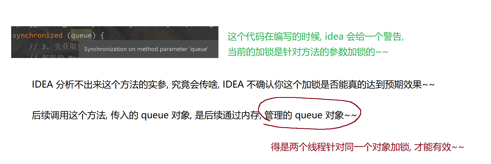

- 使用 DataOutputStream 进行二进制写操作. 比原生 OutputStream 要方便.

- 需要记录 Message 对象在文件中的偏移量. 后续的删除操作依赖这个偏移量定位到消息. offsetBeg

是原有文件大小的基础上, 再 + 4. 4 个字节是存放消息大小的空间. (参考上面的图).

- 写完消息, 要同时更新统计信息.

创建 common.MqException , 作为自定义异常类. 后续业务上出现问题, 都统一抛出这个异常.

实践中创建多个异常类, 分别表示不同异常种类是更好的做法. 此处我们只是偷懒了.

```java
public class MqException extends Exception {

   public MqException(String message) {

       super(message);

   }

}
```

实现删除消息

此处的删除只是 "逻辑删除", 即把 Message 类中的 isValid 字段设置为 0.

这样删除速度比较快. 实际的彻底删除, 则通过我们自己实现的 GC 来解决.

// 把文件上的对应消息给删除掉. (标记成无效)

```java
public void deleteMessage(MSGQueue queue, Message message) throws IOException,

ClassNotFoundException {

    synchronized (queue) {

        try (RandomAccessFile randomAccessFile = new

RandomAccessFile(getQueueDataPath(queue.getName()), "rw")) {

            // 1. 先从文件中读取出 Message 的数据

            byte[] bufferSrc = new byte[(int) (message.getOffsetEnd() -

message.getOffsetBeg())];

            randomAccessFile.seek(message.getOffsetBeg());

            randomAccessFile.read(bufferSrc);

            // 2. 转成 Message 对象

            Message diskMessage = (Message) BinaryTool.fromBytes(bufferSrc);

            // 3. 设置成无效.

            diskMessage.setIsValid((byte)0x0);

            // 4. 重新写入文件

            byte[] bufferDest = BinaryTool.toBytes(diskMessage);

            randomAccessFile.seek(message.getOffsetBeg());

            randomAccessFile.write(bufferDest);

        }

        // 更新统计文件

        Stat stat = readStat(queue.getName());

        if (stat.validCount > 0) {

            stat.validCount -= 1;

        }

        writeStat(queue.getName(), stat);

    }

}
```

- 使用 RandomAccessFile 来随机访问到文件的内容.

- 根据 Message 中的 offsetBeg 和 offsetEnd 定位到消息在文件中的位置. 通过randomAccessFile.seek 操作文件指针偏移过去. 再读取.

- 读出的结果解析成 Message 对象, 修改 isValid 字段, 再重新写回文件. 注意写的时候要重新设定文

件指针的位置. 文件指针会随着上述的读操作产生改变.

- 最后, 要记得更新统计文件, 把合法消息 - 1.

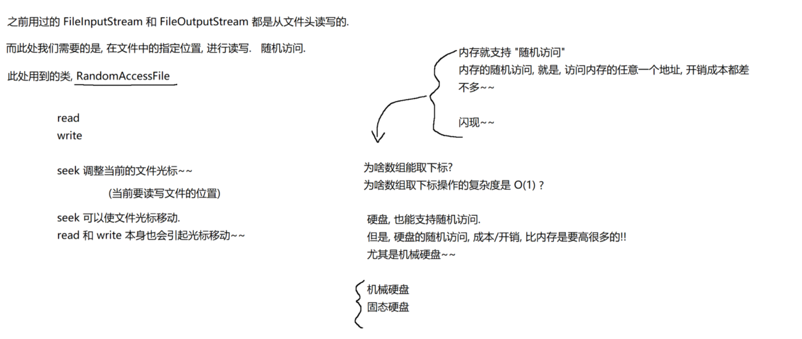

实现消息加载

把消息内容从文件加载到内存中. 这个功能在服务器重启, 和垃圾回收的时候都很关键.

// 从消息数据文件中读取出所有消息

```java
public LinkedList<Message> loadAllMessageFromQueue(String queueName) throws

MqException, IOException, ClassNotFoundException {

    // 记录当前读到的数据在文件的 offset

    long currentOffset = 0;

    LinkedList<Message> messages = new LinkedList<>();

    try (InputStream inputStream = new

FileInputStream(getQueueDataPath(queueName))) {

        DataInputStream dataInputStream = new DataInputStream(inputStream);

        while (true) {

            // 读到文件末尾, 会触发 EOFException

            int messageSize = dataInputStream.readInt();

            byte[] buffer = new byte[messageSize];

            int actualSize = dataInputStream.read(buffer);

            if (messageSize != actualSize) {

                throw new MqException("[MessageFileManager] 文件格式错误!

queueName=" + queueName);

           }

           Message message = (Message) BinaryTool.fromBytes(buffer);

           if (message.getIsValid() != 0x1) {

               // 被删除的无效数据, 直接跳过. 不要忘记更新 currentOffset

                currentOffset += 4 + messageSize;

                continue;

            }

            // 计算该 message 的 offset

            message.setOffsetBeg(currentOffset + 4);

            message.setOffsetEnd(currentOffset + 4 + messageSize);

            // 每个消息, 开头 4 个字节保存的是消息的长度. 接下来 [offsetBeg,
```

offsetEnd) 是消息体

            currentOffset += 4 + messageSize;
    
            messages.add(message);
    
        }
    
    } catch (EOFException e) {
    
       // 数据读取完毕, 循环正常退出!
    
        System.out.println("[MessageFileManager] 恢复 Message 数据完成!");

   }

   return messages;

}

- 使用 DataInputStream 读取数据. 先读 4 个字节为消息的长度, 然后再按照这个长度来读取实际消

息内容.

- 读取完毕之后, 转换成 Message 对象.

- 同时计算出该对象的 offsetBeg 和 offsetEnd.

- 最终把结果整理成链表, 返回出去.

- 注意, 对于 DataInputStream 来说, 如果读取到 EOF, 会抛出一个 EOFException , 而不是返回特定

值. 因此需要注意上述循环的结束条件.

实现垃圾回收(GC)

上述删除操作, 只是把消息在文件上标记成了无效. 并没有腾出硬盘空间. 最终文件大小可能会越积越多. 因此需要定期的进行批量清除.

此处使用类似于复制算法. 当总消息数超过 2000, 并且有效消息数目少于 50% 的时候, 就触发 GC.

> 复制算法比较适用的前提是，当前的空间里有效的数据不多，大部分都是无效垃圾。
>
> 以上的数值的设计都是“拍脑门”想出来了的，对于算法的参数的设计一个关注的是策略，思想和方法，而不是具体的数值，简而言之就是根据实际场景进行灵活的调整

> **垃圾回收的补充和扩展**
>
> 如果某个队列中，消息特别多，而且这些都是有效消息，此时就会导致整个消息的数据文件特别大，后续针对这个文件的各种操作，成本就会上升很多(文件的体积越大，执行GC时的耗时就会非常高)
>
> - 对于RabbitMQ来说，把一个大的文件拆分成一个若干的小文件
>   - 文件拆分：当单单个文件长度达到一定阈值之后，就会拆分成两个文件(越拆越多~)
>   - 文件合并：每个单独的文件都会进行GC，如果GC之后发现文件小了很多，就看会和相邻的其他相邻的文件进行合并
>
> 这样的做法就可以在消息特别多的时候，保证性能上及时响应。
>
> 实现的参考思路：
>
> 1. 需要专门的数据结构，来存储当前队列中有多少数据文件，每个数据文件大小是多少，消息数目是多少，无效消息是多少
> 2. 设计策略，什么时候出发文件的拆分，什么时候触发合并

GC 的时候会把所有有效消息加载出来, 写入到一个新的消息文件中, 使用新文件, 代替旧文件即可.

// 检查是否要针对文件进行 GC 操作

```java
public boolean checkGC(String queueName) {

    Stat stat = readStat(queueName);

    if (stat.totalCount >= 2000 && (double)stat.validCount / (double)

stat.totalCount <= 0.5) {

        return true;

    }

    return false;

}

private String getQueueDataNewPath(String queueName) {

    return getQueueDir(queueName) + "/queue_data_new.txt";

}

// 真正执行 GC 操作

// 使用复制算法.

// 先创建一个新的文件, 名字为 "queue_data_new.txt"

// 然后加载出旧的文件的所有有效消息内容

// 把这些内容写入到新的文件中.

// 删除旧文件, 对新文件重命名.

public void gc(MSGQueue queue) throws MqException, IOException,

ClassNotFoundException {

    synchronized (queue) {

        long gcBeg = System.currentTimeMillis();

        // 1. 创建一个新的文件, 名字为 "queue_data_new.txt"

        File queueDataNew = new File(getQueueDataNewPath(queue.getName()));

        if (queueDataNew.exists()) {

            throw new MqException("[MessageFileManager] gc 时发现队列新数据文件已
```

经存在! queueName=" + queue.getName());

       }
    
       boolean ok = queueDataNew.createNewFile();
    
       if (!ok) {
    
           throw new IOException("创建文件失败! queueDataNew=" +

queueDataNew.getAbsolutePath());

       }
    
       // 2. 遍历旧文件, 读取出每个对象 (只保留有效消息)
    
        List<Message> messageList = loadAllMessageFromQueue(queue.getName());
    
        // 3. 把有效消息写入到新的文件中.
    
        try (OutputStream outputStream = new FileOutputStream(queueDataNew)) {
    
            DataOutputStream dataOutputStream = new

DataOutputStream(outputStream);

            for (Message message : messageList) {
    
                byte[] buffer = BinaryTool.toBytes(message);
    
                dataOutputStream.writeInt(buffer.length);
    
                dataOutputStream.write(buffer);
    
            }
    
        }
    
        // 4. 删除 queue_data.txt, 把 queue_data_new.txt 重命名为 queue_data
    
        File queueDataOld = new File(getQueueDataPath(queue.getName()));
    
        ok = queueDataOld.delete();
    
        if (!ok) {
    
            throw new IOException("删除文件失败! queueDataOld=" +

queueDataOld.getAbsolutePath());

       }
    
       ok = queueDataNew.renameTo(queueDataOld);
    
       if (!ok) {
    
           throw new IOException("文件重命名失败! queueDataOld=" +

queueDataOld.getAbsolutePath() +

                   ", queueDataNew=" + queueDataNew.getAbsolutePath());
    
       }
    
       // 5. 更新统计文件
    
        Stat stat = readStat(queue.getName());
    
        stat.validCount = messageList.size();
    
        stat.totalCount = messageList.size();
    
        writeStat(queue.getName(), stat);
    
       long gcEnd = System.currentTimeMillis();
    
       System.out.println("[MessageFileManager] gc 执行完毕! queueName=" +

queue.getName() + ", time=" + (gcEnd - gcBeg) + "ms");

   }

}

如果文件很大, 消息非常多, 可能比较低效, 这种就需要把文件做拆分和合并了.

Rabbitmq 本体是这样实现的. 但是咱们此处为了实现简单, 就不做这个了.

测试 MessageFileManager

创建 MessageFileManagerTests  编写测试用例代码.

- 创建两个队列, 用来辅助测试.

- 使用 ReflectionTestUtils.invokeMethod  来调用私有方法.

```java
@SpringBootTest

public class MessageFileManagerTests {

   private String queueName1 = "testQueue1";

   private String queueName2 = "testQueue2";

   private MessageFileManager messageFileManager = new MessageFileManager();

   @BeforeEach

   public void setUp() throws IOException {

       messageFileManager.createQueueFiles(queueName1);

       messageFileManager.createQueueFiles(queueName2);

   }

   @AfterEach

   public void tearDown() throws IOException {

       messageFileManager.destroyQueueFiles(queueName1);

       messageFileManager.destroyQueueFiles(queueName2);

   }

}

@Test

public void testCreateFile() {

   File queueDataFile1 = new File("./data/" + queueName1 + "/queue_data.txt");

   Assertions.assertEquals(true, queueDataFile1.isFile());

   File queueStatFile1 = new File("./data/" + queueName1 + "/queue_stat.txt");

   Assertions.assertEquals(true, queueStatFile1.isFile());

   Assertions.assertTrue(queueStatFile1.length() > 0);

   File queueDataFile2 = new File("./data/" + queueName2 + "/queue_data.txt");

   Assertions.assertEquals(true, queueDataFile2.isFile());

   File queueStatFile2 = new File("./data/" + queueName2 + "/queue_stat.txt");

   Assertions.assertEquals(true, queueStatFile2.isFile());

   Assertions.assertTrue(queueStatFile2.length() > 0);

}

@Test

public void testReadWriteStat() {

   MessageFileManager.Stat stat = new MessageFileManager.Stat();

   stat.totalCount = 100;

   stat.validCount = 50;

   // 通过 Spring 提供的反射工具类, 调用私有方法.

    ReflectionTestUtils.invokeMethod(messageFileManager, "writeStat",

queueName1, stat);

    MessageFileManager.Stat newStat =

ReflectionTestUtils.invokeMethod(messageFileManager, "readStat", queueName1);

    Assertions.assertEquals(100, newStat.totalCount);

    Assertions.assertEquals(50, newStat.validCount);

}

private MSGQueue createTestQueue(String queueName) {

    MSGQueue queue = new MSGQueue();

    queue.setName(queueName);

    queue.setDurable(true);

    queue.setAutoDelete(true);

    queue.setExclusive(true);

    HashMap<String, Object> hashMap = new HashMap<>();

    hashMap.put("aaa", "111");

    hashMap.put("bbb", "222");

    queue.setArguments(hashMap);

    return queue;

}

private Message createTestMessage(String content) {

    Message message = new Message();

    message.setMessageId("M-" + UUID.randomUUID().toString());

    message.setRoutingKey("testRoutingKey");

    message.setDeliveryMode(2);

    message.setBody(content.getBytes());

    return message;

}

@Test

public void testSendMessage() throws IOException, MqException,

ClassNotFoundException {

   Message message = createTestMessage("testMessage");

   MSGQueue queue = createTestQueue(queueName1);

   messageFileManager.sendMessage(queue, message);

   // 检查 stat 文件

    MessageFileManager.Stat newStat =

ReflectionTestUtils.invokeMethod(messageFileManager, "readStat", queueName1);

    Assertions.assertEquals(1, newStat.totalCount);

    Assertions.assertEquals(1, newStat.validCount);

    // 读文件内容

    List<Message> messageList =

messageFileManager.loadAllMessageFromQueue(queueName1);

    Assertions.assertEquals(1, messageList.size());

    Message curMessage = messageList.get(0);

    Assertions.assertEquals(message.getMessageId(), curMessage.getMessageId());

    Assertions.assertEquals(message.getRoutingKey(),

curMessage.getRoutingKey());

    Assertions.assertEquals(message.getDeliveryMode(),

curMessage.getDeliveryMode());

    Assertions.assertArrayEquals(message.getBody(), curMessage.getBody());

}

@Test

public void testLoadAllMessageFromQueue() throws IOException, MqException,

ClassNotFoundException {

    MSGQueue queue = createTestQueue(queueName1);

    List<Message> expectedMessages = new ArrayList<>();

    for (int i = 0; i < 100; i++) {

        Message message = createTestMessage("testMessage");

        messageFileManager.sendMessage(queue, message);

        expectedMessages.add(message);

    }

    List<Message> actualMessages =

messageFileManager.loadAllMessageFromQueue(queueName1);

    Assertions.assertEquals(100, actualMessages.size());

    for (int i = 0; i < 100; i++) {

        Message expectedMessage = actualMessages.get(i);

        Message actualMessage = actualMessages.get(i);

        System.out.println("[" + i + "] " + actualMessage);

        Assertions.assertEquals(expectedMessage.getMessageId(),

actualMessage.getMessageId());

        Assertions.assertEquals(expectedMessage.getRoutingKey(),

actualMessage.getRoutingKey());

       Assertions.assertEquals(expectedMessage.getDeliveryMode(),

actualMessage.getDeliveryMode());

       Assertions.assertArrayEquals(expectedMessage.getBody(),

actualMessage.getBody());

       Assertions.assertEquals(0x1, actualMessage.getIsValid());

   }

}

@Test

public void testDeleteMessage() throws IOException, MqException,

ClassNotFoundException {

   MSGQueue queue = createTestQueue(queueName1);

   List<Message> expectedMessages = new ArrayList<>();

   for (int i = 0; i < 10; i++) {

       Message message = createTestMessage("testMessage");

       messageFileManager.sendMessage(queue, message);

       expectedMessages.add(message);

   }

   System.out.println("expected:" + expectedMessages);

   messageFileManager.deleteMessage(queue, expectedMessages.get(0));

   messageFileManager.deleteMessage(queue, expectedMessages.get(1));

   messageFileManager.deleteMessage(queue, expectedMessages.get(2));

   // 读出来, 这个方法只能加载有效数据.

    List<Message> actualMessages =

messageFileManager.loadAllMessageFromQueue(queueName1);

    System.out.println("actual: " + actualMessages);

    Assertions.assertEquals(7, actualMessages.size());

    for (int i = 0; i < actualMessages.size(); i++) {

        Assertions.assertEquals(expectedMessages.get(i + 3).getMessageId(),

actualMessages.get(i).getMessageId());

    }

}

@Test

public void testGc() throws IOException, MqException, ClassNotFoundException {

    MSGQueue queue = createTestQueue(queueName1);

    List<Message> expectedMessages = new ArrayList<>();

    // 创建 100 个元素

    for (int i = 0; i < 100; i++) {

        Message message = createTestMessage("testMessage");

        messageFileManager.sendMessage(queue, message);

        expectedMessages.add(message);

    }

    // 删除 偶数 下标的元素

    for (int i = 0; i < 100; i += 2) {

       messageFileManager.deleteMessage(queue, expectedMessages.get(i));

   }

   // 获取旧文件大小

    File oldFile = new File("./data/" + queueName1 + "/queue_data.txt");

    long oldLength = oldFile.length();

    // 调用 gc

    messageFileManager.gc(queue);

    // 重新读文件

    List<Message> actualMessages =

messageFileManager.loadAllMessageFromQueue(queueName1);

    Assertions.assertEquals(50, actualMessages.size());

    for (int i = 0; i < 50; i++) {

        // 注意这里的下标换算

        Assertions.assertEquals(expectedMessages.get(2 * i +
```

### 1).getMessageId(), actualMessages.get(i).getMessageId());

    }
    
    // 获取新文件大小
    
    File newFile = new File("./data/" + queueName1 + "/queue_data.txt");
    
    long newLength = newFile.length();
    
    System.out.println("oldLength=" + oldLength);
    
    System.out.println("newLength=" + newLength);
    
    Assertions.assertTrue(oldLength > newLength);

}

## 八. 整合数据库和文件

上述代码中, 使用数据库存储了 Exchange, Queue, Binding, 使用文本文件存储了 Message.

接下来我们把两个部分整合起来, 统一进行管理.

创建 DiskDataCenter

使用 DiskDataCenter 来综合管理数据库和文本文件的内容.

DiskDataCenter 会持有 DataBaseManager 和 MessageFileManager 对象.

// 管理硬盘上的数据.

// 分成两个部分:

// 1. 数据库管理元信息

// 2. 文件管理消息内容

```java
public class DiskDataCenter {

    private String virtualHostName;

   // 管理数据库中的元数据

    private DataBaseManager dataBaseManager = new DataBaseManager();

    // 管理文件中的消息数据

    private MessageFileManager messageFileManager = new MessageFileManager();

    public void init(String virtualHostName) {

        this.virtualHostName = virtualHostName;

        initDir();

        dataBaseManager.init();

        messageFileManager.init();

    }

}
```

实现 initDir

// 初始化目录结构

// virtualHostName 为 default-VirtualHost

// 则存放数据的目录名为: ./data/default-VirtualHost/

```java
private void initDir() {

    File baseDir = new File("./data/" + virtualHostName);

    if (!baseDir.exists()) {

        boolean ok = baseDir.mkdirs();

        if (ok) {

            System.out.println("[DiskDataCenter] 初始化数据目录完成!");

       } else {

           System.out.println("[DiskDataCenter] 初始化数据目录失败!");

       }

   } else {

       System.out.println("[DiskDataCenter] 数据目录已经存在!");

   }

}
```

封装 Exchange 方法

```java
public void insertExchange(Exchange exchange) {

   dataBaseManager.insertExchange(exchange);

}

public void deleteExchange(String exchangeName) {

   dataBaseManager.deleteExchange(exchangeName);

}

public List<Exchange> selectAllExchanges() {

   return dataBaseManager.selectAllExchanges();

}
```

封装 Queue 方法

```java
public void insertQueue(MSGQueue queue) throws IOException {

   dataBaseManager.insertQueue(queue);

   messageFileManager.createQueueFiles(queue.getName());

}

public void deleteQueue(String queueName) throws IOException {

   dataBaseManager.deleteQueue(queueName);

   messageFileManager.destroyQueueFiles(queueName);

}

public List<MSGQueue> selectAllQueues() {

   return dataBaseManager.selectAllQueues();

}
```

- 创建/删除队列的时候同时创建/删除队列目录.

封装 Binding 方法

```java
public void insertBinding(Binding binding) {

   dataBaseManager.insertBinding(binding);

}

public void deleteBinding(Binding binding) {

   dataBaseManager.deleteBinding(binding);

}

public List<Binding> selectAllBindings() {

   return dataBaseManager.selectAllBindings();

}
```

封装 Message 方法

```java
public void sendMessage(MSGQueue queue, Message message) throws MqException,

IOException {

   messageFileManager.sendMessage(queue, message);

}

public void deleteMessage(MSGQueue queue, Message message) throws MqException,

IOException, ClassNotFoundException {

   messageFileManager.deleteMessage(queue, message);

   // 判定是否要 GC

    if (messageFileManager.checkGC(queue.getName())) {

        messageFileManager.gc(queue);

    }

}

public LinkedList<Message> loadAllMessageFromQueue(String queueName) throws

MqException, IOException, ClassNotFoundException {

    return messageFileManager.loadAllMessageFromQueue(queueName);

}
```

- 在 deleteMessage 的时候判定是否进行 GC.

小结

通过上述封装, 把数据库和硬盘文件两部分合并成一个整体. 上层代码在调用的时候则不再关心该数据

是存储在哪个部分的.

这个类的整体实现并不复杂, 关键逻辑在之前都已经准备好了.

该类我们就不单独进行单元测试了. 同学们可以自行完成.

## 九. 内存数据结构设计

硬盘上存储数据, 只是为了实现 "持久化" 这样的效果. 但是实际的消息存储/转发, 还是主要靠内存的结

构.

对于 MQ 来说, 内存部分是更关键的, 内存速度更快, 可以达成更高的并发.

创建 MemoryDataCenter

创建 mqserver.datacenter.MemoryDataCenter

// 管理所有的内存数据.

```java
public class MemoryDataCenter {

    // key 是 exchangeName

    private ConcurrentHashMap<String, Exchange> exchangeMap = new

ConcurrentHashMap<>();

    // key 是 queueName

    private ConcurrentHashMap<String, MSGQueue> queueMap = new

ConcurrentHashMap<>();

    // 第一个 key 是 exchangeName, 第二个 key 是 queueName

    private ConcurrentHashMap<String, HashMap<String, Binding>> bindingsMap =

new ConcurrentHashMap<>();

    // 保存所有消息, key 是 messageId

    private ConcurrentHashMap<String, Message> messageMap = new

ConcurrentHashMap<>();

    // key 是 queueName

    private ConcurrentHashMap<String, LinkedList<Message>> queueMessageMap =

new ConcurrentHashMap<>();

    // 用来存放待确认的消息

    // key1 是 queueName, key2 是 messageId.

    // 这个结构不需要有对应的硬盘数据. 换句话说, 如果某个消息消费了, 但是没有 ack, 这个
```

时候 broker 宕机了, 那么重启 broker 之后

    // 就把刚才的消息当做从来没消费过.
    
    private ConcurrentHashMap<String, HashMap<String, Message>>

queueMessageWaitAck = new ConcurrentHashMap<>();

```java
    public void init() {

    }

}
```

- 使用四个哈希表, 管理 Exchange, Queue, Binding, Message.

- 使用一个哈希表 + 链表管理 队列 -> 消息 之间的关系.

- 使用一个哈希表 + 哈希表管理所有的未被确认的消息.

为了保证消息被正确消费了, 会使用两种方式进行确认. 自动 ACK 和 手动 ACK.

其中自动 ACK 是指当消息被消费之后, 就会立即被销毁释放.

其中手动 ACK 是指当消息被消费之后, 由消费者主动调用一个 basicAck 方法, 进行主动确认. 服务器

收到这个确认之后, 才能真正销毁消息.

此处的 "未确认消息" 就是指在手动 ACK 模式下, 该消息还没有被调用 basicAck. 此时消息不能删除,

但是要和其他未消费的消息区分开. 于是另搞了个结构.

当后续 basicAck 到了, 就可以删除消息了.

封装 Exchange 方法

```java
public void insertExchange(Exchange exchange) {

   exchangeMap.put(exchange.getName(), exchange);

}

public Exchange getExchange(String exchangeName) {

   return exchangeMap.get(exchangeName);

}

public void deleteExchange(String exchangeName) {

   exchangeMap.remove(exchangeName);

}
```

封装 Queue 方法

```java
public void insertQueue(MSGQueue queue) {

   queueMap.put(queue.getName(), queue);

}

public MSGQueue getQueue(String queueName) {

   return queueMap.get(queueName);

}

public void deleteQueue(String queueName) {

   queueMap.remove(queueName);

}
```

封装 Binding 方法

```java
public void insertBinding(Binding binding) throws MqException {

   HashMap<String, Binding> bindingMap =

bindingsMap.computeIfAbsent(binding.getExchangeName(), k -> new HashMap<>());

   synchronized (bindingMap) {

       // 不存在就创建一份

        if (bindingMap.get(binding.getQueueName()) != null) {

            throw new MqException("[MemoryDataCenter] 绑定已经存在!

exchangeName=" + binding.getExchangeName()

                   + ", queueName=" + binding.getQueueName());

       }

       bindingMap.put(binding.getQueueName(), binding);

   }

}

public Binding getBinding(String queueName, String exchangeName) {

   HashMap<String, Binding> bindingMap = bindingsMap.get(exchangeName);

   if (bindingMap == null) {

       return null;

   }

   synchronized (bindingMap) {

       return bindingMap.get(queueName);

   }

}

public void deleteBinding(Binding binding) throws MqException {

   HashMap<String, Binding> bindingMap =

bindingsMap.get(binding.getExchangeName());

   if (bindingMap == null) {

       throw new MqException("[MemoryDataCenter] 绑定不存在! exchangeName=" +

binding.getExchangeName()

               + ", queueName=" + binding.getQueueName());

   }

   synchronized (bindingMap) {

       Binding toDelete = bindingMap.get(binding.getQueueName());

       if (toDelete == null) {

           throw new MqException("[MemoryDataCenter] 绑定不存在! exchangeName="

+ binding.getExchangeName()

                   + ", queueName=" + binding.getQueueName());

       }

       bindingMap.remove(binding.getQueueName());

   }

}

public Map<String, Binding> getBindingsByExchange(String exchangeName) {

   return bindingsMap.get(exchangeName);

}
```

封装 Message 方法

// 查询指定的消息

```java
public Message getMessage(String messageId) {

    return messageMap.get(messageId);

}

// 向消息中心中添加消息

public void addMessage(Message message) {

    messageMap.put(message.getMessageId(), message);

    System.out.println("[MemoryCenter] 新消息被添加! messageId=" +

message.getMessageId());

}

// 从消息中心删除消息

public void removeMessage(String messageId) {

    messageMap.remove(messageId);

    System.out.println("[MemoryCenter] 消息被彻底删除! messageId=" + messageId);

}

// 发送消息到指定队列中

public void sendMessage(MSGQueue queue, Message message) {

    List<Message> messageList =

queueMessageMap.computeIfAbsent(queue.getName(), k -> new LinkedList<>());

    synchronized (messageList) {

        messageList.add(message);

    }

    // 如果消息已经存在, 重复调用也没啥大不了的.

    addMessage(message);

    System.out.println("[MemoryCenter] 消息被投递到队列中! messageId=" +

message.getMessageId() + ", queueName=" + queue.getName());

}

// 从指定队列中取消息.

public Message pollMessage(String queueName) throws MqException {

    List<Message> messageList = queueMessageMap.get(queueName);

    if (messageList == null) {

        throw new MqException("[MemoryDataCenter] 队列不存在! queueName=" +

queueName);

   }

   synchronized (messageList) {

       if (messageList.size() == 0) {

           return null;

       }

       // 出队列头元素

        Message currentMessage = messageList.remove(0);

        System.out.println("[MemoryCenter] 消息从队列中取出! messageId=" +

currentMessage.getMessageId() + ", queueName=" + queueName);

       return currentMessage;

   }

}

public int getMessageCount(String queueName) throws MqException {

   List<Message> messageList = queueMessageMap.get(queueName);

   if (messageList == null) {

       // 如果队列不存在, 则直接返回长度 0, 说明该 queueName 下还没有消息.

        return 0;

    }

    synchronized (messageList) {

        return messageList.size();

    }

}
```

针对未确认的消息的处理

// 未被确认的消息, 先临时存放一下

```java
public void addMessageWaitAck(String queueName, Message message) {

    HashMap<String, Message> messageHashMap =

queueMessageWaitAck.computeIfAbsent(queueName, k -> new HashMap<>());

    synchronized (messageHashMap) {

        messageHashMap.put(message.getMessageId(), message);

    }

    System.out.println("[MemoryCenter] 消息进入待确认队列! messageId=" +

message.getMessageId() + ", queueName=" + queueName);

}

// 消息被确认之后, 就可以真正删除了.

public void removeMessageWaitAck(String queueName, String messageId) {

    HashMap<String, Message> messageHashMap =

queueMessageWaitAck.get(queueName);

    if (messageHashMap == null) {

        return;

    }

    synchronized (messageHashMap) {

        messageHashMap.remove(messageId);

    }

    System.out.println("[MemoryCenter] 消息从待确认队列删除! messageId=" +

messageId + ", queueName=" + queueName);

}

public Message getMessageWaitAck(String queueName, String messageId) {

   HashMap<String, Message> messageHashMap =

queueMessageWaitAck.get(queueName);

   if (messageHashMap == null) {

       return null;

   }

   synchronized (messageHashMap) {

       return messageHashMap.get(messageId);

   }

}
```

实现重启后恢复内存

// 从硬盘上恢复数据

```java
public void recovery(DiskDataCenter diskDataCenter) throws MqException,

IOException, ClassNotFoundException {

    // 1. 恢复交换机数据

    List<Exchange> exchanges = diskDataCenter.selectAllExchanges();

    for (Exchange exchange : exchanges) {

        exchangeMap.put(exchange.getName(), exchange);

    }

    // 2. 恢复队列数据

    List<MSGQueue> queues = diskDataCenter.selectAllQueues();

    for (MSGQueue queue : queues) {

        queueMap.put(queue.getName(), queue);

    }

    // 3. 恢复绑定数据

    List<Binding> bindings = diskDataCenter.selectAllBindings();

    for (Binding binding : bindings) {

        HashMap<String, Binding> bindingMap =

bindingsMap.computeIfAbsent(binding.getExchangeName(), k -> new HashMap<>());

        bindingMap.put(binding.getQueueName(), binding);

    }

    // 4. 恢复消息数据

    //    只需要恢复 queueMessageMap 和 messageMap

    //    queueMessageWaitAck 则不必恢复. 未被确认的消息只是在内存存储. 如果这个时候
```

broker 宕机了, 则消息视为没有被消费过.

    for (MSGQueue queue : queues) {
    
        LinkedList<Message> messages =

diskDataCenter.loadAllMessageFromQueue(queue.getName());

        queueMessageMap.put(queue.getName(), messages);
    
        for (Message message : messages) {
    
            messageMap.put(message.getMessageId(), message);
    
        }

   }

}

测试 MemoryDataCenter

创建 MemoryDataCenterTests

```java
@SpringBootTest

public class MemoryDataCenterTests {

   private MemoryDataCenter memoryDataCenter = null;

   @BeforeEach

   public void setUp() {

       memoryDataCenter = new MemoryDataCenter();

       memoryDataCenter.init();

   }

   @AfterEach

   public void tearDown() {

       memoryDataCenter = null;

   }

private Exchange createTestExchange(String exchangeName) {

   Exchange exchange = new Exchange();

   exchange.setName(exchangeName);

   exchange.setType(ExchangeType.FANOUT);

   exchange.setAutoDelete(true);

   exchange.setDurable(true);

   HashMap<String, Object> arguments = new HashMap<>();

   arguments.put("aaa", "111");

   arguments.put("bbb", "222");

   exchange.setArguments(arguments);

   return exchange;

}

private MSGQueue createTestQueue(String queueName) {

   MSGQueue queue = new MSGQueue();

   queue.setName(queueName);

   queue.setDurable(true);

   queue.setAutoDelete(true);

   queue.setExclusive(true);

   HashMap<String, Object> hashMap = new HashMap<>();

   hashMap.put("aaa", "111");

   hashMap.put("bbb", "222");

   queue.setArguments(hashMap);

   return queue;

}

@Test

public void testExchange() {

   Exchange expectedExchange = createTestExchange("testExchange");

   memoryDataCenter.insertExchange(expectedExchange);

   Exchange actualExchange = memoryDataCenter.getExchange("testExchange");

   Assertions.assertEquals(expectedExchange, actualExchange);

   memoryDataCenter.deleteExchange("testExchange");

   actualExchange = memoryDataCenter.getExchange("testExchange");

   Assertions.assertNull(actualExchange);

}

@Test

public void testQueue() {

   MSGQueue expectedQueue = createTestQueue("testQueue");

   memoryDataCenter.insertQueue(expectedQueue);

   MSGQueue actualQueue = memoryDataCenter.getQueue("testQueue");

   Assertions.assertEquals(expectedQueue, actualQueue);

   memoryDataCenter.deleteQueue("testQueue");

   actualQueue = memoryDataCenter.getQueue("testQueue");

   Assertions.assertNull(actualQueue);

}

@Test

public void testBinding() throws MqException {

   Binding expectedBinding = new Binding();

   expectedBinding.setQueueName("testQueue");

   expectedBinding.setExchangeName("testExchange");

   expectedBinding.setBindingKey("testBindingKey");

   memoryDataCenter.insertBinding(expectedBinding);

   Binding actualBinding = memoryDataCenter.getBinding("testQueue",

"testExchange");

   Assertions.assertEquals(expectedBinding, actualBinding);

   Map<String, Binding> bindingMap =

memoryDataCenter.getBindingsByExchange("testExchange");

   actualBinding = bindingMap.get("testQueue");

   Assertions.assertEquals(expectedBinding, actualBinding);

   memoryDataCenter.deleteBinding(expectedBinding);

   actualBinding = memoryDataCenter.getBinding("testQueue", "testExchange");

   Assertions.assertNull(actualBinding);

}

private Message createTestMessage(String content) {

   Message message = new Message();

   message.setMessageId("M-" + UUID.randomUUID().toString());

   message.setRoutingKey("testRoutingKey");

   message.setDeliveryMode(2);

   message.setBody(content.getBytes());

   return message;

}

@Test

public void testMessage() {

   Message expectedMessage = createTestMessage("testMessage");

   memoryDataCenter.addMessage(expectedMessage);

   Message actualMessage =

memoryDataCenter.getMessage(expectedMessage.getMessageId());

   Assertions.assertEquals(expectedMessage, actualMessage);

   memoryDataCenter.removeMessage(expectedMessage.getMessageId());

   actualMessage =

memoryDataCenter.getMessage(expectedMessage.getMessageId());

   Assertions.assertNull(actualMessage);

}

@Test

public void testSendMessage() throws MqException {

   MSGQueue queue = createTestQueue("testQueue");

   List<Message> expectedMessages = new ArrayList<>();

   for (int i = 0; i < 10; i++) {

       Message message = createTestMessage("testMessage");

       memoryDataCenter.sendMessage(queue, message);

       expectedMessages.add(message);

   }

   List<Message> actualMessages = new ArrayList<>();

   while (true) {

       Message message = memoryDataCenter.pollMessage("testQueue");

       if (message == null) {

           break;

       }

       actualMessages.add(message);

   }

   Assertions.assertEquals(expectedMessages.size(), actualMessages.size());

   for (int i = 0; i < expectedMessages.size(); i++) {

       Assertions.assertEquals(expectedMessages.get(i),

actualMessages.get(i));

   }

}

@Test

public void testMessageWaitAck() {

   Message expectedMessage = createTestMessage("testMessage");

   memoryDataCenter.addMessageWaitAck("testQueue", expectedMessage);

   Message actualMessage = memoryDataCenter.getMessageWaitAck("testQueue",

expectedMessage.getMessageId());

   Assertions.assertEquals(expectedMessage, actualMessage);

   memoryDataCenter.removeMessageWaitAck("testQueue",

expectedMessage.getMessageId());

   actualMessage = memoryDataCenter.getMessageWaitAck("testQueue",

expectedMessage.getMessageId());

   Assertions.assertNull(actualMessage);

}

@Test

public void testRecovery() throws IOException, MqException,

ClassNotFoundException {

   JavaMessageQueueApplication.ac =

SpringApplication.run(JavaMessageQueueApplication.class);

   // 构造初始数据

    DiskDataCenter diskDataCenter = new DiskDataCenter();

    diskDataCenter.init("");

    Exchange expectedExchange = createTestExchange("testExchange");

    diskDataCenter.insertExchange(expectedExchange);

    MSGQueue expectedQueue = createTestQueue("testQueue");

    diskDataCenter.insertQueue(expectedQueue);

    Binding expectedBinding = new Binding();

    expectedBinding.setExchangeName("testExchange");

    expectedBinding.setQueueName("testQueue");

    expectedBinding.setBindingKey("testBindingKey");

    diskDataCenter.insertBinding(expectedBinding);

   Message expectedMessage = createTestMessage("testMessage");

   diskDataCenter.sendMessage(expectedQueue, expectedMessage);

   // 恢复数据

    memoryDataCenter.recovery(diskDataCenter);

    // 对比结果

    Exchange actualExchange = memoryDataCenter.getExchange("testExchange");

    Assertions.assertEquals(expectedExchange.getType(),

actualExchange.getType());

    Assertions.assertEquals(expectedExchange.isDurable(),

actualExchange.isDurable());

    Assertions.assertEquals(expectedExchange.isAutoDelete(),

actualExchange.isAutoDelete());

    Assertions.assertEquals(expectedExchange.getArguments(),

actualExchange.getArguments());

    MSGQueue actualQueue = memoryDataCenter.getQueue("testQueue");

    Assertions.assertEquals(expectedQueue.isDurable(),

actualQueue.isDurable());

    Assertions.assertEquals(expectedQueue.isAutoDelete(),

actualQueue.isAutoDelete());

    Assertions.assertEquals(expectedQueue.isExclusive(),

actualQueue.isExclusive());

    Assertions.assertEquals(expectedQueue.getArguments(),

actualQueue.getArguments());

    Binding actualBinding = memoryDataCenter.getBinding("testQueue",

"testExchange");

    Assertions.assertEquals(expectedBinding.getBindingKey(),

actualBinding.getBindingKey());

    // 清理

    JavaMessageQueueApplication.ac.close();

    File dbFile = new File("meta.db");

    dbFile.delete();

    File dataFile = new File("./data");

    FileUtils.deleteDirectory(dataFile);

}
```

## 十. 虚拟主机设计

至此, 内存和硬盘的数据都已经组织完成. 接下来使用 "虚拟主机" 这个概念, 把这两部分的数据也串起

来.

并且实现一些 MQ 的关键 API.

注意: 在 RabbitMQ 中, 虚拟主机是可以随意创建/删除的. 咱们此处为了实现简单, 并没有实现虚拟主机

的管理. 因此我们默认就只有一个虚拟主机的存在. 但是在数据结构的设计上我们预留了对于多虚拟主

机的管理.

保证不同虚拟主机中的 Exchange, Queue, Binding, Message 都是相互隔离的.

创建 VirtualHost

创建 mqserver.VirtualHost

```java
public class VirtualHost {

   private String virtualhostName;

   private DiskDataCenter diskDataCenter = new DiskDataCenter();

   private MemoryDataCenter memoryDataCenter = new MemoryDataCenter();

   private Router router = new Router();

   private ConsumerManager consumerManager = new ConsumerManager(this);

}
```

其中 Router 用来定义转发规则, ConsumerManager 用来实现消息消费. 这两个内容后续再介绍

实现构造方法和 getter

构造方法中会针对 DiskDataCenter 和 MemoryDataCenter 进行初始化.

同时会把硬盘的数据恢复到内存中.

```java
public VirtualHost(String virtualhostName) {

   this.virtualhostName = virtualhostName;

   // 先初始化硬盘数据

    diskDataCenter.init(virtualhostName);

    // 后初始化内存数据

    memoryDataCenter.init();

    try {

        // 进行恢复操作

        memoryDataCenter.recovery(diskDataCenter);

   } catch (Exception e) {

       e.printStackTrace();

       System.out.println("[VirtualHost] 恢复内存数据失败!");

   }

}

public String getVirtualhostName() {

   return virtualhostName;

}

public DiskDataCenter getDiskDataCenter() {

   return diskDataCenter;

}

public MemoryDataCenter getMemoryDataCenter() {

   return memoryDataCenter;

}
```

创建交换机

- 此处的 autoDelete, arguments 其实并没有使用. 只是先预留出来. (RabbitMQ 是支持的) .

- 约定, 交换机/队列的名字, 都加上 VirtualHostName 作为前缀. 这样不同 VirtualHost 中就可以存在

同名的交换机或者队列了.

- exchangeDeclare 的语义是, 不存在就创建, 存在则直接返回. 因此不叫做 "exchangeCreate".

- 先写硬盘, 后写内存. 因为写硬盘失败概率更大. 如果硬盘写失败了, 也就不必写内存了.

// 创建交换机

// 先写硬盘, 后写内存. 写硬盘失败概率更大, 如果异常了, 也就不写内存了.

```java
public boolean exchangeDeclare(String exchangeName, ExchangeType exchangeType,

boolean durable, boolean autoDelete,

                            Map<String, Object> arguments) {

    // 真实的 exchangeName 需要拼接上 virtualhostName

    exchangeName = virtualhostName + exchangeName;

    try {

        // 1. 判定该交换机是否存在

        Exchange existsExchange = memoryDataCenter.getExchange(exchangeName);

        if (existsExchange != null) {

            System.out.println("[VirtualHost] 交换机已经存在! exchangeName=" +

exchangeName);

           return true;

       }

       // 2. 构造 Exchange 对象

       Exchange exchange = new Exchange();

       exchange.setName(exchangeName);

       exchange.setType(exchangeType);

       exchange.setDurable(durable);

       exchange.setAutoDelete(autoDelete);

       exchange.setArguments(arguments);

       // 3. 把数据写入硬盘

        if (durable) {

            diskDataCenter.insertExchange(exchange);

        }

        // 4. 把数据写入内存

        memoryDataCenter.insertExchange(exchange);

        System.out.println("[VirtualHost] 交换机创建完成! exchangeName=" +

exchangeName);

       return true;

   } catch (Exception e) {

       System.out.println("[VirtualHost] 交换机创建失败! exchangeName=" +

exchangeName);

       e.printStackTrace();

       return false;

   }

}
```

删除交换机

// 删除交换机

// 先写硬盘, 后写内存. 写硬盘失败概率更大, 如果异常了, 也就不写内存了.

```java
public boolean exchangeDelete(String exchangeName) {

    // 真实的 exchangeName 需要拼接上 virtualhostName

    exchangeName = virtualhostName + exchangeName;

    try {

        // 1. 先找到对应的交换机.

        Exchange toDelete = memoryDataCenter.getExchange(exchangeName);

        if (toDelete == null) {

            throw new MqException("[VirtualHost] 交换机不存在, 无法删除!");

       }

       // 2. 删除硬盘上的交换机数据

        if (toDelete.isDurable()) {

            diskDataCenter.deleteExchange(exchangeName);

        }

        // 3. 删除内存中的交换机数据

        memoryDataCenter.deleteExchange(exchangeName);

       System.out.println("[VirtualHost] 交换机删除成功! exchangeName=" +

exchangeName);

       return true;

   } catch (Exception e) {

       System.out.println("[VirtualHost] 交换机删除失败! exchangeName=" +

exchangeName);

       e.printStackTrace();

       return false;

   }

}
```

创建队列

// 创建队列

```java
public boolean queueDeclare(String queueName, boolean durable, boolean

exclusive, boolean autoDelete,

                         Map<String, Object> arguments) {

    // 真实的 queueName 需要拼接上 virtualhostName

    queueName = virtualhostName + queueName;

    try {

        // 1. 判定队列是否存在

        MSGQueue existsQueue = memoryDataCenter.getQueue(queueName);

        if (existsQueue != null) {

            System.out.println("[VirtualHost] 队列已经存在! queueName=" +

queueName);

           return true;

       }

       // 2. 创建队列对象

        MSGQueue queue = new MSGQueue();

        queue.setName(queueName);

        queue.setDurable(durable);

        queue.setAutoDelete(autoDelete);

        queue.setArguments(arguments);

        // 3. 写硬盘

        if (durable) {

            diskDataCenter.insertQueue(queue);

        }

        // 4. 写内存

        memoryDataCenter.insertQueue(queue);

        System.out.println("[VirtualHost] 队列创建成功! queueName=" + queueName);

       return true;

   } catch (Exception e) {

       System.out.println("[VirtualHost] 队列创建失败! queueName=" + queueName);

       e.printStackTrace();

       return false;

   }

}
```

删除队列

// 删除队列

```java
public boolean queueDelete(String queueName) {

    // 真实的 queueName 需要拼接上 virtualhostName

    queueName = virtualhostName + queueName;

    try {

        // 1. 根据 queueName 查询对应的队列对象

        MSGQueue queue = memoryDataCenter.getQueue(queueName);

        if (queue == null) {

            throw new MqException("[VirtualHost] 队列不存在, 无法删除!");

       }

       // 2. 删除硬盘数据

        if (queue.isDurable()) {

            diskDataCenter.deleteQueue(queueName);

        }

        // 3. 删除内存数据

        memoryDataCenter.deleteQueue(queueName);

        System.out.println("[VirtualHost] 队列删除成功! queueName=" + queueName);

       return true;

   } catch (Exception e) {

       System.out.println("[VirtualHost] 队列删除失败! queueName=" + queueName);

       e.printStackTrace();

       return false;

   }

}
```

创建绑定

- bindingKey 是进行 topic 转发时的一个关键概念. 使用 router 类来检测是否是合法的 bindingKey.

- 后续再介绍 router.checkBindingKeyValid  的实现. 此处先留空.

// 创建绑定

```java
public boolean queueBind(String queueName, String exchangeName, String

bindingKey) {

   // 真实的 queueName 需要拼接上 virtualhostName

    queueName = virtualhostName + queueName;

    exchangeName = virtualhostName + exchangeName;

    try {

        // 1. 判定 binding 是否存在

        Binding existsBinding = memoryDataCenter.getBinding(queueName,

exchangeName);

        if (existsBinding != null) {

            throw new MqException("[VirtualHost] binding 已经存在! queueName="

+ queueName + ", exchangeName=" + exchangeName);

       }

       // 2. 校验 bindingKey 是否合法

        if (!router.checkBindingKeyValid(bindingKey)) {

            throw new MqException("[VirtualHost] bindingKey 非法! bindingKey="

+ bindingKey);

       }

       // 3. 创建 binding 对象

        Binding binding = new Binding();

        binding.setQueueName(queueName);

        binding.setExchangeName(exchangeName);

        binding.setBindingKey(bindingKey);

        // 4. 获取到对应的 exchange 和 queue 对象

        MSGQueue queue = memoryDataCenter.getQueue(queueName);

        if (queue == null) {

            throw new MqException("[VirtualHost] 对应的队列不存在! queueName=" +

queueName);

       }

       Exchange exchange = memoryDataCenter.getExchange(exchangeName);

       if (exchange == null) {

           throw new MqException("[VirtualHost] 对应的交换机不存在!

exchangeName=" + exchangeName);

       }

       // 5. 如果 exchange 和 queue 都是持久化的, 则 binding 也持久化.

        if (queue.isDurable() && exchange.isDurable()) {

            diskDataCenter.insertBinding(binding);

        }

        // 6. 写入内存

        memoryDataCenter.insertBinding(binding);

        System.out.println("[VirtualHost] 创建绑定成功! exchangeName=" +

exchangeName + ", queueName=" + queueName);

       return true;

   } catch (Exception e) {

       System.out.println("[VirtualHost] 创建绑定失败! exchangeName=" +

exchangeName + ", queueName=" + queueName);

       e.printStackTrace();

       return false;

   }

}
```

删除绑定

// 解除绑定

```java
public boolean queueUnbind(String queueName, String exchangeName) {

    // 真实的 queueName 需要拼接上 virtualhostName

    queueName = virtualhostName + queueName;

    exchangeName = virtualhostName + exchangeName;

    try {

        // 1. 获取到 binding

        Binding binding = memoryDataCenter.getBinding(queueName, exchangeName);

        if (binding == null) {

            throw new Exception("[VirtualHost] 绑定不存在!");

       }

       // 2. 获取到对应的 exchange 和 queue 对象

        MSGQueue queue = memoryDataCenter.getQueue(queueName);

        if (queue == null) {

            throw new Exception("[VirtualHost] 对应的队列不存在! queueName=" +

queueName);

       }

       Exchange exchange = memoryDataCenter.getExchange(exchangeName);

       if (exchange == null) {

           throw new Exception("[VirtualHost] 对应的交换机不存在! exchangeName="

+ exchangeName);

       }

       // 3. 如果 exchange 和 queue 都是持久化的, 则 binding 从硬盘删除

        if (queue.isDurable() && exchange.isDurable()) {

            diskDataCenter.deleteBinding(binding);

        }

        // 4. 从内存删除 binding

        memoryDataCenter.deleteBinding(binding);

        System.out.println("[VirtualHost] 绑定删除成功! exchangeName=" +

exchangeName + ", queueName=" + queueName);

       return true;

   } catch (Exception e) {

       System.out.println("[VirtualHost] 绑定删除失败! exchangeName=" +

exchangeName + ", queueName=" + queueName);

       e.printStackTrace();

       return false;

   }

}
```

发布消息

- 发布消息其实是把消息发送给指定的 Exchange, 再根据 Exchange 和 Queue 的 Binding 关系, 转发

到对应队列中.

- 发送消息需要指定 routingKey, 这个值的作用和 ExchangeType 是相关的.

◦
Direct: routingKey 就是对应队列的名字. 此时不需要 binding 关系, 也不需要 bindingKey, 就可

以直接转发消息.

◦
Fanout: routingKey 不起作用, bindingKey 也不起作用. 此时消息会转发给绑定到该交换机上的

所有队列中.

◦
Topic: routingKey 是一个特定的字符串, 会和 bindingKey 进行匹配. 如果匹配成功, 则发到对应

的队列中. 具体规则后续介绍.

- BasicProperties 是消息的元信息. body 是消息本体.

// 发送消息

```java
public boolean basicPublish(String exchangeName, String routingKey,

                            BasicProperties basicProperties, byte[] body) {

    try {

        // 1. 转换交换机名字. 如果是 null, 则使用默认交换机

        if (exchangeName == null) {

            exchangeName = "";

        }

        exchangeName = virtualhostName + exchangeName;

        // 2. 检查参数合法性

        if (!router.checkRoutingKeyValid(routingKey)) {

            throw new MqException("[VirtualHost] routingKey 非法! routingKey="

+ routingKey);

       }

       // 3. 查找到交换机对象

        Exchange exchange = memoryDataCenter.getExchange(exchangeName);

        if (exchange == null) {

            throw new MqException("[VirtualHost] 交换机不存在! exchangeName=" +

exchangeName);

       }

       if (exchange.getType() == ExchangeType.DIRECT) {

           String queueName = virtualhostName + routingKey;

           // 4. 构造消息对象

            Message message = Message.createMessageWithId(routingKey,

basicProperties, body);

            // 5. 直接转发, 不需要 binding, 直接根据 routingKey 找到队列名, 进行转
```

发.

            MSGQueue queue = memoryDataCenter.getQueue(queueName);
    
            if (queue == null) {
    
                throw new MqException("[VirtualHost] 队列不存在! queueName=" +

queueName);

           }
    
           // 6. 直接转发消息
    
            sendMessage(queue, message);
    
        } else {
    
            // 4. 找到交换机对应的绑定对象
    
            Map<String, Binding> bindings =

memoryDataCenter.getBindingsByExchange(exchangeName);

            // 5. 遍历所有绑定, 进入消息转发逻辑.
    
            for (Map.Entry<String, Binding> entry : bindings.entrySet()) {
    
                // 1) 判定队列是否存在
    
                Binding binding = entry.getValue();
    
                MSGQueue queue =

memoryDataCenter.getQueue(binding.getQueueName());

                if (queue == null) {
    
                    throw new MqException("[VirtualHost] 队列不存在! queueName="

+ binding.getQueueName());

               }
               
               // 2) 构造消息对象. 针对每次写入队列, 都构造一个唯一的消息对象 id. 使

同一个消息, 在不同队列中也能有不同的消息 id.

                //    如果两个队列中的消息 id 一样, 此时就可能在 messageMap 中只存在

一份消息, 而在 queueMessageMap 中存在多份消息.

                //    此时针对消息进行消费操作, 就可能出现一个队列消费了之后, 把消息从

messageMap 删除了; 第二次再从另一个队列消费

                //    的时候, 就无法从 messageMap 中获取到消息了.
    
                Message message = Message.createMessageWithId(routingKey,

basicProperties, body);

                // 3) 判定能否转发
    
                if (!router.route(exchange.getType(), binding, message)) {
    
                    continue;
    
                }
    
                // 4) 真正转发消息
    
                sendMessage(queue, message);
    
            }
    
        }
    
        return true;
    
    } catch (Exception e) {
    
        System.out.println("[VirtualHost] 消息发布失败!");
    
       e.printStackTrace();
    
       return false;

   }

}

```java
private void sendMessage(MSGQueue queue, Message message) throws Exception {

   // 1. 先写硬盘

    //    deliverMode 为 1, 表示不持久化; 为 2 表示持久化. AMQP 协议规定的.

    int deliveryMode = message.getBasicProperties().getDeliveryMode();

    if (deliveryMode == 2) {

        diskDataCenter.sendMessage(queue, message);

    }

    // 2. 再写内存

    memoryDataCenter.sendMessage(queue, message);

    // 3. 通知消费者去取消息

    consumerManager.notifyConsume(queue.getName());

}
```

路由规则

实现 mqserver.core.Router

### 1) 实现 route 方法

```java
public class Router {

   public boolean route(ExchangeType exchangeType, Binding binding, Message

message) throws MqException {

       // 根据不同的 exchangeType 进行不同的转发逻辑

        // DIRECT 的转发逻辑已经在外部判定过.

        if (exchangeType == ExchangeType.FANOUT) {

            return routeFanout(binding, message);

        } else if (exchangeType == ExchangeType.TOPIC) {

            return routeTopic(binding, message);

        } else {

            throw new MqException("[VirtualHost] 未知的 exchangeType!

exchangeType=" + exchangeType);

       }

   }

   private boolean routeFanout(Binding binding, Message message) {

       // 对于 fanout 类型, 直接转发, 不需要进行任何匹配.

        return true;

    }

}
```

### 2) 实现 checkRoutingKeyValid

一个 RoutingKey 是由数字字母下划线构成的, 并且可以使用 . 分成若干部分.

形如 aaa.bbb.ccc

// 不包含通配符, 规则更简单.

```java
public boolean checkRoutingKeyValid(String routingKey) {

    if (routingKey.length() == 0) {

        return true;

    }

    // 数字字母下划线构成

    for (int i = 0; i < routingKey.length(); i++) {

        char ch = routingKey.charAt(i);

        if (ch >= 'A' && ch <= 'Z') {

            continue;

        }

        if (ch >= 'a' && ch <= 'z') {

            continue;

        }

        if (ch >= '0' && ch <= '9') {

            continue;

        }

        if (ch == '_' || ch == '.') {

            continue;

        }

        return false;

    }

    return true;

}
```

### 3) 实现 checkBindingKeyValid

一个 BindingKey 是由数字字母下划线构成的, 并且使用 . 分成若干部分.

另外, 支持 * 和 # 两种通配符. (* # 只能作为 . 切分出来的独立部分, 不能和其他数字字母混用, 比如

a.*.b 是合法的, a.*a.b 是不合法的).

其中 * 可以匹配任意一个单词.

其中 # 可以匹配任意零个或者多个单词.

例如:

bindingKey 为 a.*.b, 可以匹配 routingKey 为 a.a.b 和 a.b.b 和 a.aaa.b

bindingKey 为 a.#.b, 可以匹配 routingKey 为 a.a.b 和 a.b.b 和 a.aaa.b 和 a.aa.bb.b 和 a.b

   // 需要考虑通配符, 复杂一些

```java
    public boolean checkBindingKeyValid(String bindingKey) {

        // 1. 允许是空字符串

        // 2. 数字字母下划线构成

        // 3. 可以包含通配符

        // 4. # 不能连续出现.

        // 5. # 和 * 不能相邻

        if (bindingKey.length() == 0) {

            return true;

        }

        // 先判定基础构成

        for (int i = 0; i < bindingKey.length(); i++) {

            char ch = bindingKey.charAt(i);

            if (ch >= 'A' && ch <= 'Z') {

                continue;

            }

            if (ch >= 'a' && ch <= 'z') {

                continue;

            }

            if (ch >= '0' && ch <= '9') {

                continue;

            }

            if (ch == '.' || ch == '_' || ch == '*' || ch == '#') {

                continue;

            }

            return false;

        }

        // 再判定每个词的情况

        // 比如 aaa.a*a 这种应该视为非法.

        String[] words = bindingKey.split("\\.");

        for (String word : words) {

            if (word.length() > 1 && (word.contains("*") ||

word.contains("#"))) {

                return false;

            }

        }

        // 再判定相邻词的情况

        for (int i = 0; i < words.length - 1; i++) {

           // 连续两个 ##

            if (words[i].equals("#") && words[i + 1].equals("#")) {

                return false;

            }

            // # 连着 *

            if (words[i].equals("#") && words[i + 1].equals("*")) {

                return false;

            }

            // * 连着 #

            if (words[i].equals("*") && words[i + 1].equals("#")) {

                return false;

            }

        }

        return true;

    }
```

### 4) 实现 routeTopic

// 需要按照通配符匹配

// binding key 包含通配符

// 1. * 表示任意一个 token 都可以匹配

// 2. # 表示任意 0 个或 N 个 token 都可以匹配

// 3. 其他内容则要求严格匹配.

// 4. # 不会连续出现. # 和 * 不会相邻.

// routing key 不包含通配符. 这个在发消息的时候校验

```java
private boolean routeTopic(Binding binding, Message message) {

    // 按照 . 来切分 binding key 和 routing key

    String[] bindingTokens = binding.getBindingKey().split("\\.");

    String[] routingTokens = message.getRoutingKey().split("\\.");

    // 使用双指针的方式来实现匹配

    // 1. 如果是普通字符, 直接匹配内容是否相等, 不相等则返回 false, 相等直接进入下一轮

    // 2. 如果是 * , 直接进入下一轮

    // 3. 如果 # 没有下一个位置, 则直接返回 true

    // 4. 如果遇到 # , 则找到 # 下一个位置的 token 在 routingKey 中的位置.

    // 5. 如果能找到对应的位置了, 就可以继续匹配. 如果找不到, 就返回 false

    // 6. 循环结束后, 检查看两个下标是否同时到达末尾. 是则匹配成功, 否则匹配失败.

    int bindingIndex = 0;

    int routingIndex = 0;

    while (bindingIndex < bindingTokens.length && routingIndex <

routingTokens.length) {

        if (bindingTokens[bindingIndex].equals("*")) {

            // 2. 如果是 * , 直接进入下一轮

            // 直接进入下一轮比较

           bindingIndex++;

           routingIndex++;

       } else if (bindingTokens[bindingIndex].equals("#")) {

           bindingIndex++;

           if (bindingIndex == bindingTokens.length) {

               // 3. 如果 # 没有下一个位置, 则直接返回 true

                return true;

            }

            // 4. 如果遇到 # , 则找到 # 下一个位置的 token 在 routingKey 中的位置.

            routingIndex = findNextMatch(routingTokens, routingIndex,

bindingTokens[bindingIndex]);

            // 5. 如果能找到对应的位置了, 就可以继续下一轮匹配. 如果找不到, 就返回

false

           if (routingIndex == -1) {

               return false;

           }

           bindingIndex++;

           routingIndex++;

       } else {

           // 1. 如果是普通字符, 直接匹配内容是否相等, 不相等则返回 false, 相等直接进
```

入下一轮

            if

(!bindingTokens[bindingIndex].equals(routingTokens[routingIndex])) {

                return false;
    
            }
    
            bindingIndex++;
    
            routingIndex++;
    
        }
    
    }
    
    // 如果两方不能同时结束, 则也视为匹配失败.
    
    // 比如 aaa.*.bbb 和 aaa.bbb
    
    if (bindingIndex == bindingTokens.length && routingIndex ==

routingTokens.length) {

        return true;
    
    }
    
    return false;

}

```java
private int findNextMatch(String[] routingTokens, int routingIndex, String

bindingToken) {

    for (int i = routingIndex; i < routingTokens.length; i++) {

        if (routingTokens[i].equals(bindingToken)) {

            return i;

        }

    }

    return -1;

}
```

### 5) 匹配规则测试用例

// [测试用例]

// binding key          routing key         result

// aaa                  aaa                 true

// aaa.bbb              aaa.bbb             true

// aaa.bbb              aaa.bbb.ccc         false

// aaa.bbb              aaa.ccc             false

// aaa.bbb.ccc          aaa.bbb.ccc         true

// aaa.*                aaa.bbb             true

// aaa.*.bbb            aaa.bbb.ccc         false

// *.aaa.bbb            aaa.bbb             false

// #                    aaa.bbb.ccc         true

// aaa.#                aaa.bbb             true

// aaa.#                aaa.bbb.ccc         true

// aaa.#.ccc            aaa.ccc             true

// aaa.#.ccc            aaa.bbb.ccc         true

// aaa.#.ccc            aaa.aaa.bbb.ccc     true

// #.ccc                ccc                 true

// #.ccc                aaa.bbb.ccc         true

### 6) 测试 Router

创建 RouterTests

```java
@SpringBootTest

public class RouterTests {

   private Router router = new Router();

   private Message message = null;

   private Binding binding = null;

   @BeforeEach

   public void setUp() {

       message = new Message();

       binding = new Binding();

   }

   @AfterEach

   public void tearDown() {

       message = null;

       binding = null;

   }

}

@Test

public void test() throws MqException {

   binding.setBindingKey("aaa");

   message.setRoutingKey("aaa");

   Assertions.assertTrue(router.route(ExchangeType.TOPIC, binding, message));

   binding.setBindingKey("aaa.bbb");

   message.setRoutingKey("aaa.bbb");

   Assertions.assertTrue(router.route(ExchangeType.TOPIC, binding, message));

   binding.setBindingKey("aaa.bbb");

   message.setRoutingKey("aaa.bbb.ccc");

   Assertions.assertFalse(router.route(ExchangeType.TOPIC, binding, message));

   binding.setBindingKey("aaa.bbb");

   message.setRoutingKey("aaa.ccc");

   Assertions.assertFalse(router.route(ExchangeType.TOPIC, binding, message));

   binding.setBindingKey("aaa.bbb.ccc");

   message.setRoutingKey("aaa.bbb.ccc");

   Assertions.assertTrue(router.route(ExchangeType.TOPIC, binding, message));

   binding.setBindingKey("aaa.*");

   message.setRoutingKey("aaa.bbb");

   Assertions.assertTrue(router.route(ExchangeType.TOPIC, binding, message));

   binding.setBindingKey("aaa.*.bbb");

   message.setRoutingKey("aaa.bbb.ccc");

   Assertions.assertFalse(router.route(ExchangeType.TOPIC, binding, message));

   binding.setBindingKey("*.aaa.bbb");

   message.setRoutingKey("aaa.bbb");

   Assertions.assertFalse(router.route(ExchangeType.TOPIC, binding, message));

   binding.setBindingKey("#");

   message.setRoutingKey("aaa.bbb.ccc");

   Assertions.assertTrue(router.route(ExchangeType.TOPIC, binding, message));

   binding.setBindingKey("aaa.#");

   message.setRoutingKey("aaa.bbb");

   Assertions.assertTrue(router.route(ExchangeType.TOPIC, binding, message));

   binding.setBindingKey("aaa.#");

   message.setRoutingKey("aaa.bbb.ccc");

   Assertions.assertTrue(router.route(ExchangeType.TOPIC, binding, message));

   binding.setBindingKey("aaa.#.ccc");

   message.setRoutingKey("aaa.ccc");

   Assertions.assertTrue(router.route(ExchangeType.TOPIC, binding, message));

   binding.setBindingKey("aaa.#.ccc");

   message.setRoutingKey("aaa.bbb.ccc");

   Assertions.assertTrue(router.route(ExchangeType.TOPIC, binding, message));

   binding.setBindingKey("aaa.#.ccc");

   message.setRoutingKey("aaa.aaa.bbb.ccc");

   Assertions.assertTrue(router.route(ExchangeType.TOPIC, binding, message));

   binding.setBindingKey("#.ccc");

   message.setRoutingKey("ccc");

   Assertions.assertTrue(router.route(ExchangeType.TOPIC, binding, message));

   binding.setBindingKey("#.ccc");

   message.setRoutingKey("aaa.bbb.ccc");

   Assertions.assertTrue(router.route(ExchangeType.TOPIC, binding, message));

}
```

订阅消息

### 1) 添加一个订阅者

// 订阅消息

// 如果是多个消费者消费一个队列, 将使用轮询的方式进行消费.

// 参数的 consumerTag 应该在网络通信部分设定.

```java
public boolean basicConsume(String consumerTag, String queueName, boolean

autoAck, Consumer consumer) {

    queueName = virtualhostName + queueName;

    try {

        // 把 consumer 加到监听线程管理的消费者数组中

        consumerManager.addConsumer(consumerTag, queueName, autoAck, consumer);

        System.out.println("[VirtualHost] basicConsume 成功! queueName=" +

queueName);

       return true;

   } catch (Exception e) {

       System.out.println("[VirtualHost] basicConsume 失败! queueName=" +

queueName);

       e.printStackTrace();

       return false;

   }

}
```

Consumer 相当于一个回调函数. 放到 common.Consumer  中.

```java
@FunctionalInterface

public interface Consumer {

   // consumerTag 消费者标识, 后面使用 channelId 填充.

    void handleDelivery(String consumerTag, BasicProperties properties, byte[]

body) throws MqException, IOException;

}
```

### 2) 创建订阅者管理管理类

创建 mqserver.core.ConsumerManager

```java
public class ConsumerManager {

   private VirtualHost parent;

   // 存放令牌的队列. 通过令牌来触发消费线程的消费操作.

    private BlockingQueue<String> tokenQueue = new LinkedBlockingQueue<>();

    private ExecutorService workerPool = Executors.newFixedThreadPool(4);

}
```

- parent 用来记录虚拟主机.

- 使用一个阻塞队列用来触发消息消费. 称为令牌队列. 每次有消息过来了, 都往队列中放一个令牌(也

就是队列名), 然后消费者再去消费对应队列的消息.

- 使用一个线程池用来执行消息回调.

这样令牌队列的设定避免搞出来太多线程. 否则就需要给每个队列都安排一个单独的线程了, 如果队

列很多则开销就比较大了.

### 3) 添加令牌接口

// 通知消费者去消费消息

```java
public void notifyConsume(String queueName) throws InterruptedException {

    tokenQueue.put(queueName);

}
```

### 4) 实现添加订阅者

- 新来订阅者的时候, 需要先消费掉之前积压的消息.

- consumeMessage 真正的消息消费操作, 一会再实现.

```java
public void addConsumer(String consumerTag, String queueName, boolean autoAck,

Consumer consumer) throws MqException {

   // 消费已经积压的消息消息

    MSGQueue msgQueue = parent.getMemoryDataCenter().getQueue(queueName);

    if (msgQueue == null) {

        throw new MqException("[ConsumerManager] 队列不存在! queueName=" +

queueName);

   }

   ConsumerEnv consumerEnv = new ConsumerEnv(consumerTag, queueName, autoAck,

consumer);

   synchronized (msgQueue) {

       msgQueue.addConsumerEnv(consumerEnv);

       // 把已经积压的 n 个数据都先消费掉

        int n = parent.getMemoryDataCenter().getMessageCount(queueName);

        for (int i = 0; i < n; i++) {

            consumeMessage(msgQueue);

        }

    }

}
```

创建 ConsumerEnv , 这个类表示一个订阅者的执行环境.

// 表示一个消费者的上下文环境

```java
public class ConsumerEnv {

    private String consumerTag;

    private String queueName;

    private boolean autoAck;

   private Consumer consumer;

   public ConsumerEnv(String consumerTag, String queueName, boolean autoAck,

Consumer consumer) {

       this.consumerTag = consumerTag;

       this.queueName = queueName;

       this.autoAck = autoAck;

       this.consumer = consumer;

   }

   // 省略 getter setter

}
```

给 MsgQueue  添加一个订阅者列表.

// 该队列被哪些消费者订阅

```java
private List<ConsumerEnv> consumerEnvList = new ArrayList<>();

// 轮询序号

private AtomicInteger consumerSeq = new AtomicInteger(0);

public void addConsumerEnv(ConsumerEnv consumerEnv) {

    consumerEnvList.add(consumerEnv);

}

public ConsumerEnv chooseConsumer() {

    if (consumerEnvList.size() == 0) {

        return null;

    }

    int index = consumerSeq.get() % consumerEnvList.size();

    consumerSeq.getAndIncrement();

    return consumerEnvList.get(index);

}
```

此处的 chooseConsumer 是实现一个轮询效果. 如果一个队列有多个订阅者, 将会按照轮询的方式轮

流拿到消息.

### 5) 实现扫描线程

在 ConsumerManager 中创建一个线程, 不停的尝试扫描令牌队列. 如果拿到了令牌, 就真正触发消费消

息操作.

```java
public ConsumerManager(VirtualHost parent) {

   this.parent = parent;

   // 启动扫描线程

    Thread scanThread = new Thread(() -> {

        while (true) {

            try {

                // 1. 拿到令牌

                String queueName = tokenQueue.take();

                // 2. 找到队列

                MSGQueue msgQueue =

parent.getMemoryDataCenter().getQueue(queueName);

                if (msgQueue == null) {

                    throw new MqException("[ConsumerManager] 队列不存在!

queueName=" + queueName);

               }

               // 3. 消费一个数据

                synchronized (msgQueue) {

                    consumeMessage(msgQueue);

                }

            } catch (MqException | InterruptedException e) {

                e.printStackTrace();

            }

        }

    }, "scanThread");

    scanThread.start();

}
```

### 6) 实现消费消息

所谓的消费消息, 其实就是调用消息的回调. 并把消息删除掉.

```java
private void consumeMessage(MSGQueue msgQueue) throws MqException {

   // 1. 按照轮询方式, 先找个消费者出来

    ConsumerEnv luckyDog = msgQueue.chooseConsumer();

    if (luckyDog == null) {

        // 如果当前还没有订阅者, 就先暂时不消费.

        return;

    }

    // 2. 从指定队列中取一个元素

    Message message =

parent.getMemoryDataCenter().pollMessage(msgQueue.getName());

    if (message == null) {

        return;

   }

   System.out.println("[ConsumerManager] 消息被成功消费! queueName=" +

msgQueue.getName() + ", messageId=" + message.getMessageId());

   // 3. 丢到线程池中干活. 回调执行时间可能比较长. 不适合让扫描线程去调用.

    workerPool.submit(() -> {

        try {

            // 1. 先把消息放到待确认队列中

            //    (这个逻辑必须放到执行回调前面. 如果是 autoAck false, 在回调内部会调
```

用 basicAck, 执行彻底删除. 需要先放到待确认队列, 才能彻底删除)

            parent.getMemoryDataCenter().addMessageWaitAck(msgQueue.getName(),

message);

            // 2. 调用消费者的回调. 如果回调抛出异常了, 则不会对消息进行任何 ack 操作.
    
            //    相当于消息仍然处在待消费的状态.
    
            luckyDog.getConsumer().handleDelivery(luckyDog.getConsumerTag(),

message.getBasicProperties(), message.getBody());

            // 3. 如果消息是自动确认, 则可以直接把消息彻底删除了.
    
            //    (这个逻辑必须放到执行回调后面. 万一执行回调一半服务器崩溃, 这个消息仍

然存在于硬盘上, 下次启动还可以被继续消费到)

            if (luckyDog.isAutoAck()) {
    
                //  则修改硬盘上的消息为 "无效". 同时删除内存中的消息
    
                if (message.getDeliveryMode() == 2) {
    
                    parent.getDiskDataCenter().deleteMessage(msgQueue,

message);

                }

parent.getMemoryDataCenter().removeMessageWaitAck(msgQueue.getName(),

message.getMessageId());

parent.getMemoryDataCenter().removeMessage(message.getMessageId());

            }
    
        } catch (MqException | IOException | ClassNotFoundException e) {
    
            e.printStackTrace();
    
        }
    
    });

}

注意: 一个队列可能有 N 个消费者, 此处应该按照轮询的方式挑一个消费者进行消费.

小结

## 一. 消费消息的两种典型情况

### 1) 订阅者已经存在了, 才发送消息

这种直接获取队列的订阅者, 从中按照轮询的方式挑一个消费者来调用回调即可.

### 2) 消息先发送到队列了, 订阅者还没到.

此时当订阅者到达, 就快速把指定队列中的消息全都消费掉.

## 二. 关于消息不丢失的论证

每个消息在从内存队列中出队列时, 都会先进入 待确认 中.

- 如果 autoAck 为 true

消息被消费完毕后(执行完消息回调之后), 再执行清除工作.

分别清除硬盘数据, 待确认队列, 消息中心.

- 如果 autoAck 为 false

在回调内部, 进行清除工作.

分别清除硬盘数据, 待确认队列, 消息中心.

### 1) 执行消息回调的时候抛出异常

此时消息仍然处在待确认队列中.

此时可以用一个线程扫描待确认队列, 如果发现队列中的消息超时未确认, 则放入死信队列.

死信队列咱们此处暂不实现.

### 2) 执行消息回调的时候服务器宕机

内存所有数据都没了, 但是消息在硬盘上仍然存在. 会在服务下次启动的时候, 加载回内存. 重新被消费

到.

消息确认

下列方法只是手动应答的时候才会使用.

应答成功, 则把消息删除掉.

```java
public boolean basicAck(String queueName, String messageId) {

   queueName = virtualhostName + queueName;

   try {

       // 删除待 ack 队列中的数据

        memoryDataCenter.removeMessageWaitAck(queueName, messageId);

        // 删除硬盘上的数据

        MSGQueue queue = memoryDataCenter.getQueue(queueName);

       Message message = memoryDataCenter.getMessage(messageId);

       if (message.getDeliveryMode() == 2) {

           diskDataCenter.deleteMessage(queue, message);

       }

       // 删除内存中的数据

        memoryDataCenter.removeMessage(messageId);

        System.out.println("[VirtualHost] basicAck 成功! queueName=" +

queueName + ", messageId=" + messageId);

       return true;

   } catch (Exception e) {

       System.out.println("[VirtualHost] basicAck 失败! queueName=" +

queueName + ", messageId=" + messageId);

       e.printStackTrace();

   }

   return false;

}
```

对于 RabbitMQ 来说, 还支持否定应答的情况. 此处没有支持. 同学们可以自行尝试实现.

测试 VirtualHost

编写 VirtualHostTests

- 操作数据库, 需要先启动 Spring 服务.

- 同时, 需要先关闭 Spring 服务, 才能删除数据库文件

- 使用 FileUtils.deleteDirector  递归的删除目录中的内容. 这个是 Spring 自带的类

org.apache.tomcat.util.http.fileupload.FileUtils

```java
@SpringBootTest

public class VirtualHostTests {

   private VirtualHost virtualHost = null;

   @BeforeEach

   public void setUp() {

       JavaMessageQueueApplication.ac =

SpringApplication.run(JavaMessageQueueApplication.class);

       virtualHost = new VirtualHost("");

   }

   @AfterEach

   public void tearDown() throws IOException {

       JavaMessageQueueApplication.ac.close();

       File dbFile = new File("meta.db");

       dbFile.delete();

       File dataFile = new File("./data");

       FileUtils.deleteDirectory(dataFile);

   }

}
```

编写测试用例

```java
@Test

public void testExchangeDeclare() {

   boolean ok = virtualHost.exchangeDeclare("testExchange",

ExchangeType.DIRECT, true, false, null);

   Assertions.assertTrue(ok);

}

@Test

public void testExchangeDelete() {

   boolean ok = virtualHost.exchangeDeclare("testExchange",

ExchangeType.DIRECT, true, false, null);

   Assertions.assertTrue(ok);

   ok = virtualHost.exchangeDelete("testExchange");

   Assertions.assertTrue(ok);

}

@Test

public void testQueueDeclare() {

   boolean ok = virtualHost.queueDeclare("testQueue", true, false, false,

null);

   Assertions.assertTrue(ok);

}

@Test

public void testQueueDelete() {

   boolean ok = virtualHost.queueDeclare("testQueue", true, false, false,

null);

   Assertions.assertTrue(ok);

   ok = virtualHost.queueDelete("testQueue");

   Assertions.assertTrue(ok);

}

@Test

public void testQueueBind() {

   boolean ok = virtualHost.queueDeclare("testQueue", true, false, false,

null);

   Assertions.assertTrue(ok);

   ok = virtualHost.exchangeDeclare("testExchange", ExchangeType.DIRECT,

true, false, null);

   Assertions.assertTrue(ok);

   ok = virtualHost.queueBind("testQueue", "testExchange", "testBindingKey");

   Assertions.assertTrue(ok);

}

@Test

public void testQueueUnbind() {

   boolean ok = virtualHost.queueDeclare("testQueue", true, false, false,

null);

   Assertions.assertTrue(ok);

   ok = virtualHost.exchangeDeclare("testExchange", ExchangeType.DIRECT,

true, false, null);

   Assertions.assertTrue(ok);

   ok = virtualHost.queueBind("testQueue", "testExchange", "testBindingKey");

   Assertions.assertTrue(ok);

   ok = virtualHost.queueUnbind("testQueue", "testExchange");

   Assertions.assertTrue(ok);

}

@Test

public void testBasicPublic() {

   boolean ok = virtualHost.queueDeclare("testQueue", true, false, false,

null);

   Assertions.assertTrue(ok);

   ok = virtualHost.exchangeDeclare("testExchange", ExchangeType.DIRECT,

true, false, null);

   Assertions.assertTrue(ok);

   ok = virtualHost.basicPublish("testExchange", "testQueue", null,

"hello".getBytes());

   Assertions.assertTrue(ok);

}

// 先订阅消息, 后发送消息

@Test

public void testBasicConsumeDirect1() throws InterruptedException {

    boolean ok = virtualHost.queueDeclare("testQueue", true, false, false,

null);

    Assertions.assertTrue(ok);

    ok = virtualHost.exchangeDeclare("testExchange", ExchangeType.DIRECT,

true, false, null);

    Assertions.assertTrue(ok);

    ok = virtualHost.basicConsume("testConsumerTag", "testQueue", true, new

Consumer() {

       @Override

       public void handleDelivery(String consumerTag, BasicProperties

properties, byte[] body) throws MqException, IOException {

           System.out.println("messageId=" + properties.getMessageId());

           Assertions.assertEquals("testQueue", properties.getRoutingKey());

           Assertions.assertEquals(1, properties.getDeliveryMode());

           Assertions.assertArrayEquals("hello".getBytes(), body);

       }

   });

   Assertions.assertTrue(ok);

   ok = virtualHost.basicPublish("testExchange", "testQueue", null,

"hello".getBytes());

   Assertions.assertTrue(ok);

}

// 先发送消息, 后订阅

@Test

public void testBasicConsumeDirect2() throws InterruptedException {

    boolean ok = virtualHost.queueDeclare("testQueue", true, false, false,

null);

    Assertions.assertTrue(ok);

    ok = virtualHost.exchangeDeclare("testExchange", ExchangeType.DIRECT,

true, false, null);

    Assertions.assertTrue(ok);

    ok = virtualHost.basicPublish("testExchange", "testQueue", null,

"hello".getBytes());

    Assertions.assertTrue(ok);

    ok = virtualHost.basicConsume("testConsumerTag", "testQueue", true, new

Consumer() {

        @Override

        public void handleDelivery(String consumerTag, BasicProperties

properties, byte[] body) throws MqException, IOException {

            System.out.println("messageId=" + properties.getMessageId());

            Assertions.assertEquals("testQueue", properties.getRoutingKey());

            Assertions.assertEquals(1, properties.getDeliveryMode());

            Assertions.assertArrayEquals("hello".getBytes(), body);

        }

    });

    Assertions.assertTrue(ok);

    // 保证消费者有足够的时间完成消费

    Thread.sleep(500);

}

@Test

public void testBasicConsumeFanout() throws InterruptedException {

   boolean ok = virtualHost.exchangeDeclare("testExchange",

ExchangeType.FANOUT, true, false, null);

   Assertions.assertTrue(ok);

   ok = virtualHost.queueDeclare("testQueue1", true, false, false, null);

   Assertions.assertTrue(ok);

   ok = virtualHost.queueBind("testQueue1", "testExchange", "");

   Assertions.assertTrue(ok);

   ok = virtualHost.queueDeclare("testQueue2", true, false, false, null);

   Assertions.assertTrue(ok);

   ok = virtualHost.queueBind("testQueue2", "testExchange", "");

   Assertions.assertTrue(ok);

   ok = virtualHost.basicPublish("testExchange", "", null,

"hello".getBytes());

   Assertions.assertTrue(ok);

   ok = virtualHost.basicConsume("testConsumerTag", "testQueue1", false, new

Consumer() {

       @Override

       public void handleDelivery(String consumerTag, BasicProperties

properties, byte[] body) throws MqException, IOException {

           System.out.println("messageId=" + properties.getMessageId());

           Assertions.assertEquals("testQueue1", properties.getRoutingKey());

           Assertions.assertEquals(1, properties.getDeliveryMode());

           Assertions.assertArrayEquals("hello".getBytes(), body);

       }

   });

   Assertions.assertTrue(ok);

   ok = virtualHost.basicConsume("testConsumerTag", "testQueue2", true, new

Consumer() {

       @Override

       public void handleDelivery(String consumerTag, BasicProperties

properties, byte[] body) throws MqException, IOException {

           System.out.println("messageId=" + properties.getMessageId());

           Assertions.assertEquals("testQueue2", properties.getRoutingKey());

           Assertions.assertEquals(1, properties.getDeliveryMode());

           Assertions.assertArrayEquals("hello".getBytes(), body);

       }

   });

   Assertions.assertTrue(ok);

   Thread.sleep(500);

}

@Test

public void testBasicConsumeTopic() throws InterruptedException {

   boolean ok = virtualHost.exchangeDeclare("testExchange",

ExchangeType.TOPIC, true, false, null);

   Assertions.assertTrue(ok);

   ok = virtualHost.queueDeclare("testQueue", true, false, false, null);

   Assertions.assertTrue(ok);

   ok = virtualHost.queueBind("testQueue", "testExchange", "aaa.*");

   Assertions.assertTrue(ok);

   ok = virtualHost.basicPublish("testExchange", "aaa.bbb", null,

"hello".getBytes());

   Assertions.assertTrue(ok);

   ok = virtualHost.basicConsume("testConsumerTag", "testQueue", true, new

Consumer() {

       @Override

       public void handleDelivery(String consumerTag, BasicProperties

properties, byte[] body) throws MqException, IOException {

           System.out.println("messageId=" + properties.getMessageId());

           Assertions.assertEquals("testQueue", properties.getRoutingKey());

           Assertions.assertEquals(1, properties.getDeliveryMode());

           Assertions.assertArrayEquals("hello".getBytes(), body);

       }

   });

   Assertions.assertTrue(ok);

   Thread.sleep(500);

}

@Test

public void testBasicAck() throws InterruptedException {

   boolean ok = virtualHost.queueDeclare("testQueue", true, false, false,

null);

   Assertions.assertTrue(ok);

   ok = virtualHost.exchangeDeclare("testExchange", ExchangeType.DIRECT,

true, false, null);

   Assertions.assertTrue(ok);

   ok = virtualHost.basicPublish("testExchange", "testQueue", null,

"hello".getBytes());

   Assertions.assertTrue(ok);

   Thread.sleep(500);

   ok = virtualHost.basicConsume("testConsumerTag", "testQueue", false, new

Consumer() {

       @Override

       public void handleDelivery(String consumerTag, BasicProperties

properties, byte[] body) throws MqException, IOException {

           System.out.println("messageId=" + properties.getMessageId());

           Assertions.assertEquals("testQueue", properties.getRoutingKey());

           Assertions.assertEquals(1, properties.getDeliveryMode());

           Assertions.assertArrayEquals("hello".getBytes(), body);

           System.out.println("===================================");

           // 手动调用 ack

            Assertions.assertTrue(virtualHost.basicAck("testQueue",

properties.getMessageId()));

        }

    });

    Assertions.assertTrue(ok);

    Thread.sleep(500);

}
```

## 十一. 网络通信协议设计

明确需求

接下来需要考虑客户端和服务器之间的通信. 回顾交互模型.

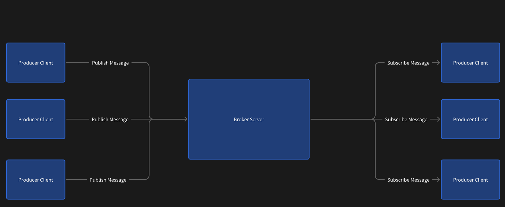
生产者和消费者都是客户端, 都需要通过网络和 Broker Server 进行通信.

此处我们使用 TCP 协议, 来作为通信的底层协议. 同时在这个基础上自定义应用层协议, 完成客户端对服

务器这边功能的远程调用.

要调用的功能有:

- 创建 channel

- 关闭 channel

- 创建 exchange

- 删除 exchange

- 创建 queue

- 删除 queue

- 创建 binding

- 删除 binding

- 发送 message

- 订阅 message

- 发送 ack

- 返回 message (服务器 -> 客户端)

设计应用层协议

使用二进制的方式设定协议.

因为 Message 的消息体本身就是二进制的. 因此不太方便使用 json 等文本格式的协议.

请求:

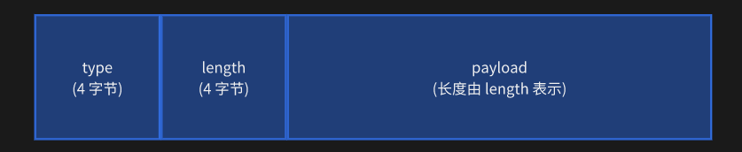
响应:

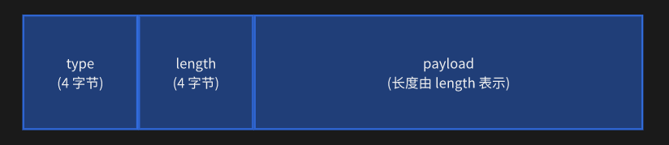
其中 type 表示请求响应不同的功能. 取值如下:

- 0x1  创建 channel

- 0x2  关闭 channel

- 0x3  创建 exchange

- 0x4  销毁 exchange

- 0x5  创建 queue

- 0x6  销毁 queue

- 0x7  创建 binding

- 0x8  销毁 binding

- 0x9  发送 message

- 0xa  订阅 message

- 0xb  返回 ack

- 0xc  服务器给客户端推送的消息. (被订阅的消息) 响应独有的.

其中 payload 部分, 会根据不同的 type, 存在不同的格式.

对于请求来说, payload 表示这次方法调用的各种参数信息.

对于响应来说, payload 表示这次方法调用的返回值.

定义 Request / Response

创建 common.Request

```java
public class Request {

   private int type;

   private int length;

   private byte[] payload;

   // 省略 getter setter

}
```

创建 common.Response

```java
public class Response {

   private int type;

   private int length;

   private byte[] payload;

   // 省略 getter setter

}
```

定义参数父类

构造一个类表示方法的参数, 作为 Request 的 payload.

不同的方法中, 参数形态各异, 但是有些信息是通用的, 使用一个父类表示出来. 具体每个方法的参数再

通过继承的方式体现.

common.BasicArguments

```java
public class BaseArguments implements Serializable {

   // 表示一次请求/响应的唯一 id. 用来把响应和请求对上.

    protected String rid;

    protected String channelId;

    // 省略 getter setter

}
```

- 此处的 rid 和 channelId 都是基于 UUID 来生成的. rid 用来标识一个请求-响应. 这一点在请求响应

比较多的时候非常重要.

定义返回值父类

和参数同理, 也需要构造一个类表示返回值, 作为 Response 的 payload.

common.BasicReturns

```java
public class BaseReturns implements Serializable {

   // 表示一次请求/响应的唯一 id. 用来把响应和请求对上.

    protected String rid;

    protected String channelId;

    protected boolean ok;

    // 省略 getter setter

}
```

定义其他参数类

针对每个 VirtualHost 提供的方法, 都需要有一个类表示对应的参数.

### 1) ExchangeDeclareArguments

```java
public class ExchangeDeclareArguments extends BaseArguments implements

Serializable {

   private String exchangeName;

   private ExchangeType exchangeType;

   private boolean durable;

   private boolean autoDelete;

   private Map<String, Object> arguments;

}
```

一个创建交换机的请求, 形如:

- 可以把 ExchangeDeclareArguments 转成 byte[], 就得到了下列图片的结构.

- 按照 length 长度读取出 payload, 就可以把读到的二进制数据转换成

ExchangeDeclareArguments 对象.

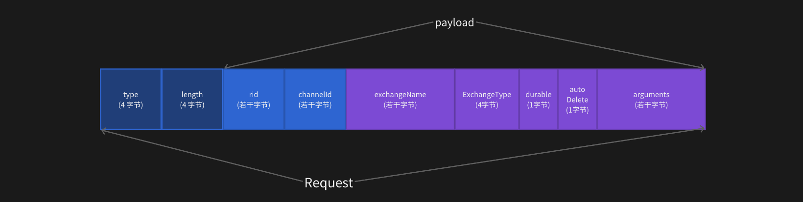
后续请求报文格式同理, 就不再重复画了.

### 2) ExchangeDeleteArguments

```java
public class ExchangeDeleteArguments extends BaseArguments implements

Serializable {

   private String exchangeName;

}
```

### 3) QueueDeclareArguments

```java
public class QueueDeclareArguments extends BaseArguments implements

Serializable {

   private String queueName;

   private boolean durable;

   private boolean exclusive;

   private boolean autoDelete;

   private Map<String, Object> arguments;

}
```

### 4) QueueDeleteArguments

```java
public class QueueDeleteArguments extends BaseArguments implements Serializable

{

   private String queueName;

}
```

### 5) QueueBindArguments

```java
public class QueueBindArguments extends BaseArguments implements Serializable {

   private String queueName;

   private String exchangeName;

   private String bindingKey;

}
```

### 6) QueueUnbindArguments

```java
public class QueueUnbindArguments extends BaseArguments implements Serializable

{

   private String queueName;

   private String exchangeName;

}
```

### 7) BasicPublishArguments

```java
public class BasicPublishArguments extends BaseArguments implements

Serializable {

   private String exchangeName;

   private String routingKey;

   private BasicProperties basicProperties;

   private byte[] body;

}
```

### 8) BasicConsumeArguments

```java
public class BasicConsumeArguments extends BaseArguments implements

Serializable {

   private String consumeTag;

   private String queueName;

   private boolean autoAck;

}
```

### 9) SubScribeReturns

- 这个不是参数, 是返回值. 是服务器给消费者推送的订阅消息.

- consumerTag 其实是 channelId.

- basicProperties 和 body 共同构成了 Message.

```java
public class SubScribeReturns extends BaseReturns implements Serializable {

   private String consumerTag;

   private BasicProperties basicProperties;

   private byte[] body;

}
```

## 十二. 实现 BrokerServer

创建 BrokerServer 类

```java
public class BrokerServer {

   // 当前程序只考虑一个虚拟主机的情况.

    private VirtualHost virtualHost = new VirtualHost("default-VirtualHost");

    // key 为 channelId, value 为 channel 对应的 socket 对象.

    private ConcurrentHashMap<String, Socket> sessions = new

ConcurrentHashMap<>();

    private ServerSocket serverSocket;

    private ExecutorService executorService;

    private volatile boolean runnable = true;

}
```

- virtualHost 表示服务器持有的虚拟主机. 队列, 交换机, 绑定, 消息都是通过虚拟主机管理.

- sessions 用来管理所有的客户端的连接. 记录每个客户端的 socket.

- serverSocket 是服务器自身的 socket

- executorService 这个线程池用来处理响应.

- runnable 这个标志位用来控制服务器的运行停止.

启动/停止服务器

- 这里就是一个单纯的 TCP 服务器, 没啥特别的.

- 实现停止操作, 主要是为了方便后续开展单元测试.

```java
public BrokerServer(int port) throws IOException {

   serverSocket = new ServerSocket(port);

}

public void start() throws IOException {

   System.out.println("[BrokerServer] 启动完成!");

   executorService = Executors.newCachedThreadPool();

   try {

       while (runnable) {

           Socket clientSocket = serverSocket.accept();

           executorService.submit(() -> processConnection(clientSocket));

       }

   } catch (SocketException e) {

       System.out.println("[BrokerServer] 服务器关闭完成!");

   }

}

public void stop() throws IOException {

   runnable = false;

   // 立即结束所有的线程池的任务

    executorService.shutdownNow();

    serverSocket.close();

}
```

实现处理连接

- 对于 EOFException 和 SocketException , 我们视为客户端正常断开连接.

◦
如果是客户端先 close, 后调用 DataInputStream 的 read, 则抛出 EOFException

◦
如果是先调用 DataInputStream 的 read, 后客户端调用 close, 则抛出 SocketException

```java
private void processConnection(Socket clientSocket) {

   try (InputStream inputStream = clientSocket.getInputStream();

        OutputStream outputStream = clientSocket.getOutputStream()) {

       DataInputStream dataInputStream = new DataInputStream(inputStream);

       DataOutputStream dataOutputStream = new DataOutputStream(outputStream);

       while (true) {

           Request request = readRequest(dataInputStream);

           Response response = process(request, clientSocket);

           writeResponse(dataOutputStream, response);

       }

   } catch (EOFException | SocketException e) {

       System.out.println("[BrokerServer] connection 关闭! serverIP=" +

clientSocket.getInetAddress().toString()

               + ", port=" + clientSocket.getPort());

   } catch (MqException | IOException | ClassNotFoundException e) {

       System.out.println("[BrokerServer] connection 出现异常!");

       e.printStackTrace();

   } finally {

       try {

           clientSocket.close();

           // 对 sessions 进行清理

            clearClosedSession(clientSocket);

        } catch (IOException e) {

            e.printStackTrace();

        }

   }

}
```

实现 readRequest

```java
private Request readRequest(DataInputStream dataInputStream) throws

IOException {

   Request request = new Request();

   request.setType(dataInputStream.readInt());

   request.setLength(dataInputStream.readInt());

   byte[] payload = new byte[request.getLength()];

   int n = dataInputStream.read(payload);

   if (n != request.getLength()) {

       throw new IOException("读取请求数据出错!");

   }

   request.setPayload(payload);

   return request;

}
```

实现 writeResponse

- 注意这里的 flush 操作很关键, 否则响应不一定能及时返回给客户端.

```java
private void writeResponse(DataOutputStream dataOutputStream, Response

response) throws IOException {

   dataOutputStream.writeInt(response.getType());

   dataOutputStream.writeInt(response.getLength());

   dataOutputStream.write(response.getPayload());

   dataOutputStream.flush();

}
```

实现处理请求

- 先把请求转换成 BaseArguments , 获取到其中的 channelId 和 rid

- 再根据不同的 type, 分别处理不同的逻辑. (主要是调用 virtualHost 中不同的方法).

- 针对消息订阅操作, 则需要在存在消息的时候通过回调, 把响应结果写回给对应的客户端.

- 最后构造成统一的响应.

```java
private Response process(Request request, Socket clientSocket) throws

MqException, IOException, ClassNotFoundException {

   // 1. 从 request 中解析出业务请求

    BaseArguments baseArguments = (BaseArguments)

BinaryTool.fromBytes(request.getPayload());

    System.out.println("[Request] rid=" + baseArguments.getRid() + ",

channelId=" + baseArguments.getChannelId()

            + ", type=" + request.getType() + ", length=" +

request.getLength());

    // 2. 根据 type 来区分业务分支.

    boolean ok = true;

    if (request.getType() == 0x1) {

        // 创建 channel

        sessions.put(baseArguments.getChannelId(), clientSocket);

        System.out.println("[BrokerServer] 创建 channel 完成! channelId=" +

baseArguments.getChannelId());

   } else if (request.getType() == 0x2) {

       // 销毁 channel

        sessions.remove(baseArguments.getChannelId());

        System.out.println("[BrokerServer] 销毁 channel 完成! channelId=" +

baseArguments.getChannelId());

   } else if (request.getType() == 0x3) {

       // 创建交换机

        ExchangeDeclareArguments exchangeDeclareArguments =

(ExchangeDeclareArguments) baseArguments;

        ok =

virtualHost.exchangeDeclare(exchangeDeclareArguments.getExchangeName(),

exchangeDeclareArguments.getExchangeType(),

                exchangeDeclareArguments.isDurable(),

exchangeDeclareArguments.isAutoDelete(),

exchangeDeclareArguments.getArguments());

    } else if (request.getType() == 0x4) {

        // 删除交换机

        ExchangeDeleteArguments exchangeDeleteArguments =

(ExchangeDeleteArguments) baseArguments;

        ok =

virtualHost.exchangeDelete(exchangeDeleteArguments.getExchangeName());

    } else if (request.getType() == 0x5) {

        // 创建队列

        QueueDeclareArguments queueDeclareArguments = (QueueDeclareArguments)

baseArguments;

        ok = virtualHost.queueDeclare(queueDeclareArguments.getQueueName(),

queueDeclareArguments.isDurable(), queueDeclareArguments.isExclusive(),

               queueDeclareArguments.isAutoDelete(),

queueDeclareArguments.getArguments());

   } else if (request.getType() == 0x6) {

       // 删除队列

        QueueDeleteArguments queueDeleteArguments = (QueueDeleteArguments)

baseArguments;

        ok = virtualHost.queueDelete(queueDeleteArguments.getQueueName());

    } else if (request.getType() == 0x7) {

        // 创建绑定

        QueueBindArguments queueBindArguments = (QueueBindArguments)

baseArguments;

        ok = virtualHost.queueBind(queueBindArguments.getQueueName(),

queueBindArguments.getExchangeName(), queueBindArguments.getBindingKey());

    } else if (request.getType() == 0x8) {

        // 解除绑定

        QueueUnbindArguments queueUnbindArguments = (QueueUnbindArguments)

baseArguments;

        ok = virtualHost.queueUnbind(queueUnbindArguments.getQueueName(),

queueUnbindArguments.getExchangeName());

    } else if (request.getType() == 0x9) {

        // 发送消息

        BasicPublishArguments basicPublishArguments = (BasicPublishArguments)

baseArguments;

        ok = virtualHost.basicPublish(basicPublishArguments.getExchangeName(),

basicPublishArguments.getRoutingKey(),

                basicPublishArguments.getBasicProperties(),

basicPublishArguments.getBody());

    } else if (request.getType() == 0xa) {

        // 订阅消息

        BasicConsumeArguments basicConsumeArguments = (BasicConsumeArguments)

baseArguments;

        // 创建个回调, 用来把消费的数据转发回客户端.

        ok = virtualHost.basicConsume(basicConsumeArguments.getConsumeTag(),

basicConsumeArguments.getQueueName(),

                basicConsumeArguments.isAutoAck(), new Consumer() {

                    @Override

                    public void handleDelivery(String consumerTag,

BasicProperties properties, byte[] body) throws MqException, IOException {

                        // 1. 根据 channelId 找到对应的 socket

                        Socket clientSocket =

sessions.get(basicConsumeArguments.getChannelId());

                        if (clientSocket == null || clientSocket.isClosed()) {

                            throw new MqException("[BrokerServer] 订阅消息的客户
```

端已经关闭!");

                       }
    
                       // 2. 构造响应数据
    
                       SubScribeReturns subScribeReturns = new

SubScribeReturns();

subScribeReturns.setChannelId(basicConsumeArguments.getChannelId());

                       subScribeReturns.setConsumerTag(consumerTag);
    
                       subScribeReturns.setBasicProperties(properties);
    
                       subScribeReturns.setBody(body);
    
                       byte[] payload = BinaryTool.toBytes(subScribeReturns);
    
                       // 3. 写入到对应 socket 中
    
                        Response response = new Response();
    
                        response.setType(0xc);
    
                        response.setLength(payload.length);
    
                        response.setPayload(payload);
    
                        // 此处不应该关闭 DataOutputStream, 关闭这个会导致内部持有

的 clientSocket.getOutputStream 被关闭.

                        DataOutputStream dataOutputStream = new

DataOutputStream(clientSocket.getOutputStream());

                        writeResponse(dataOutputStream, response);
    
                    }
    
                });
    
    } else if (request.getType() == 0xb) {
    
        // 确认 ack
    
        BasicAckArguments basicAckArguments = (BasicAckArguments)

baseArguments;

        ok = virtualHost.basicAck(basicAckArguments.getQueueName(),

basicAckArguments.getMessageId());

    } else {
    
        throw new MqException("[BrokerServer] 未知的请求 type ! type=" +

request.getType());

   }

   // 3. 构造响应.

    BaseReturns baseReturns = new BaseReturns();
    
    baseReturns.setRid(baseArguments.getRid());
    
    baseReturns.setChannelId(baseArguments.getChannelId());
    
    baseReturns.setOk(ok);
    
    byte[] payload = BinaryTool.toBytes(baseReturns);
    
    Response response = new Response();
    
    response.setType(request.getType());
    
    response.setLength(payload.length);
    
    response.setPayload(payload);
    
    System.out.println("[Response] rid=" + baseReturns.getRid() + ",

channelId=" + baseReturns.getChannelId()

            + ", type=" + response.getType() + ", length=" +

response.getLength());

    return response;

}

实现 clearClosedSession

- 如果客户端只关闭了 Connection, 没关闭 Connection 中包含的 Channel, 也没关系, 在这里统一进

行清理.

- 注意迭代器失效问题.

```java
private void clearClosedSession(Socket clientSocket) {

   // 这里不要在同一个循环中, 同时进行遍历 + 删除操作. 否则可能有迭代器失效问题.

   // 拆成两个循环来处理是更合适的.

    List<String> toDeleteChannelId = new ArrayList<>();

    for (Map.Entry<String, Socket> entry : sessions.entrySet()) {

        if (entry.getValue() == clientSocket) {

            toDeleteChannelId.add(entry.getKey());

        }

    }

    for (String channelId : toDeleteChannelId) {

        sessions.remove(channelId);

    }

    System.out.println("[BrokerServer] 清理 session 完成! 被清理的 channelId=" +

toDeleteChannelId);

}
```

## 十三. 实现客户端

创建包 mqclient

创建 ConnectionFactory

用来创建连接的工厂类.

- 当前没有实现用户认证和多虚拟主机, 用户名密码可以暂时先不要.

```java
public class ConnectionFactory {

   // BrokerServer 的 ip 和 port

    private String host;

    private int port;

    // 这几个部分暂时不加.

//    private String virtualHost;

//    private String username;

//    private String password;

   // 建立一个 tcp 连接

    public Connection newConnection() throws IOException {

        Connection connection = new Connection(host, port);

        return connection;

    }

}
```

Connection 和 Channel 的定义

一个客户端可以创建多个 Connection.

一个 Connection 对应一个 socket, 一个 TCP 连接.

一个 Connection 可以包含多个 Channel

### 1) Connection 的定义

```java
public class Connection {

   private Socket socket;

   private InputStream inputStream;

   private OutputStream outputStream;

   private DataInputStream dataInputStream;

   private DataOutputStream dataOutputStream;

   // 记录当前 Connection 包含的 Channel

    private ConcurrentHashMap<String, Channel> channelMap = new

ConcurrentHashMap<>();

    // 执行消费消息回调的线程池

    private ExecutorService callbackPool = Executors.newFixedThreadPool(4);

}
```

- Socket 是客户端持有的套接字. InputStream OutputStream DataInputStream

DataOutputStream 均为 socket 通信的接口.

- channelMap 用来管理该连接中所有的 Channel.

- callbackPool 是用来在客户端这边执行用户回调的线程池.

### 2) Channel 的定义

```java
public class Channel {

   private String channelId;

   private Connection connection;

   // key 为 rid, 即 requestId / responseId.

    private ConcurrentHashMap<String, BaseReturns> baseReturnsMap = new

ConcurrentHashMap<>();

    // 订阅消息的回调

    private Consumer consumer = null;

    public Channel(String channelId, Connection connection) {

        this.channelId = channelId;

        this.connection = connection;

    }

}
```

- channelId 为 channel 的身份标识, 使用 UUID 标识.

- Connection 为 channel 对应的连接.

- baseReturnsMap 用来保存响应的返回值. 放到这个哈希表中方便和请求匹配.

- consumer 为消费者的回调(用户注册的). 对于消息响应, 应该调用这个回调处理消息.

封装请求响应读写操作

在 Connection 中, 实现下列方法

// 读取响应应该在另外一个单独的线程中完成.

```java
public void writeRequest(Request request) throws IOException {

    dataOutputStream.writeInt(request.getType());

    dataOutputStream.writeInt(request.getLength());

    dataOutputStream.write(request.getPayload());

    dataOutputStream.flush();

    System.out.println("[Connection] 发送请求! type=" + request.getType() + ",

length=" + request.getLength());

}

public Response readResponse() throws IOException {

   Response response = new Response();

   response.setType(dataInputStream.readInt());

   response.setLength(dataInputStream.readInt());

   byte[] payload = new byte[response.getLength()];

   int n = dataInputStream.read(payload);

   if (n != response.getLength()) {

       throw new IOException("读取到的响应数据不完整!");

   }

   response.setPayload(payload);

   System.out.println("[Connection] 收到响应! type=" + response.getType() + ",

length=" + response.getLength());

   return response;

}
```

创建 channel

在 Connection 中, 定义下列方法来创建一个 channel

```java
public Channel createChannel() throws IOException {

   // 使用 UUID 生产 channelId, 以 C- 开头

    String channelId = "C-" + UUID.randomUUID().toString();

    Channel channel = new Channel(channelId, this);

    // 这里需要先把 channel 键值对放到 Map 中. 否则后续 createChannel 的阻塞等待就等
```

不到结果了

    channelMap.put(channelId, channel);
    
    boolean ok = channel.createChannel();
    
    if (!ok) {
    
        // 服务器返回创建 channel 失败!
    
        // 把 channelId 删除掉即可
    
        channelMap.remove(channelId);
    
        return null;
    
    }
    
    return channel;

}

发送请求

通过 Channel 提供请求的发送操作.

### 1) 创建 channel

```java
public boolean createChannel() throws IOException {

   BaseArguments baseArguments = new BaseArguments();

   baseArguments.setRid(generateRid());

   baseArguments.setChannelId(channelId);

   byte[] payload = BinaryTool.toBytes(baseArguments);

   Request request = new Request();

   request.setType(0x1);

   request.setLength(payload.length);

   request.setPayload(payload);

   connection.writeRequest(request);

   // 阻塞等待服务器的响应

    BaseReturns baseReturns = waitResult(baseArguments.getRid());

    return baseReturns.isOk();

}
```

generateRid 的实现

```java
private String generateRid() {

   return "R-" + UUID.randomUUID().toString();

}
```

waitResult 的实现

- 由于服务器的响应是异步的. 此处通过 waitResult 实现同步等待的效果.

```java
private BaseReturns waitResult(String rid){

   BaseReturns baseReturns = null;

   while ((baseReturns = baseReturnsMap.get(rid)) == null) {

       synchronized (this) {

           try {

               wait();

           } catch (InterruptedException e) {

               // 如果 wait 被提前唤醒, 也应该继续循环.

                // 所以这里啥都不干, 但是 try 需要放到 while 内部.

                e.printStackTrace();

            }

        }

    }

    return baseReturns;

}
```

### 2) 关闭 channel

```java
public boolean close() throws IOException {

   // 删除服务器上的 channel. 如果不显式调用, 也没关系. 服务器会在 Connection 断开的
```

时候统一回收.

    BaseArguments baseArguments = new BaseArguments();
    
    baseArguments.setRid(generateRid());
    
    baseArguments.setChannelId(channelId);
    
    byte[] payload = BinaryTool.toBytes(baseArguments);
    
    Request request = new Request();
    
    request.setType(0x2);
    
    request.setLength(payload.length);
    
    request.setPayload(payload);
    
    connection.writeRequest(request);
    
    // 阻塞等待服务器的响应
    
    BaseReturns baseReturns = waitResult(baseArguments.getRid());
    
    return baseReturns.isOk();

}

### 3) 创建交换机

```java
public boolean exchangeDeclare(String exchangeName, ExchangeType exchangeType,

boolean durable, boolean autoDelete,

                           Map<String, Object> arguments) throws IOException {

   ExchangeDeclareArguments exchangeDeclareArguments = new

ExchangeDeclareArguments();

   exchangeDeclareArguments.setRid(generateRid());

   exchangeDeclareArguments.setChannelId(channelId);

   exchangeDeclareArguments.setExchangeName(exchangeName);

   exchangeDeclareArguments.setExchangeType(exchangeType);

   exchangeDeclareArguments.setDurable(durable);

   exchangeDeclareArguments.setAutoDelete(autoDelete);

   exchangeDeclareArguments.setArguments(arguments);

   byte[] payload = BinaryTool.toBytes(exchangeDeclareArguments);

   Request request = new Request();

   request.setType(0x3);

   request.setLength(payload.length);

   request.setPayload(payload);

   connection.writeRequest(request);

   // 阻塞等待服务器的响应

    BaseReturns baseReturns = waitResult(exchangeDeclareArguments.getRid());

    return baseReturns.isOk();

}
```

### 4) 删除交换机

```java
public boolean exchangeDelete(String exchangeName) throws IOException {

   ExchangeDeleteArguments exchangeDeleteArguments = new

ExchangeDeleteArguments();

   exchangeDeleteArguments.setRid(generateRid());

   exchangeDeleteArguments.setChannelId(channelId);

   exchangeDeleteArguments.setExchangeName(exchangeName);

   byte[] payload = BinaryTool.toBytes(exchangeDeleteArguments);

   Request request = new Request();

   request.setType(0x4);

   request.setLength(payload.length);

   request.setPayload(payload);

   connection.writeRequest(request);

   // 阻塞等待服务器的响应

    BaseReturns baseReturns = waitResult(exchangeDeleteArguments.getRid());

    return baseReturns.isOk();

}
```

### 5) 创建队列

```java
public boolean queueDeclare(String queueName, boolean durable, boolean

exclusive, boolean autoDelete,

                        Map<String, Object> arguments) throws IOException {

   QueueDeclareArguments queueDeclareArguments = new QueueDeclareArguments();

   queueDeclareArguments.setRid(generateRid());

   queueDeclareArguments.setChannelId(channelId);

   queueDeclareArguments.setQueueName(queueName);

   queueDeclareArguments.setDurable(durable);

   queueDeclareArguments.setExclusive(exclusive);

   queueDeclareArguments.setAutoDelete(autoDelete);

   queueDeclareArguments.setArguments(arguments);

   byte[] payload = BinaryTool.toBytes(queueDeclareArguments);

   Request request = new Request();

   request.setType(0x5);

   request.setLength(payload.length);

   request.setPayload(payload);

   connection.writeRequest(request);

   // 阻塞等待服务器的响应

    BaseReturns baseReturns = waitResult(queueDeclareArguments.getRid());

    return baseReturns.isOk();

}
```

### 6) 删除队列

```java
public boolean queueDelete(String queueName) throws IOException {

   QueueDeleteArguments queueDeleteArguments = new QueueDeleteArguments();

   queueDeleteArguments.setRid(generateRid());

   queueDeleteArguments.setChannelId(channelId);

   queueDeleteArguments.setQueueName(queueName);

   byte[] payload = BinaryTool.toBytes(queueDeleteArguments);

   Request request = new Request();

   request.setType(0x6);

   request.setLength(payload.length);

   request.setPayload(payload);

   connection.writeRequest(request);

   // 阻塞等待服务器的响应

    BaseReturns baseReturns = waitResult(queueDeleteArguments.getRid());

    return baseReturns.isOk();

}
```

### 7) 创建绑定

// 对于直接交换机和 fanout 交换机, bindingKey 不生效. 直接设为 "" 即可

```java
public boolean queueBind(String queueName, String exchangeName) throws

IOException {

   return queueBind(queueName, exchangeName, "");

}

public boolean queueBind(String queueName, String exchangeName, String

bindingKey) throws IOException {

   QueueBindArguments queueBindArguments = new QueueBindArguments();

   queueBindArguments.setRid(generateRid());

   queueBindArguments.setChannelId(channelId);

   queueBindArguments.setQueueName(queueName);

   queueBindArguments.setExchangeName(exchangeName);

   queueBindArguments.setBindingKey(bindingKey);

   byte[] payload = BinaryTool.toBytes(queueBindArguments);

   Request request = new Request();

   request.setType(0x7);

   request.setLength(payload.length);

   request.setPayload(payload);

   connection.writeRequest(request);

   // 阻塞等待服务器的响应

    BaseReturns baseReturns = waitResult(queueBindArguments.getRid());

    return baseReturns.isOk();

}
```

### 8) 删除绑定

```java
public boolean queueUnbind(String queueName, String exchangeName) throws

IOException {

   QueueUnbindArguments queueUnbindArguments = new QueueUnbindArguments();

   queueUnbindArguments.setRid(generateRid());

   queueUnbindArguments.setChannelId(channelId);

   queueUnbindArguments.setQueueName(queueName);

   queueUnbindArguments.setExchangeName(exchangeName);

   byte[] payload = BinaryTool.toBytes(queueUnbindArguments);

   Request request = new Request();

   request.setType(0x8);

   request.setLength(payload.length);

   request.setPayload(payload);

   connection.writeRequest(request);

   // 阻塞等待服务器的响应

    BaseReturns baseReturns = waitResult(queueUnbindArguments.getRid());

   return baseReturns.isOk();

}
```

### 9) 发送消息

```java
public boolean basicPublish(String exchangeName, String routingKey,

BasicProperties basicProperties, byte[] body) throws IOException {

   BasicPublishArguments basicPublishArguments = new BasicPublishArguments();

   basicPublishArguments.setRid(generateRid());

   basicPublishArguments.setChannelId(channelId);

   basicPublishArguments.setExchangeName(exchangeName);

   basicPublishArguments.setRoutingKey(routingKey);

   basicPublishArguments.setBasicProperties(basicProperties);

   basicPublishArguments.setBody(body);

   byte[] payload = BinaryTool.toBytes(basicPublishArguments);

   Request request = new Request();

   request.setType(0x9);

   request.setLength(payload.length);

   request.setPayload(payload);

   connection.writeRequest(request);

   // 阻塞等待服务器的响应

    BaseReturns baseReturns = waitResult(basicPublishArguments.getRid());

    return baseReturns.isOk();

}
```

### 10) 订阅消息

```java
public boolean basicConsume(String queueName, boolean autoAck, Consumer

consumer) throws IOException, MqException {

   BasicConsumeArguments basicConsumeArguments = new BasicConsumeArguments();

   basicConsumeArguments.setRid(generateRid());

   basicConsumeArguments.setChannelId(channelId);

   basicConsumeArguments.setQueueName(queueName);

   basicConsumeArguments.setAutoAck(autoAck);

   basicConsumeArguments.setConsumeTag(channelId);

   byte[] payload = BinaryTool.toBytes(basicConsumeArguments);

   Request request = new Request();

   request.setType(0xa);

   request.setLength(payload.length);

   request.setPayload(payload);

   connection.writeRequest(request);

   // 阻塞等待服务器的响应

    BaseReturns baseReturns = waitResult(basicConsumeArguments.getRid());

    if (baseReturns.isOk()) {

        // 设置回调

        if (this.consumer != null) {

            throw new MqException("该 channel 已经设置过消费回调, 不能重复设置!");

       }

       this.consumer = consumer;

   }

   return baseReturns.isOk();

}
```

### 11) 确认消息

```java
public boolean basicAck(String queueName, String messageId) throws IOException

{

   BasicAckArguments basicAckArguments = new BasicAckArguments();

   basicAckArguments.setRid(generateRid());

   basicAckArguments.setChannelId(channelId);

   basicAckArguments.setQueueName(queueName);

   basicAckArguments.setMessageId(messageId);

   byte[] payload = BinaryTool.toBytes(basicAckArguments);

   Request request = new Request();

   request.setType(0xb);

   request.setLength(payload.length);

   request.setPayload(payload);

   connection.writeRequest(request);

   // 阻塞等待服务器的响应

    BaseReturns baseReturns = waitResult(basicAckArguments.getRid());

    return baseReturns.isOk();

}
```

小结

上述发送请求的操作, 逻辑基本一致. 构造参数 + 构造请求 + 发送 + 等待结果.

处理响应

### 1) 创建扫描线程

创建一个扫描线程, 用来不停的读取 socket 中的响应数据.

注意: 一个 Connection 中可能包含多个 channel, 需要把响应分别放到对应的 channel 中.

```java
public Connection(String host, int port) throws IOException {

   socket = new Socket(host, port);

   inputStream = socket.getInputStream();

   outputStream = socket.getOutputStream();

   dataInputStream = new DataInputStream(inputStream);

   dataOutputStream = new DataOutputStream(outputStream);

   // 创建一个读响应的线程

    Thread t = new Thread(() -> {

        try {

            while (!socket.isClosed()) {

                Response response = readResponse();

                dispatchResponse(response);

            }

        } catch (SocketException e) {

            // 连接断开, 忽略该异常.

            // System.out.println("[Connection] 连接断开!");

        } catch (IOException | ClassNotFoundException | MqException e) {

            System.out.println("[Connection] 连接出现异常!");

           e.printStackTrace();

       }

   });

   t.start();

}
```

### 2) 实现响应的分发

给 Connection 创建 dispatchResponse 方法.

- 针对服务器返回的控制响应和消息响应, 分别处理.

◦
如果是订阅数据, 则调用 channel 中的回调.

◦
如果是控制消息, 直接放到结果集合中.

```java
private void dispatchResponse(Response response) throws IOException,

ClassNotFoundException, MqException {

   if (response.getType() == 0xc) {

       // 1. 解析到服务器返回的订阅数据

        SubScribeReturns subScribeReturns = (SubScribeReturns)

BinaryTool.fromBytes(response.getPayload());

        // 2. 获取到 channel

        Channel channel = channelMap.get(subScribeReturns.getChannelId());

        if (channel == null) {

            throw new MqException("该消息对应的 channel 不存在! channelId=" +

subScribeReturns.getChannelId());

       }

       // 3. 执行 channel 中对应的回调.

        callbackPool.submit(() -> {

            try {

channel.getConsumer().handleDelivery(subScribeReturns.getConsumerTag(),

                        subScribeReturns.getBasicProperties(),

subScribeReturns.getBody());

            } catch (MqException | IOException e) {

                e.printStackTrace();

            }

        });

    } else {

        // 1. 拿到服务器返回的控制消息

        BaseReturns baseReturns = (BaseReturns)

BinaryTool.fromBytes(response.getPayload());

        // System.out.printf("[Connection] 收到响应: type=0x%x, channelId=%s,

ok=%b\n", response.getType(),

       //        baseReturns.getChannelId(), baseReturns.isOk());

       // 2. 找到对应 Channel

        Channel channel = channelMap.get(baseReturns.getChannelId());

        if (channel == null) {

            // 这个是小问题, 不要抛异常

            System.out.println("[Connection] channel 不存在! channelId=" +

baseReturns.getChannelId());

           return;

       }

       // 3. 把响应放到对应的 Channel 的 map 中.

        channel.putReturns(baseReturns);

    }

}
```

### 3) 实现 channel.putReturns

把响应放到响应的 hash 表中, 同时唤醒等待响应的线程去消费.

```java
public void putReturns(BaseReturns baseReturns) {

   baseReturnsMap.put(baseReturns.getRid(), baseReturns);

   synchronized (this) {

       // 这里要唤醒所有等待的线程, 不能只唤醒一个.

        notifyAll();

    }

}
```

关闭 Connection

给 Connection 实现 close 方法

```java
public void close() {

   try {

       callbackPool.shutdown();

       channelMap = null;

       inputStream.close();

       outputStream.close();

       socket.close();

   } catch (IOException e) {

       e.printStackTrace();

   }

}
```

测试客户端-服务器

创建 MqClientTests

```java
public class MqClientTests {

   private BrokerServer brokerServer = null;

   private Thread t = null;

   private ConnectionFactory factory = null;

   @BeforeEach

   public void setUp() throws IOException {

       JavaMessageQueueApplication.ac =

SpringApplication.run(JavaMessageQueueApplication.class);

       t = new Thread(() -> {

           try {

               brokerServer = new BrokerServer(9090);

               brokerServer.start();

           } catch (IOException e) {

               e.printStackTrace();

           }

       });

       t.start();

       factory = new ConnectionFactory();

       factory.setHost("127.0.0.1");

       factory.setPort(9090);

   }

   @AfterEach

   public void tearDown() throws IOException, InterruptedException {

       // 结束服务器

        brokerServer.stop();

        // 等待线程结束

        t.join();

        // 关闭 Spring 服务器

        JavaMessageQueueApplication.ac.close();

        // 删除服务器的数据文件

        File dbFile = new File("meta.db");

        dbFile.delete();

        // 删除数据文件

        File dataFile = new File("./data");

        FileUtils.deleteDirectory(dataFile);

        factory = null;

    }

}
```

编写测试用例

```java
@Test

public void testConnection() throws IOException {

   Connection connection = factory.newConnection();

   Assertions.assertNotNull(connection);

}

@Test

public void testChannel() throws IOException {

   Connection connection = factory.newConnection();

   Assertions.assertNotNull(connection);

   Channel channel = connection.createChannel();

   Assertions.assertNotNull(channel);

}

@Test

public void testExchange() throws IOException, InterruptedException {

   Connection connection = factory.newConnection();

   Assertions.assertNotNull(connection);

   Channel channel = connection.createChannel();

   Assertions.assertNotNull(channel);

   boolean ok = channel.exchangeDeclare("testExchange", ExchangeType.DIRECT,

true, false, null);

   Assertions.assertTrue(ok);

   ok = channel.exchangeDelete("testExchange");

   Assertions.assertTrue(ok);

   channel.close();

   connection.close();

}

@Test

public void testQueue() throws IOException {

   Connection connection = factory.newConnection();

   Assertions.assertNotNull(connection);

   Channel channel = connection.createChannel();

   Assertions.assertNotNull(channel);

   boolean ok = channel.queueDeclare("testQueue", true, false, false, null);

   Assertions.assertTrue(ok);

   ok = channel.queueDelete("testQueue");

   Assertions.assertTrue(ok);

   channel.close();

   connection.close();

}

@Test

public void testBind() throws IOException {

   Connection connection = factory.newConnection();

   Assertions.assertNotNull(connection);

   Channel channel = connection.createChannel();

   Assertions.assertNotNull(channel);

   boolean ok = channel.exchangeDeclare("testExchange", ExchangeType.DIRECT,

true, false, null);

   Assertions.assertTrue(ok);

   ok = channel.queueDeclare("testQueue", true, false, false, null);

   Assertions.assertTrue(ok);

   ok = channel.queueBind("testQueue", "testExchange");

   Assertions.assertTrue(ok);

   ok = channel.queueUnbind("testQueue", "testExchange");

   Assertions.assertTrue(ok);

   channel.close();

   connection.close();

}

@Test

public void testMessageDirect() throws IOException, MqException,

InterruptedException {

   Connection connection = factory.newConnection();

   Assertions.assertNotNull(connection);

   Channel channel = connection.createChannel();

   Assertions.assertNotNull(channel);

   boolean ok = channel.exchangeDeclare("testExchange", ExchangeType.DIRECT,

true, false, null);

   Assertions.assertTrue(ok);

   ok = channel.queueDeclare("testQueue", true, false, false, null);

   Assertions.assertTrue(ok);

   byte[] requestBody = "hello".getBytes();

   // DIRECT 模式, routingKey 就是队列名字

    // 发送的时候 basicProperties 可以是空着的. 服务器会进行构造. 订阅者收到的消息则是
```

带有完整 basicProperties 的.

    ok = channel.basicPublish("testExchange", "testQueue", null, requestBody);
    
    Assertions.assertTrue(ok);
    
    ok = channel.basicConsume("testQueue", true, new Consumer() {

```java
        @Override

        public void handleDelivery(String consumerTag, BasicProperties

properties, byte[] responseBody) {

            System.out.println("[消费数据] 开始!");

           System.out.println("consumerTag=" + consumerTag);

           System.out.println("properties=" + properties);

           String bodyString = new String(responseBody, 0,

responseBody.length);

           System.out.println("body=" + bodyString);

           Assertions.assertEquals(requestBody, responseBody);

       }

   });

   Assertions.assertTrue(ok);

   // 等待数据消费完.

    Thread.sleep(500);

    channel.close();

    connection.close();

}

@Test

public void testMessageFanout() throws IOException, MqException,

InterruptedException {

    Connection connection = factory.newConnection();

    Assertions.assertNotNull(connection);

    Channel channel1 = connection.createChannel();

    Assertions.assertNotNull(channel1);

    boolean ok = channel1.exchangeDeclare("testExchange", ExchangeType.FANOUT,

true, false, null);

    Assertions.assertTrue(ok);

    ok = channel1.queueDeclare("testQueue1", true, false, false, null);

    Assertions.assertTrue(ok);

    ok = channel1.queueDeclare("testQueue2", true, false, false, null);

    Assertions.assertTrue(ok);

    ok = channel1.queueBind("testQueue1", "testExchange");

    Assertions.assertTrue(ok);

    ok = channel1.queueBind("testQueue2", "testExchange");

    Assertions.assertTrue(ok);

    byte[] requestBody = "hello".getBytes();

    // FANOUT 模式, routingKey 不需要

    ok = channel1.basicPublish("testExchange", "", null, requestBody);

    Assertions.assertTrue(ok);

    ok = channel1.basicConsume("testQueue1", true, new Consumer() {

        @Override

        public void handleDelivery(String consumerTag, BasicProperties

properties, byte[] responseBody) throws MqException, IOException {

            System.out.println("consumerTag=" + consumerTag);

            System.out.println("properties=" + properties);

           String bodyString = new String(responseBody, 0,

responseBody.length);

           System.out.println("body=" + bodyString);

           Assertions.assertEquals(requestBody, responseBody);

       }

   });

   Assertions.assertTrue(ok);

   Channel channel2 = connection.createChannel();

   Assertions.assertNotNull(channel1);

   ok = channel2.basicConsume("testQueue2", true, new Consumer() {

       @Override

       public void handleDelivery(String consumerTag, BasicProperties

properties, byte[] responseBody) throws MqException, IOException {

           System.out.println("consumerTag=" + consumerTag);

           System.out.println("properties=" + properties);

           String bodyString = new String(responseBody, 0,

responseBody.length);

           System.out.println("body=" + bodyString);

           Assertions.assertEquals(requestBody, responseBody);

       }

   });

   Assertions.assertTrue(ok);

   Thread.sleep(1000);

   channel1.close();

   channel2.close();

   connection.close();

}

@Test

public void testMessageTopic() throws IOException, MqException,

InterruptedException {

   Connection connection = factory.newConnection();

   Assertions.assertNotNull(connection);

   Channel channel = connection.createChannel();

   Assertions.assertNotNull(channel);

   boolean ok = channel.exchangeDeclare("testExchange", ExchangeType.TOPIC,

true, false, null);

   Assertions.assertTrue(ok);

   ok = channel.queueDeclare("testQueue", true, false, false, null);

   Assertions.assertTrue(ok);

   ok = channel.queueBind("testQueue", "testExchange", "aaa.#");

   byte[] requestBody = "hello".getBytes();

   ok = channel.basicPublish("testExchange", "aaa.bbb.ccc", null,

requestBody);

   Assertions.assertTrue(ok);

   ok = channel.basicConsume("testQueue", true, new Consumer() {

       @Override

       public void handleDelivery(String consumerTag, BasicProperties

properties, byte[] responseBody) {

           System.out.println("[消费数据] 开始!");

           System.out.println("consumerTag=" + consumerTag);

           System.out.println("properties=" + properties);

           String bodyString = new String(responseBody, 0,

responseBody.length);

           System.out.println("body=" + bodyString);

           Assertions.assertEquals(requestBody, responseBody);

       }

   });

   Assertions.assertTrue(ok);

   // 等待数据消费完.

    Thread.sleep(500);

    channel.close();

    connection.close();

}
```

## 十四. 案例: 基于 MQ 的生产者消费者模型

生产者:

```java
public class DemoProducer {

   public static void main(String[] args) throws IOException,

InterruptedException {

       System.out.println("启动生产者!");

       ConnectionFactory factory = new ConnectionFactory();

       factory.setHost("127.0.0.1");

       factory.setPort(9090);

       Connection connection = factory.newConnection();

       Channel channel = connection.createChannel();

       channel.exchangeDeclare("testExchange", ExchangeType.DIRECT, true,

false, null);

       channel.queueDeclare("testQueue", true, false, false, null);

       byte[] body = "hello".getBytes();

       boolean ok = channel.basicPublish("testExchange", "testQueue", null,

body);

       System.out.println("投递消息完成! ok=" + ok);

       Thread.sleep(500);

       channel.close();

       connection.close();

   }

}
```

消费者:

```java
public class DemoConsumer {

   public static void main(String[] args) throws IOException, MqException,

InterruptedException {

       System.out.println("启动消费者!");

       ConnectionFactory factory = new ConnectionFactory();

       factory.setHost("127.0.0.1");

       factory.setPort(9090);

       Connection connection = factory.newConnection();

       Channel channel = connection.createChannel();

       channel.exchangeDeclare("testExchange", ExchangeType.DIRECT, true,

false, null);

       channel.queueDeclare("testQueue", true, false, false, null);

       channel.basicConsume("testQueue", true, new Consumer() {

           @Override

           public void handleDelivery(String consumerTag, BasicProperties

properties, byte[] body) {

               System.out.println("[消费数据] 开始!");

               System.out.println("consumerTag=" + consumerTag);

               System.out.println("properties=" + properties);

               String bodyString = new String(body, 0, body.length);

               System.out.println("body=" + bodyString);

               System.out.println("[消费数据] 完毕!");

           }

       });

       while (true) {

           Thread.sleep(500);

       }

   }

}
```

## 十五. 扩展功能

- 虚拟主机管理

- 用户管理/用户认证

- 交换机/队列 的独占模式和自动删除.

- 发送方确认(broker 给生产者的确认应答)

- 拒绝应答 (nack)

- 死信队列

- 管理接口

- 管理页面