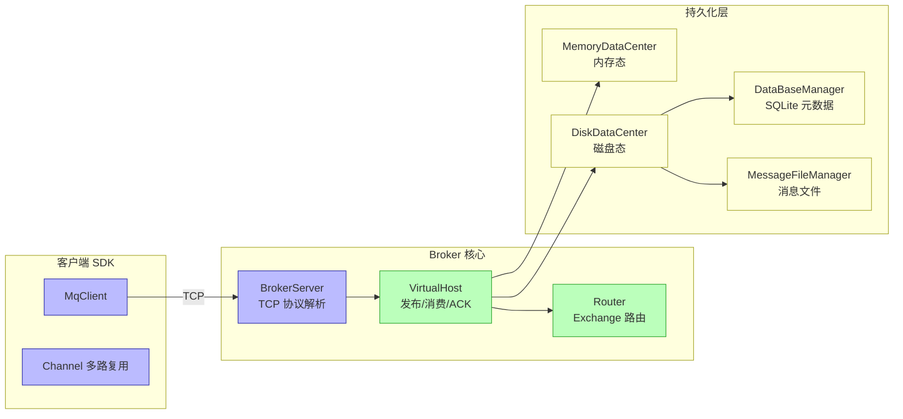
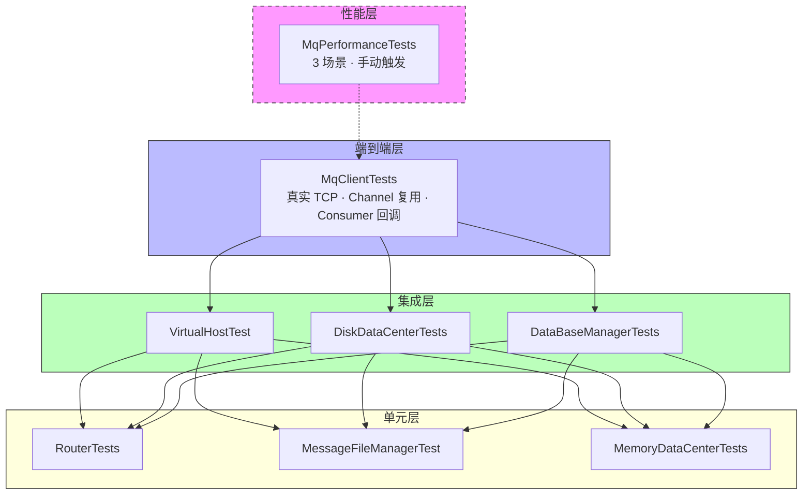
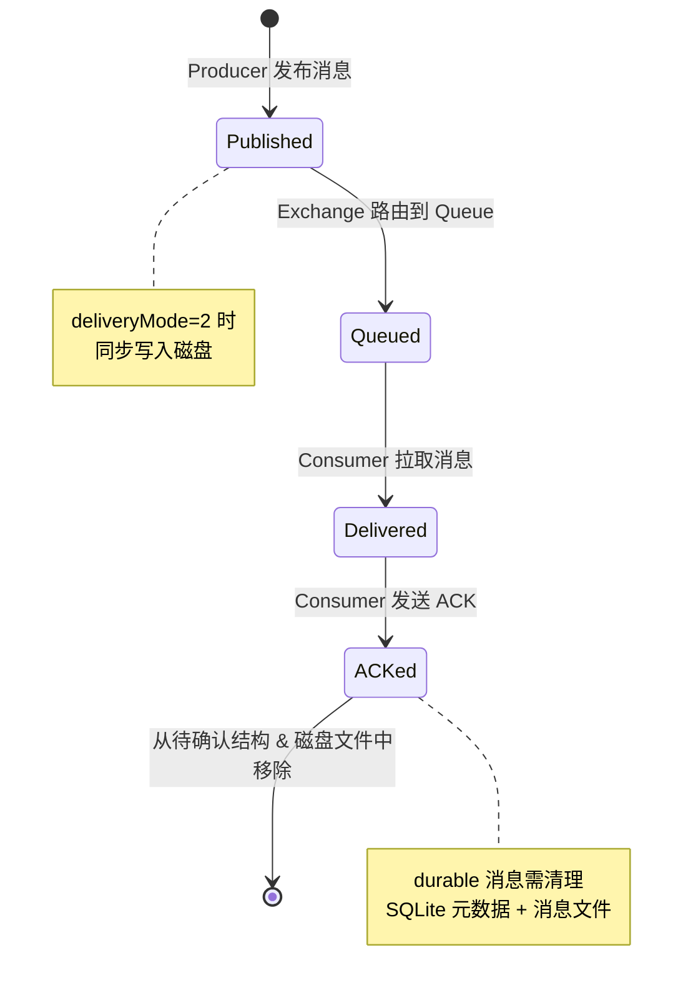
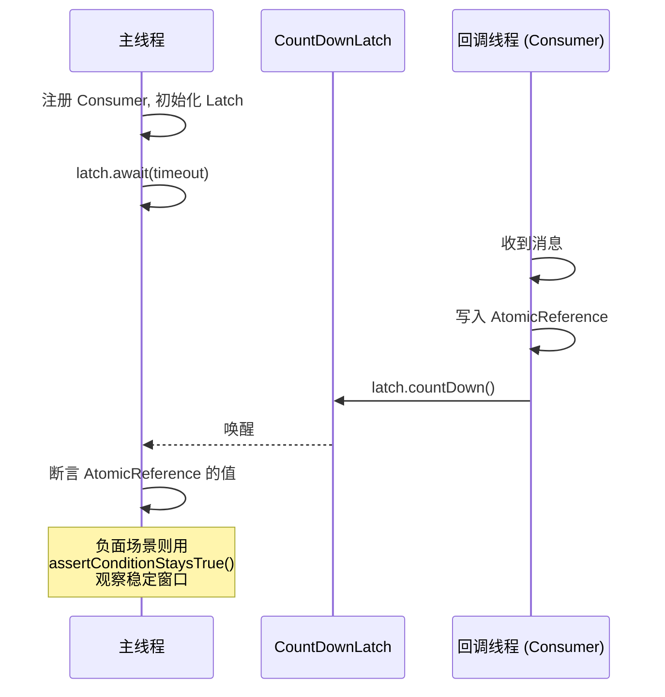
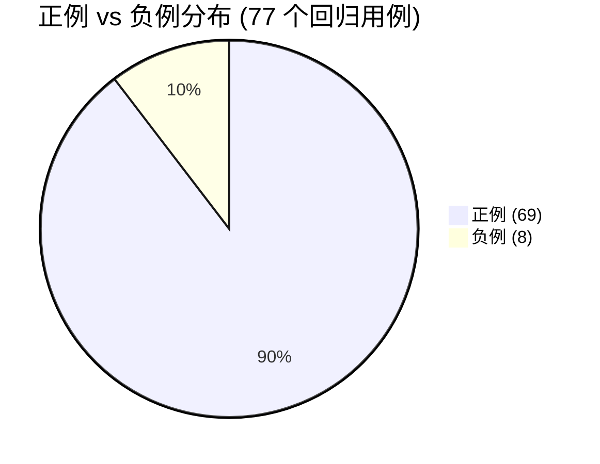
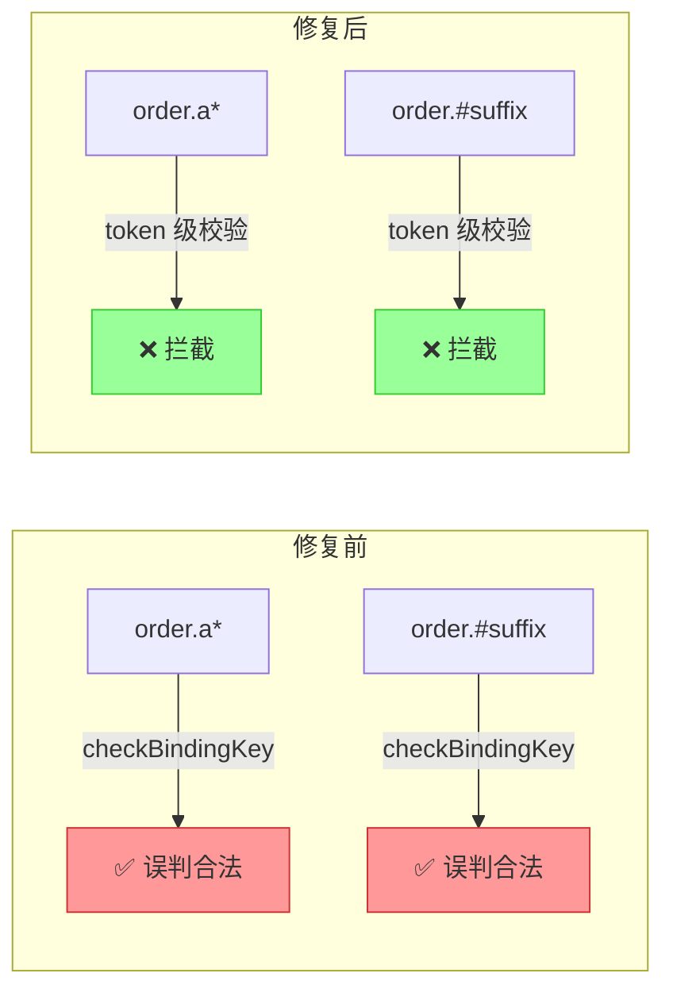
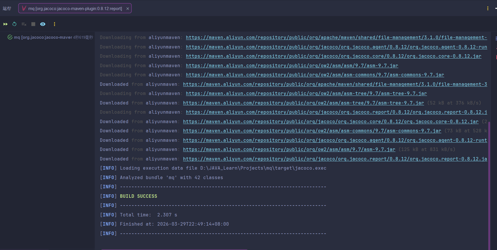
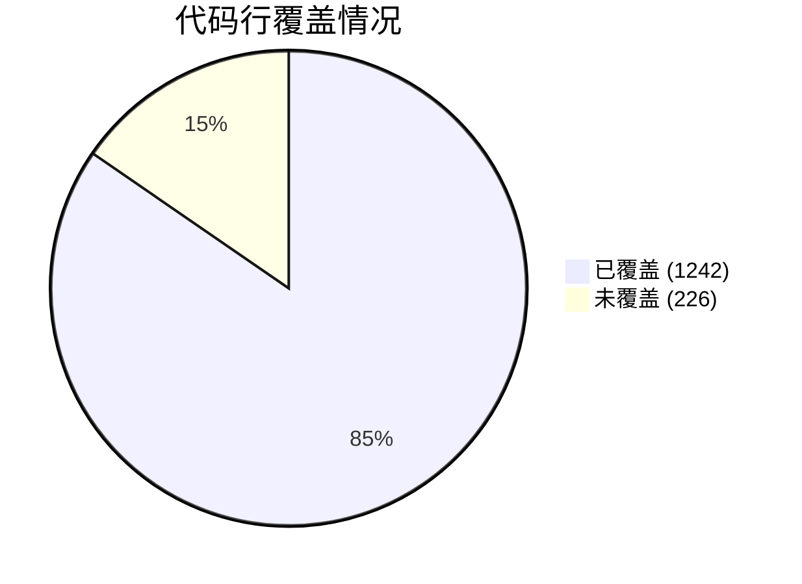
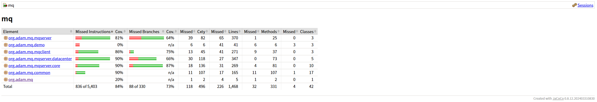
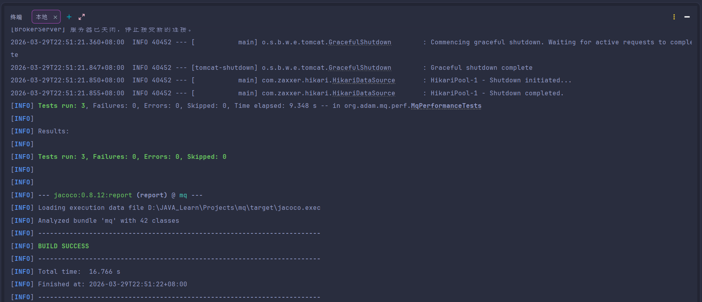

# 自定义MQ 项目测试报告

## 项目概述

独立负责本项目的测试体系建设。从项目初期的基础冒烟测试出发，系统性地设计了单元/集成/端到端/性能四层自动化测试框架，自主实现了 `TestRuntimeSupport` 测试基础设施来解决异步测试可靠性和数据隔离两大难题。通过有意识的边界分析发现并推动修复了 Router 通配符校验缺陷（该缺陷会导致非法 bindingKey 绕过校验进入路由层，影响消息投递正确性）。最终交付 77 个自动化回归用例，行覆盖率达到 84.6%，并建立了 3 个可复跑的性能 smoke 基线。

## 1. 项目背景

本项目是一个基于 Java 17 + Spring Boot 3.5.8 + SQLite 的学习型消息队列，支持 Exchange/Queue 路由、消息持久化、发布/消费/ACK 全链路，以及客户端 SDK（自定义 TCP 协议）。

### 系统架构与测试覆盖



> 蓝色 = 端到端测试覆盖 | 绿色 = 集成测试覆盖 | 黄色 = 单元 + 集成测试覆盖

这次测试要回答几个核心问题：

1. 路由规则能不能稳定拦住非法的 `bindingKey` / `routingKey`？
2. 消息从发布到消费再到 ACK 删除，状态转换是否一致？
3. SQLite + 消息文件并存的持久化层，基本正确性有没有保障？
4. 客户端 SDK 和 Broker 之间的真实 TCP 链路能不能跑通？
5. 性能上能不能给出一组可复跑的 smoke 基线？

## 2. 测试范围与环境

**测试范围：**

| 层级 | 内容 | 日常回归 |
| --- | --- | --- |
| 单元测试 | `RouterTests`、`MessageFileManagerTest`、`MemoryDataCenterTests` | 是 |
| 集成测试 | `VirtualHostTest`、`DiskDataCenterTests`、`DataBaseManagerTests` | 是 |
| 端到端测试 | `MqClientTests` | 是 |
| 启动 smoke | `MqApplicationTests` | 是 |
| 性能 smoke | `MqPerformanceTests`（3 个场景） | 否，手动触发 |

回归套件共 8 个测试类、77 个用例。性能 smoke 独立执行，不计入回归统计。

执行命令：

```bash
# 日常回归
.\mvnw.cmd clean test

# 性能 smoke
.\mvnw.cmd "-Dmq.perf.enabled=true" "-Dtest=MqPerformanceTests" test
```

**测试环境：** JDK 17 / JUnit 5 / JaCoCo 0.8.12 / SQLite JDBC 3.46.0.0 / Windows 11 / Maven Wrapper

## 3. 测试策略

### 分层设计



- **单元层**（Router、MessageFileManager、MemoryDataCenter）：逻辑纯、边界多，适合高频快速回归。
- **集成层**（VirtualHost、DiskDataCenter、DataBaseManager）：依赖 SQLite 和文件系统，必须用真实实例。
- **端到端层**（MqClient + BrokerServer）：验证自定义 TCP 协议、Channel 复用和 Consumer 回调链路。
- **性能层**：建立可解释的 smoke 基线，不是工业级压测。

### 为什么集成层不用 mock？

这个项目的持久化同时依赖 SQLite 元数据和自定义消息文件。如果 mock 掉，以下问题根本测不到：

- SQLite 文件锁与上下文释放顺序
- 消息文件读写删除的一致性
- `@BeforeEach` / `@AfterEach` 清理不彻底导致的测试污染

所以集成层的重点不是"接口调没调用"，而是"状态最终是否一致"。

### 用例设计方法

- **等价类划分**：Router TOPIC 匹配，将 `bindingKey` 分为合法模式（`aaa.*`）和非法模式（`order.a*`）
- **边界值分析**：MessageFileManager GC 阈值 `totalCount > 2000` 与 `validRatio < 0.5`
- **状态转换**：VirtualHost 消息生命周期 `publish → consume → ACK → durable 清理`



- **异常路径**：缺失 exchange、非法 routingKey、缺失消息 ACK 等负路径

## 4. 测试基础设施

### TestRuntimeSupport

为了解决测试隔离和异步可靠性问题，抽取了 `TestRuntimeSupport` 工具类：

- 统一管理 Spring 上下文生命周期（`startApplicationContext` / `stopApplicationContext`）
- 清理 `./data` 目录，避免 SQLite 与消息文件残留互相污染
- 在测试内启动 Broker，基于 Socket 探测等待端口就绪
- teardown 时确认 Broker 线程已退出
- 提供 `assertConditionStaysTrue()` 用于负面异步验证

### 数据隔离

每个测试从干净状态开始：`@BeforeEach` 先清目录再启动上下文，`@AfterEach` 先停服务再删目录（避免 Windows 文件锁问题）。测试类之间互不依赖，不走 `@SpringBootTest` 的上下文缓存。

### 异步测试方案

Consumer 回调跑在独立线程里，直接在回调线程断言会被吞掉。统一采用的模式是：



1. 回调线程只写 `AtomicReference` / `AtomicInteger`
2. 通过 `CountDownLatch` 通知主线程
3. 主线程等待超时后做最终断言
4. 负面场景用 `assertConditionStaysTrue()` 观察稳定窗口

## 5. 技术挑战与解决思路

### 挑战一：异步断言被线程吞掉

Consumer 回调运行在独立线程中，如果直接在回调里写 `assertEquals`，断言失败时 `AssertionError` 会被回调线程吞掉，主线程感知不到——测试会"假绿"。

解决方案是将断言和数据收集分离：回调线程只负责把结果写入 `AtomicReference`，通过 `CountDownLatch` 通知主线程事件已发生，所有断言都回到主线程执行。对于负面场景（验证某条消息不应该被投递），则用 `assertConditionStaysTrue()` 在一段稳定窗口内持续检查条件，避免用 `Thread.sleep` 硬等。

这个模式最终被抽象到 `TestRuntimeSupport` 中，在 `MqClientTests` 和 `VirtualHostTest` 的所有异步场景中复用。

### 挑战二：Windows 文件锁导致 teardown 失败

集成测试依赖真实的 SQLite 文件和消息文件。在 Windows 上，如果 Spring 上下文（持有 SQLite 连接）或 Broker（持有消息文件的 FileChannel）还没关闭就去删 `./data` 目录，会因为文件锁导致删除失败，进而污染下一个测试。

解决方案是严格保证 teardown 顺序：`@AfterEach` 中先调用 `stopApplicationContext()` 关闭所有连接和文件句柄，再调用 `deleteDataDirectory()` 清理目录。`TestRuntimeSupport` 把这两个操作设计为独立方法而不是合并成一个 `cleanup()`，就是为了让调用方意识到顺序的重要性——先停后删，不能反过来。

### 挑战三：Router 缺陷的发现过程

这个缺陷不是偶然发现的。在设计 `RouterTests` 用例时，对 `bindingKey` 的 token 做了等价类划分：

```
合法 token：纯字母（aaa）、单独 *、单独 #
非法 token：字母+通配符混合（a*、#suffix、pre#）
```

写到"非法 token"这一类时，发现原有代码只校验了 token 之间的组合关系（`#.#`、`#.*`、`*.#` 不允许），完全没有校验单个 token 内部是否混入了通配符。`order.a*` 这种输入会被放行，但它在 AMQP 语义下是非法的。这是典型的"只测了组合边界，漏了元素边界"的问题。

## 6. 核心测试场景

### 用例分布



负例共 8 个，分布在三个测试类中：
- `RouterTests`（3 个）：非法内联通配符拦截、相邻 `#.*` 组合拦截、Exchange 类型为 null 时抛异常
- `VirtualHostTest`（4 个）：非法 bindingKey 绑定拒绝、非法 routingKey 发布拒绝、缺失 Exchange 发布失败、缺失消息 ACK 失败
- `MqClientTests`（1 个）：同一 Channel 重复注册 Consumer 拒绝

正例与负例约 8.6:1。对于一个学习型项目，核心正路径的覆盖是优先级最高的；但如果是生产系统，负例比例偏低，网络异常、并发冲突、资源耗尽等场景都应该补充。

### 测试矩阵

| 模块 | 测试类 | 用例数 | 重点 |
| --- | --- | --- | --- |
| 路由规则 | `RouterTests` | 19 | TOPIC 通配符匹配、非法 bindingKey 拦截 |
| 虚拟主机 | `VirtualHostTest` | 17 | 发布/消费/ACK 生命周期、durable 清理、负路径 |
| 客户端链路 | `MqClientTests` | 8 | 真实 TCP、多 Channel 复用、重复 Consumer 限制 |
| 文件存储 | `MessageFileManagerTest` | 8 | GC 阈值边界、消息文件读写删除 |
| 磁盘数据中心 | `DiskDataCenterTests` | 10 | 元数据与消息落盘协同 |
| 数据库管理 | `DataBaseManagerTests` | 7 | Exchange/Queue/Binding CRUD |
| 内存数据中心 | `MemoryDataCenterTests` | 7 | 内存态对象与恢复 |
| 应用启动 | `MqApplicationTests` | 1 | Spring Boot 启动 smoke |

几个值得展开说的场景：

**Router 非法通配符校验** — 正例 `aaa.*`、`aaa.#`，反例 `order.a*`、`order.#suffix`。核心是验证 `*` / `#` 必须作为独立 token 出现。

**VirtualHost TOPIC 负面验证** — `bindingKey = user.*.update`，发一条匹配消息和一条不匹配消息，用 `CountDownLatch` 等匹配消息到达，用条件稳定等待确认不匹配消息没被投递。

**VirtualHost durable ACK 清理** — 发布 `deliveryMode = 2` 的持久化消息，Consumer 手动 ACK 后，验证消息从待确认结构和磁盘文件中都被移除。

**MqClient 多 Channel** — 同一连接创建两个 Channel，验证 `channelId` 不同，确认基本的 AMQP 风格多路复用语义。

## 7. 缺陷发现

补写 Router 负路径用例时，发现 `Router.checkBindingKey()` 会错误放行 `order.a*`、`order.#suffix` 这类非法模式。



**根因：** 原实现只检查了相邻通配符组合（`#.#`、`#.*`、`*.#`），没有检查通配符是否嵌入 token 内部。`a*` 这种长度大于 1 且包含 `*` 的 token 会被误判为合法。

**修复：** 在 `bindingKey` 按 `.` 切分后，新增 token 级校验——若 token 长度大于 1 且包含 `*` 或 `#`，直接判非法。保留原有相邻通配符限制逻辑不变。

**回归验证：** `RouterTests` 扩展到 19 个用例全部通过，`VirtualHostTest` 同步补充了非法 `bindingKey` / `routingKey` 的链路级回归。

## 8. 执行结果

| 测试类 | 用例数 | 结果 | 耗时 |
| --- | --- | --- | --- |
| `RouterTests` | 19 | 通过 | 0.085s |
| `VirtualHostTest` | 17 | 通过 | 12.02s |
| `MqClientTests` | 8 | 通过 | 6.216s |
| `MessageFileManagerTest` | 8 | 通过 | 0.764s |
| `DiskDataCenterTests` | 10 | 通过 | 12.20s |
| `DataBaseManagerTests` | 7 | 通过 | 13.90s |
| `MemoryDataCenterTests` | 7 | 通过 | 0.845s |
| `MqApplicationTests` | 1 | 通过 | 0.013s |
| **合计** | **77** | **全部通过** | **46.04s** |

回归速度控制在 1 分钟内，可以作为本地开发和 CI 基线。

下图保留了一次完整回归执行的收尾结果，能直接对应上表中的总用例数、执行状态和整体耗时。



*图 1：日常回归执行结果（命令：`.\mvnw.cmd clean test`）*

## 9. 覆盖率

| 指标 | 数值 |
| --- | --- |
| 行覆盖率 | 84.60%（1242 / 1468） |



与目标对比：

- 核心业务路径的自动化保护 — **已达成**，路由、发布消费 ACK、持久化、客户端链路均有回归覆盖。
- 行覆盖率 > 85% — **接近但未达成**，差 0.4 个百分点。
- 可复跑性能基线 — **已达成**，3 个 smoke 场景可独立执行。

主要未覆盖的路径：`MqApplication.main()`（测试直接管理上下文）、`BrokerServer` 网络异常分支、`ConsumerManager` 线程池中断/异常传播路径。这些都需要故障注入才能覆盖，不是简单加用例能解决的。

覆盖率数据直接来自 JaCoCo 生成的 HTML 报告，而不是手工汇总。下图截取了总览页的核心指标，和上表中的 84.60% 保持一致。



*图 2：JaCoCo 覆盖率总览（`target/site/jacoco/index.html`）*

## 10. 性能 smoke

> 以下数据来自一轮独立 perf run，用于说明趋势和瓶颈方向，不作为容量规划依据。

| 场景 | 线程数 | 消息量 | 成功 | 失败 | 耗时(ms) | TPS | 平均(ms/条) |
| --- | --- | --- | --- | --- | --- | --- | --- |
| `single-producer` | 1 | 500 | 500 | 0 | 347.81 | 1437 | 0.70 |
| `multi-producer` | 4 | 1000 | 1000 | 0 | 200.92 | 4977 | 0.20 |
| `publish-consume-ack` | 1 | 100 | 100 | 0 | 427.67 | 234 | 4.28 |

几个观察：

- `multi-producer` TPS 约为 `single-producer` 的 3.5 倍，并发发布有明显扩展性，但没到线性（4 倍）。差距主要来自 Broker 端共享资源竞争和小规模测试的调度抖动。
- `publish-consume-ack` 平均耗时 4.28ms/条，是纯发布的 6 倍左右。瓶颈在完整状态链路（publish → consume → ACK）、durable 磁盘写入删除、以及 Consumer 回调线程调度。
- 如果要进一步判断系统上限，需要加大消息量、延长运行时间、引入并发和故障场景。

下图保留了这轮性能 smoke 的原始终端输出，主要用来说明数据来源和三个场景的实际执行情况。



*图 3：性能 smoke 执行结果（命令：`.\mvnw.cmd "-Dmq.perf.enabled=true" "-Dtest=MqPerformanceTests" test`）*

## 11. 风险与后续

**当前风险：**

- 没有网络故障注入，`BrokerServer` 异常处理分支覆盖不足
- 没有 Broker 重启恢复验证，SQLite + 消息文件的恢复链路缺乏证明
- 没有长稳测试，内存/文件句柄/线程资源在长时间运行下的表现未知
- 负路径虽已覆盖，但业务代码仍会打印堆栈，日志可读性一般

**后续优先级：**

1. **高** — Broker 重启恢复测试、网络故障注入测试
2. **中** — 长稳与高并发压测、覆盖率按模块拆解
3. **低** — 负路径日志治理

## 12. 结论

这轮测试建立了 77 个自动化回归用例，覆盖单元、集成、端到端和启动 smoke；发现并修复了 Router 通配符校验缺陷；通过 `TestRuntimeSupport` 和异步等待机制提高了测试可重复性；给出了 84.60% 的覆盖率和 3 个性能 smoke 基线。

作为支撑后续迭代的测试资产，已经具备实际价值。下一阶段的重点是网络故障、重启恢复和长稳压测。

### 回顾与反思

如果重新来过，有几件事会做得不同：

- **更早引入变异测试（Mutation Testing）**：当前 77 个用例的"有效性"只能通过人工审查判断。如果用 PIT 等工具做变异测试，可以量化"用例真正能捕获多少代码变异"，而不是只看覆盖率数字。
- **集成测试的启动开销可以优化**：目前每个集成测试都完整启停 Spring 上下文，导致 `DataBaseManagerTests` 单类就要 13.9s。可以考虑在保证隔离的前提下，对同一测试类内的用例复用上下文，只清理数据。
- **性能 smoke 应该更早建立**：性能基线是在功能测试全部完成后才补的，如果在开发中期就建立，可以更早发现持久化链路的性能瓶颈。
